## Docker Commands 

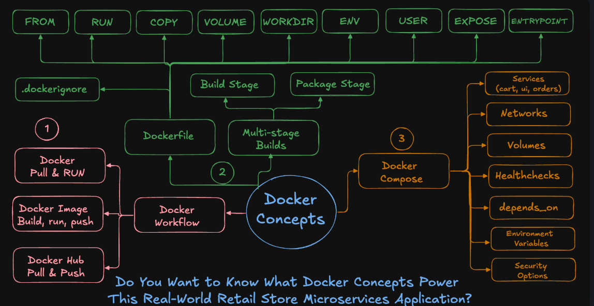


#### Install Docker on Amazon Linux 2023

```bash
sudo dnf update -y
sudo dnf install docker -y
sudo systemctl enable docker
sudo systemctl start docker
sudo usermod -aG docker ec2-user
```

```bash
# Check Docker version
docker version

# List Docker images
docker images

# Run a test container
docker run hello-world

# List images again
docker images

# give only container id
docker ps -aq

# Remove the stopped container
docker rm $(docker ps -aq)

# Remove the image
docker rmi hello-world
docker rmi $(docker images -q)
```

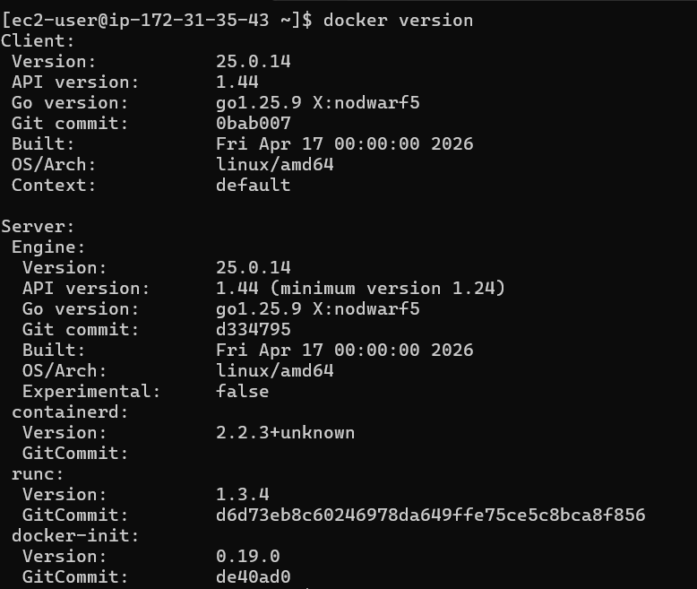
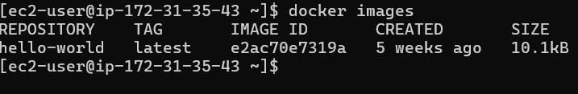
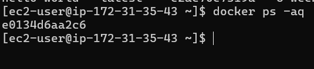
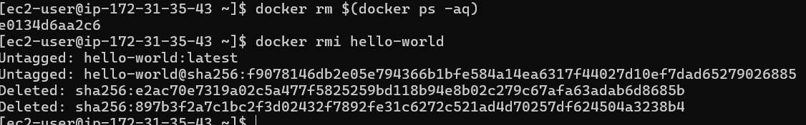

---
## Pull-from-Hub-and-Run-Docker-Image

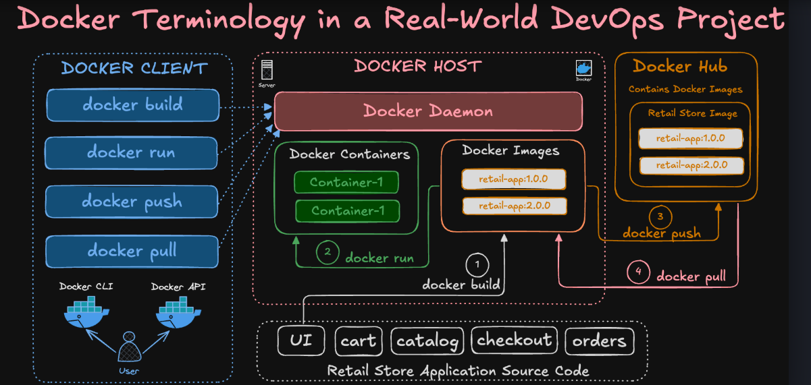
---
#### Step 1: Pull Docker Image from Docker Hub

```bash

# List Docker images 
docker images

# Pull Docker image from Docker Hub
docker pull stacksimplify/retail-store-sample-ui:1.0.0

# List Docker images to confirm the image is pulled
docker images

```
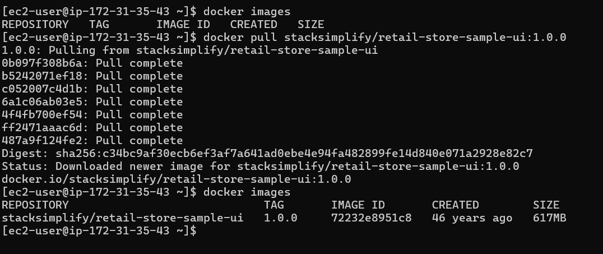
---
#### Step 2: Run the Downloaded Docker Image


```bash
# Run Docker Container
docker run --name <CONTAINER-NAME> -p <HOST_PORT>:<CONTAINER_PORT> -d <IMAGE_NAME>:<TAG>

# Example using Docker Hub image:
docker run --name demoapp -p 8889:8080 -d stacksimplify/retail-store-sample-ui:1.0.0

```
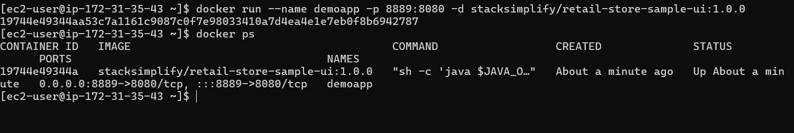
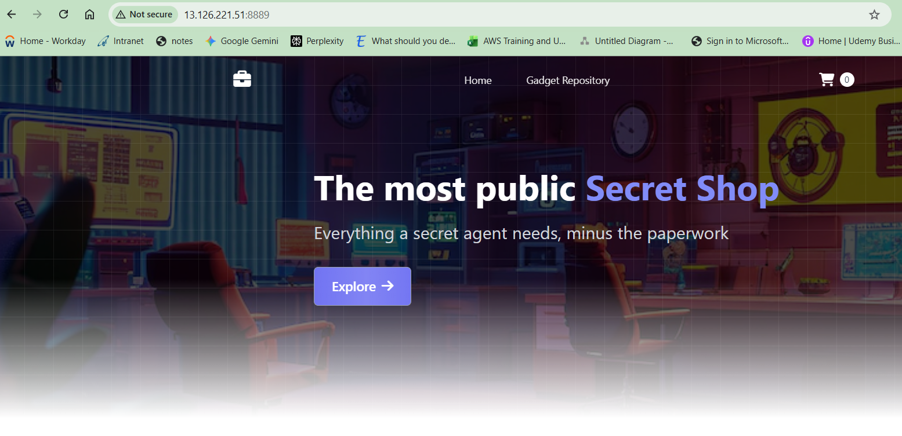
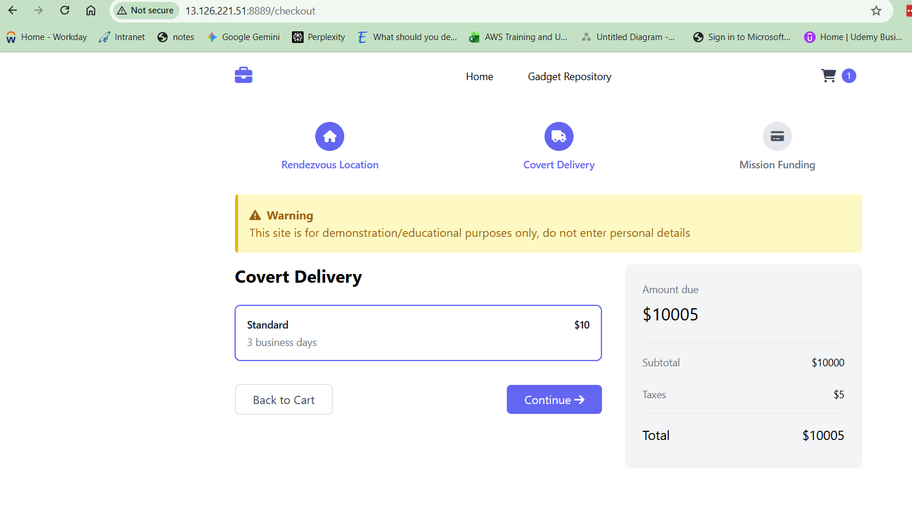

---
#### Step 3: List Running Docker Containers

```bash
# List only running containers
docker ps

# List all containers (including stopped ones)
docker ps -a

# List only container IDs
docker ps -q

# List only container IDs (including stopped ones)
docker ps -aq

```

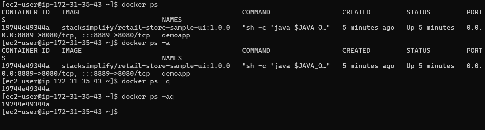

---
#### Step 4: Connect to Docker Container Terminal

```bash
# Connect to the container's terminal
docker exec -it <CONTAINER-NAME> /bin/sh

# Example:
docker exec -it demoapp /bin/sh

## Basic OS Info
uname -a                    # Kernel version and system details
cat /etc/os-release         # Check base OS details
whoami                      # See current user (usually 'root')

## Exit container shell
exit                        # Exit from /bin/sh back to host shell

# Execute Commands Directly:

docker exec -it demoapp whoami

```
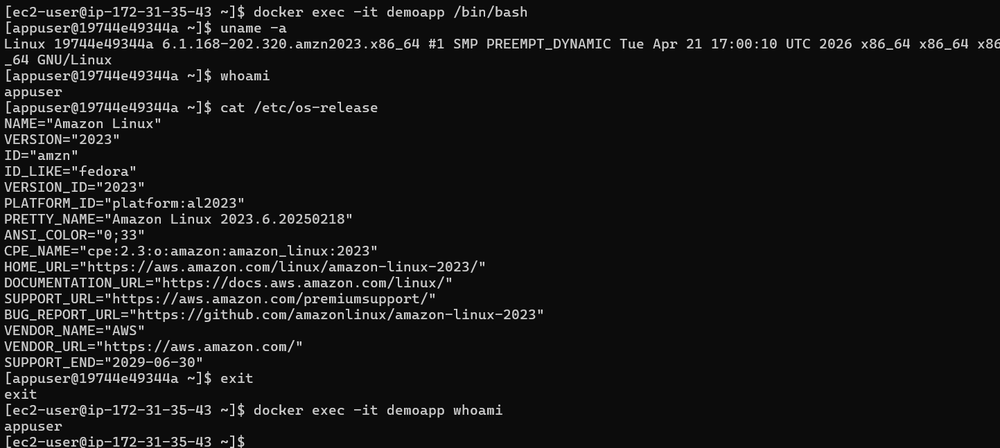

---

#### Step 5: Stop and Start Docker Containers

```bash
# Stop a running container
docker stop <CONTAINER-NAME>

# Example:
docker stop demoapp

# Verify the container has stopped
docker ps

# Test if the application is down
curl http://<EC2-Instance-Public-IP>:8889

# Start the stopped container
docker start <CONTAINER-NAME>

# Example:
docker start demoapp

# Verify the container is running
docker ps

# Test if the application is back up
curl http://<EC2-Instance-Public-IP>:8889

```
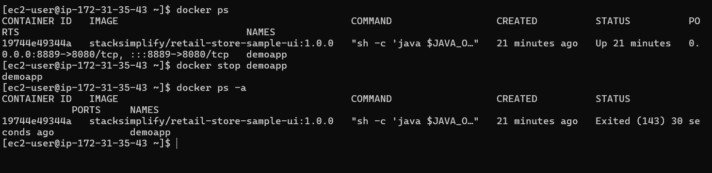
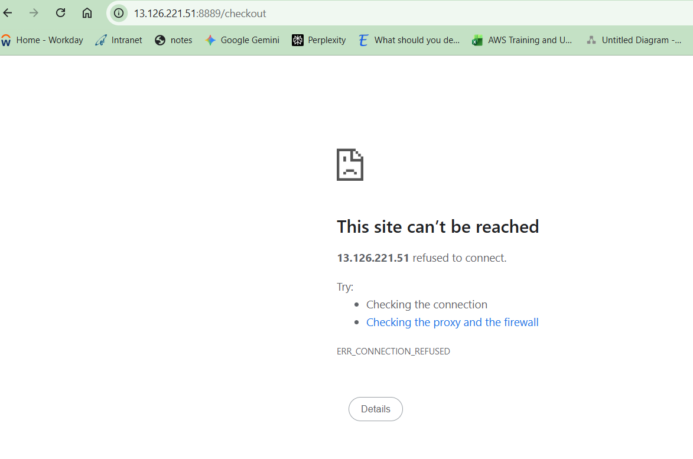
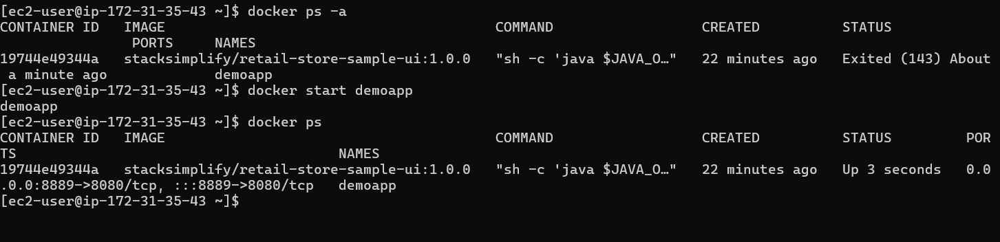
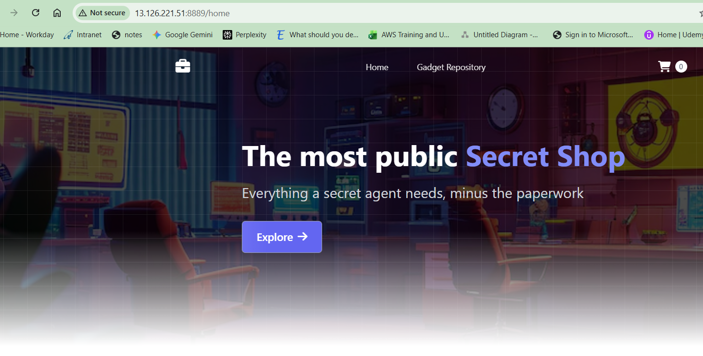

---

#### Step 6: Remove Docker Containers
```bash

# Stop the container if it's still running
docker stop <CONTAINER-NAME>
docker stop demoapp

# Remove the container
docker rm <CONTAINER-NAME>
docker rm demoapp

# Or stop and remove the container in one command
docker rm -f <CONTAINER-NAME>
docker rm -f demoapp

```
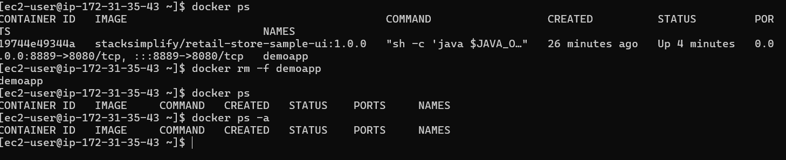


#### Step 7: Remove Docker Images

```bash
# List Docker images
docker images

# Remove Docker image using Image ID
docker rmi <IMAGE-ID>

# Example:
docker rmi 72232e8951c8

# Remove Docker image using Image Name and Tag
docker rmi <IMAGE-NAME>:<IMAGE-TAG>

# Example:
docker rmi stacksimplify/retail-store-sample-ui:1.0.0

```

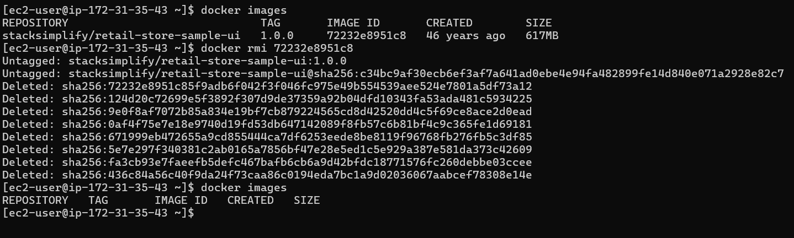

---

## Build-Docker-Image-Push-to-DockerHub
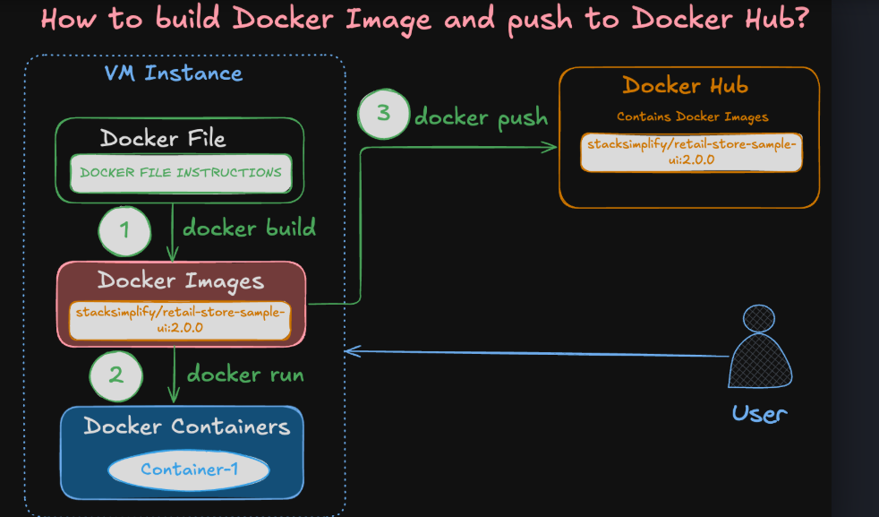
---
#### Step-01: Log In docker hub via Command Line
```bash
# Log in to Docker Hub
docker login
```
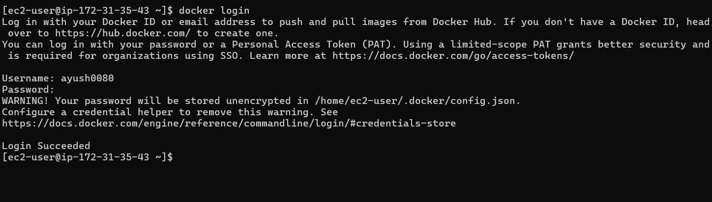
---
#### Step-02: Download the code for which Docker Image to be built
```bash

# Create a Folder
mkdir demo-docker-build
cd demo-docker-build

# Download the Application Source
wget https://github.com/aws-containers/retail-store-sample-app/archive/refs/tags/v1.2.4.zip

# Unzip Application Source
unzip v1.2.4.zip

# Make change to file
cd /home/ec2-user/demo-docker-build/retail-store-sample-app-1.2.4/src/ui/src/main/resources/templates
File name: home.html
We are making a change for UI stating V2 at line 

# List to Verify if we are at that file
ls home.html
ls -lrt

# Changes we are doing 
## Before
          The most public <span class="text-primary-400">Secret Shop</span>

## After
          The most public <span class="text-primary-400">Secret Shop - Ayush  V2 Version</span>          


# Command to Make That Change via Terminal (No Manual Editing)
sed -i 's/Secret Shop<\/span>/Secret Shop - Ayush  V2 Version<\/span>/' home.html


```
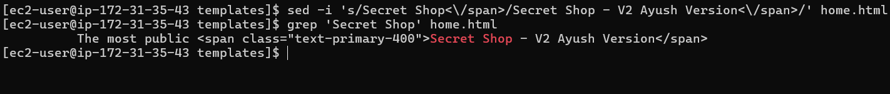

---
#### Step-03: Build Docker Image and Run It

```bash
# Change to the directory containing your Dockerfile
cd /home/ec2-user/demo-docker-build/retail-store-sample-app-1.2.4/src/ui

# Verify Dockerfile before starting the build
ls -lrt Dockerfile
cat Dockerfile

# Build the Docker image
docker build -t <IMAGE_NAME>:<TAG> .

# Example:
docker build -t devops_project_bootcamp:2.0.0 .

# List Docker images
docker images

# Run the Docker container and verify
docker run --name <CONTAINER-NAME> -p <HOST_PORT>:<CONTAINER_PORT> -d <IMAGE_NAME>:<TAG>

# Example:
docker run --name demoapp-v2 -p 8889:8080 -d devops_project_bootcamp:2.0.0

# Access the application in your browser
http://<EC2-Instance-Public-IP>:8889

## RUN Container: 1.0.0 version on Host port 8888 (TO COMPARE WITH 2.0.0)
# Example using Docker Hub image:
docker run --name demoapp -p 8888:8080 -d stacksimplify/retail-store-sample-ui:1.0.0

```

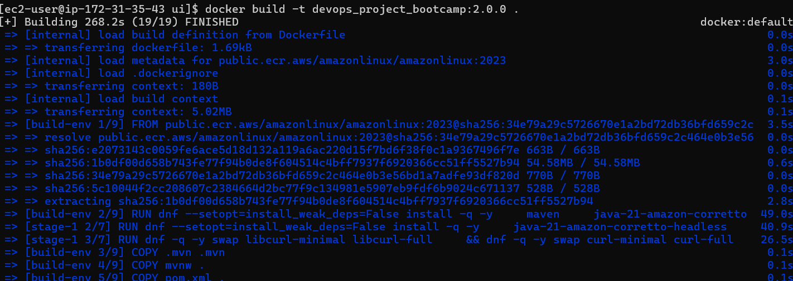

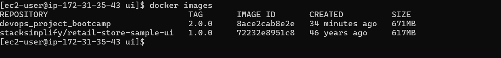

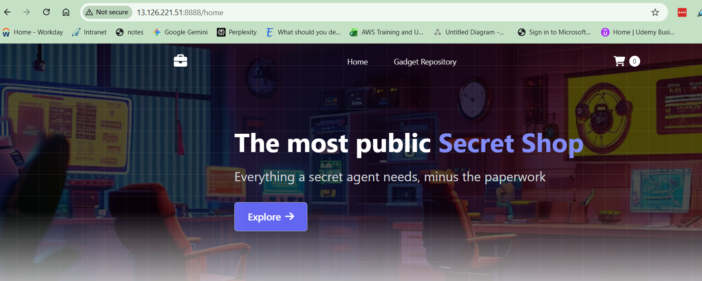
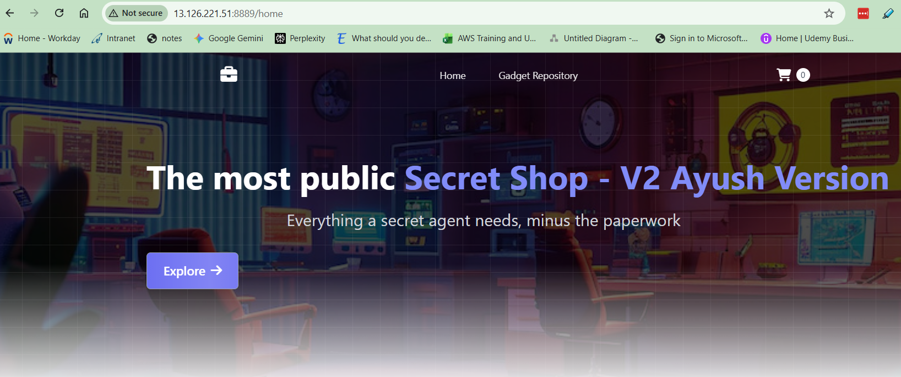

---
#### Step-04: Tag and Push the Docker Image to Docker Hub

```bash

# List Docker images
docker images

# Tag the Docker image
docker tag devops_project_bootcamp:2.0.0 ayush0080/devops_project_bootcamp:2.0.0

# Push the Docker image to Docker Hub
docker push YOUR_DOCKER_USERNAME/retail-store-sample-ui:2.0.0

# Example with 'stacksimplify':
docker push ayush0080/devops_project_bootcamp:2.0.0

```

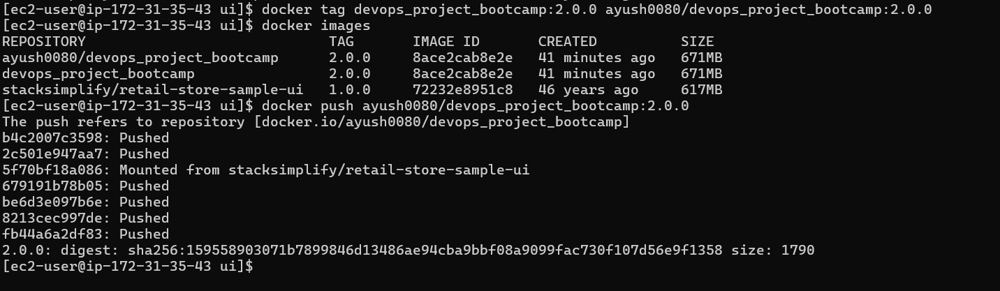
[Docker Hub](https://hub.docker.com/repository/docker/ayush0080/devops_project_bootcamp/image-management)
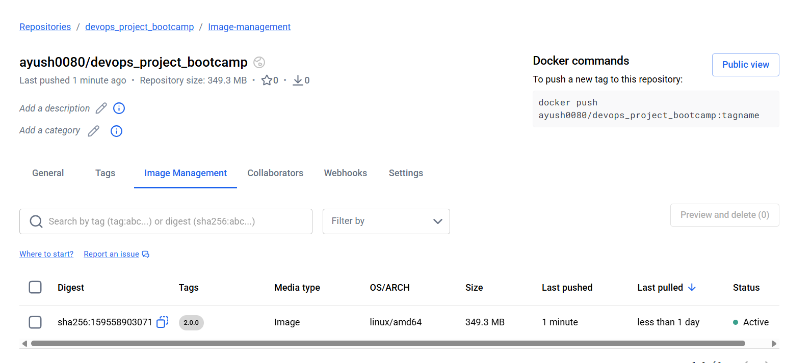

---


## Docker Files 

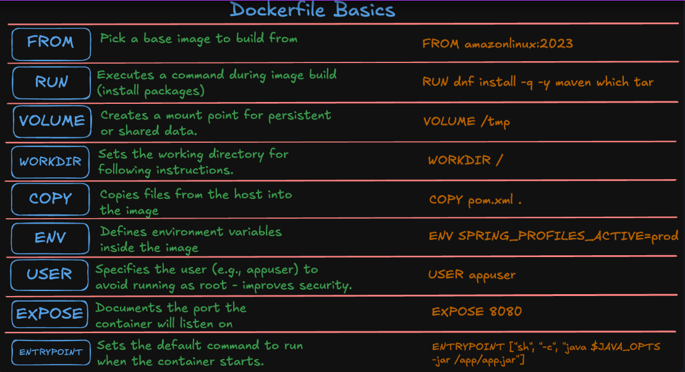
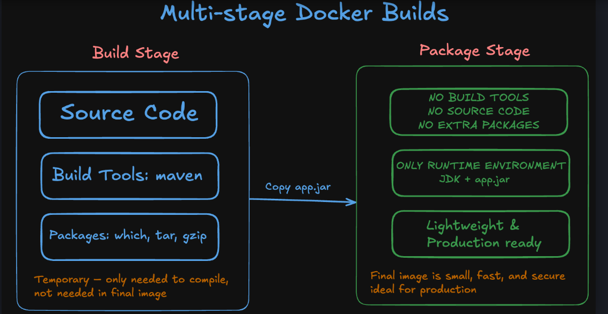
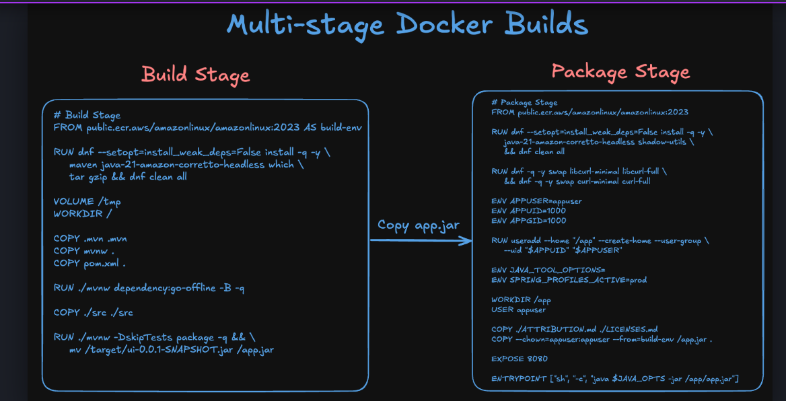


---
-  `.dockerignore` file ensures that large or unnecessary files don’t get sent to Docker during image builds:

```bash
.dockerignore
├── Dockerfile
├── docker-compose.yml
├── target/
├── .idea/
├── scripts/
└── chart/

```

---

- Remove ALL Build Cache (including unused images and layers)

```bash
docker builder prune --all
# Add -f to confirm without prompt:
docker builder prune --all -f

```
---
- If you want to rebuild from scratch and ignore cache:
```bash
docker build --no-cache -t retail-ui:10.0.0 .
```

---
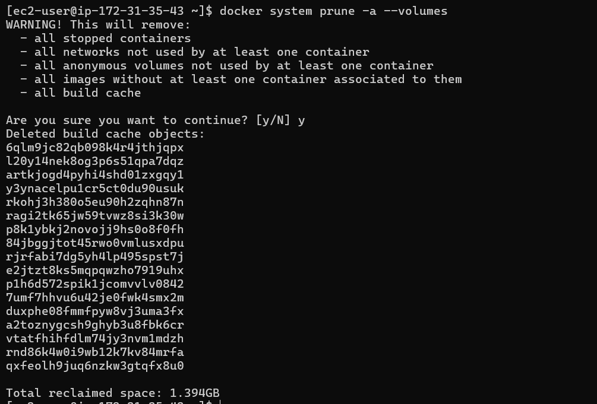


## Extra commands

```bash
# remove only "Exited" (stopped) containers
docker container prune

# remove multiple container using single commnad 
docker rm <container_id1> <container_id2>

# Check Logs  
docker logs <container_name>

# Follow Logs live: 
docker logs -f <container_name>

# Enter a running container (Shell):
docker exec -it <container_name> bash

# Inspect metadata (IPs, Mounts): 
docker inspect <container_name>

# Check resource usage (CPU/RAM): 
docker stats

# View processes inside container:
docker top <container_name>

# Show Docker disk usage.
docker system df

# See the layers and commands used to create an image.
docker history <image>

# List different Docker environments (e.g., local, cloud, remote)
docker context ls

# select context
docker context use <name>
```

