## Kubernetes Ingress 


### `Ingress`
   - A Kubernetes object/resource that defines routing rules — what traffic goes where. It is just a configuration file

    ```bash
        Ingress = RULES ONLY
        "If request comes to myapp.com/api
        send it to api-service"

        Does NOT:
         Create any Load Balancer
         Route any traffic
         Do anything by itself

        Just a YAML file with rules 

    ```

### `Ingress Controller`

  - A pod running inside cluster that watches Ingress resources and implements the routing rules. It reads Ingress YAML and actually does the routing work.
    ```bash
        Ingress Controller:
        Watches Ingress objects
        Reads routing rules
        Implements rules
        Routes traffic to correct service
        Runs as Deployment in cluster
    ```

### `Load Balancer Controller (AWS LB Controller)`

  - A specific Ingress Controller built by AWS that watches Ingress/Service resources and creates/manages AWS ALB and NLB automatically. 

    ```bash
        AWS LB Controller:
        Watches Ingress resources
        Creates AWS ALB automatically
        Watches Service (LoadBalancer type)
        Creates AWS NLB automatically
        Manages target groups
        Manages listener rules
        Runs as Deployment in kube-system

    ``` 

### `IngressClass`
   - A Kubernetes resource that tells which Ingress Controller should handle a particular Ingress — acts as a bridge between Ingress and Ingress Controller.      

   ```bash
    Problem:
    Cluster has TWO controllers installed:
    - AWS ALB Controller
    - Nginx Controller

    New Ingress created!
            ↓
    Both controllers see it!
    "Should I handle this?" ALB asks
    "Should I handle this?" Nginx asks

    Without IngressClass:
    BOTH try to handle it 
    Conflict! 

    With IngressClass:
    Ingress says: "ingressClassName: alb"
    Only ALB Controller handles it 
    Nginx ignores it 

   ```


    ```bash
    User types: shop.myapp.com
            ↓
    DNS resolves to ALB IP
            ↓
    AWS Application Load Balancer
    (created by ALB Ingress Controller)
            ↓
    Ingress rules checked:
    "shop.myapp.com → frontend-service" 
            ↓
    frontend-service
            ↓
    frontend pod 


    ```

# AWS Load Balancer Controller on EKS — Complete Flow

## Architecture Overview

```
Users
  ↓
AWS Elastic Load Balancer (ALB)
  ↓
EKS Cluster
  ↓
Ingress → Service → Pod → Microservices
```

---

## Components

### Namespace: kube-system
| Component | Type | Purpose |
|---|---|---|
| AWS Load Balancer Controller | Deployment | Watches Ingress resources and creates ALB |
| aws-load-balancer-controller | Service Account (SA) | Identity for the controller pod |
| EKS Pod Identity Agent (PIA) | DaemonSet (ds) | Runs on every node, fetches AWS credentials |

### Namespace: default
| Component | Type | Purpose |
|---|---|---|
| Ingress | Ingress resource | Defines routing rules for incoming traffic |
| SpringBoot Web UI | Deployment | Frontend web application |
| Service (svc) | ClusterIP | Routes traffic to pods |
| Pod | Pod | Runs the actual application |

### AWS Side
| Component | Purpose |
|---|---|
| AWS Elastic Load Balancer | Actual ALB created by controller |
| AWS IAM Role | Permissions for Load Balancer Controller |
| EKS Pod Identity Association | Links SA to IAM Role |

---

## Complete Flow — Step by Step

### Phase 1 — Setup (One Time)

```
Step 1: Install EKS Pod Identity Agent (PIA)
        Runs as DaemonSet on every node
        Handles AWS credential fetching

Step 2: Create IAM Role in AWS
        Attach AWSLoadBalancerControllerIAMPolicy
        Trust Policy: pods.eks.amazonaws.com

Step 3: Create Service Account
        name: aws-load-balancer-controller
        namespace: kube-system

Step 4: Create EKS Pod Identity Association
        Links SA → IAM Role
        aws eks create-pod-identity-association
          --service-account aws-load-balancer-controller
          --role-arn arn:aws:iam::123:role/alb-role

Step 5: Install AWS Load Balancer Controller
        Via Helm in kube-system namespace
        Uses the Service Account created above
```

### Phase 2 — Authentication Flow

```
AWS Load Balancer Controller pod starts
          ↓
Uses SA: aws-load-balancer-controller
          ↓
Calls PIA Agent (DaemonSet on same node)
          ↓
PIA Agent → EKS Pod Identity Association
"Is this SA linked to IAM Role?" 
          ↓
PIA Agent → AWS IAM
Authenticate & Assume Role
          ↓
Temporary credentials returned
          ↓
Controller has AWS permissions 
```

### Phase 3 — Ingress Resource Creation

```
Developer applies Ingress YAML:
kubectl apply -f ingress.yaml
          ↓
Ingress resource created
in namespace: default
          ↓
AWS Load Balancer Controller
watches all Ingress resources
"New Ingress detected!" 
          ↓
Controller reads Ingress rules
          ↓
Calls AWS API using IAM credentials
          ↓
Creates AWS Elastic Load Balancer (ALB)
with target groups and listener rules 
```

### Phase 4 — Traffic Flow

```
Users send request:
https://myapp.com
          ↓
DNS resolves to ALB endpoint
          ↓
AWS Elastic Load Balancer
          ↓
Ingress rules checked:
/ → SpringBoot Web UI Service 
          ↓
Service (svc) in default namespace
          ↓
SpringBoot Web UI Pod
          ↓
Pod calls backend microservices:
          ↓
┌──────────────────────────────────┐
│  Catalog      → catalog pods     │
│  Carts        → carts pods       │
│  Checkout     → checkout pods    │
│  Orders       → orders pods      │
└──────────────────────────────────┘
```

---

## Authentication Chain

```
ALB Controller Pod
      ↓
Service Account (aws-load-balancer-controller)
      ↓
EKS Pod Identity Association
      ↓
PIA Agent (DaemonSet)
      ↓
AWS IAM Role
      ↓
Temp credentials
      ↓
Creates/Manages ALB 
```

---

## Key Points

```
1. PIA Agent runs as DaemonSet
   → on every node
   → handles credential fetching

2. Service Account is the identity
   → links pod to IAM Role
   → via Pod Identity Association

3. ALB Controller watches Ingress
   → auto creates ALB
   → no manual AWS console work

4. One ALB for all services
   → cost effective
   → single entry point

5. Ingress routes to Service
   → Service routes to Pod
   → Pod calls microservices
```

---


## Microservices Architecture

```
Web UI (SpringBoot)
      ↓
┌─────────────────────────────────┐
│  Catalog Microservice           │
│  → product listings             │
│                                 │
│  Carts Microservice             │
│  → shopping cart management     │
│                                 │
│  Checkout Microservice          │
│  → order processing             │
│                                 │
│  Orders Microservice            │
│  → order history management     │
└─────────────────────────────────┘
```

---

## scheme Types

```bash
# Public — accessible from internet
alb.ingress.kubernetes.io/scheme: internet-facing

# Private — accessible only inside VPC
alb.ingress.kubernetes.io/scheme: internal

```
---

##


```bash
# Route to Pod IP directly (recommended)
alb.ingress.kubernetes.io/target-type: ip

# Route to Node then to Pod
alb.ingress.kubernetes.io/target-type: instance

```
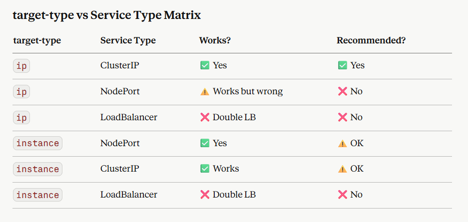


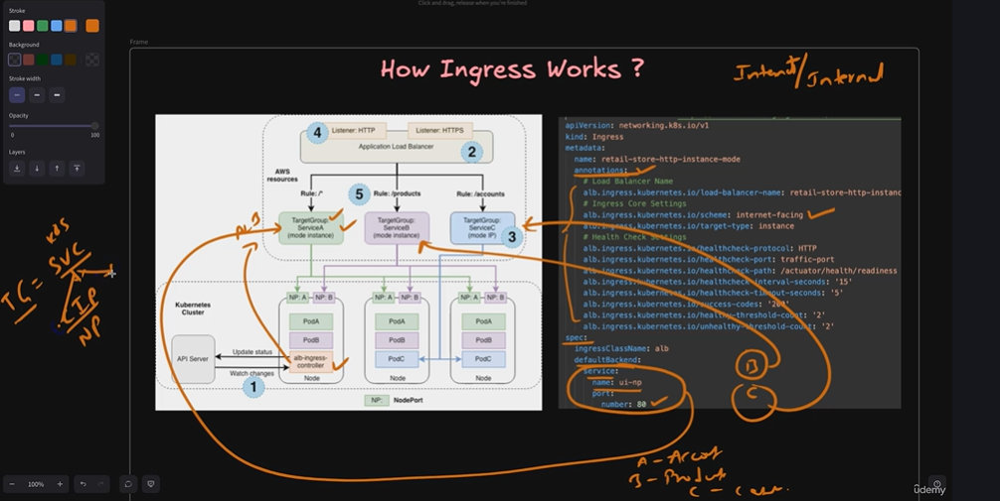

```bash
target-type: instance:
User → ALB → Node → kube-proxy → Service → Pod
       hop1   hop2    hop3         hop4     hop5
        5 hops!

target-type: ip:
User → ALB → Pod
       hop1   hop2
        2 hops! Much faster!
```


```bash
Service used for:
 ALB Controller reads Endpoints
 Gets list of Pod IPs
 Registers Pod IPs in Target Group

Service NOT used for:
 Actual traffic routing
 kube-proxy
 iptables rules

Ingress rule used for:
 Deciding which service's pods
   to send traffic to
 Path/host matching
 Creating ALB listener rules

```


#### in ingress object *** target = svc ***


## Deploy Ingress

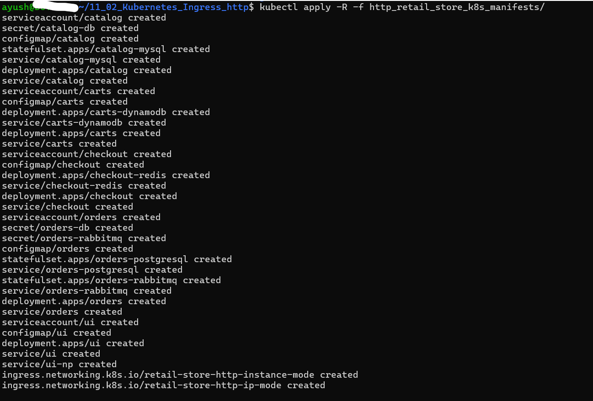


### Issue: Pod Pending — No Nodes Available

#### Problem
```
Warning  FailedScheduling  default-scheduler
0/1 nodes are available: 1 Too many pods.
No new claims to deallocate,
preemption: 0/1 nodes are available:
1 No preemption victims found for incoming pod.
```

#### Root Cause
Node capacity exhausted — existing node had reached
maximum pod limit. No available resources to schedule
the new pod.

#### Investigation

```bash
# Check pod status
kubectl get pods -n default

# Describe pod to see scheduling error
kubectl describe pod <pod-name> -n default

# Check node capacity and allocated resources
kubectl describe node | grep -A10 "Allocated resources"

# Check current node group desired count
aws eks describe-nodegroup \
  --cluster-name <cluster-name> \
  --nodegroup-name <nodegroup-name> \
  --region ap-south-1
```

#### Fix Applied

Increased EKS Node Group desired count from `1` to `2`
via AWS Console:

```
EKS → Cluster → Node Groups
→ Edit → Desired Size: 2
→ Save
```

Or via AWS CLI:
```bash
aws eks update-nodegroup-config \
  --cluster-name <cluster-name> \
  --nodegroup-name <nodegroup-name> \
  --scaling-config minSize=1,maxSize=3,desiredSize=2 \
  --region ap-south-1
```

#### Result
```
New node provisioned automatically
Pod scheduled on new node
Status: Running 
```

#### Prevention
- Enable **Cluster Autoscaler** to automatically
  scale nodes based on demand
- Set proper `minSize` and `maxSize` in node group
- Monitor node capacity via CloudWatch metrics

```bash
# Monitor node resource usage
kubectl top nodes

# Check pod distribution across nodes
kubectl get pods -o wide -A
```


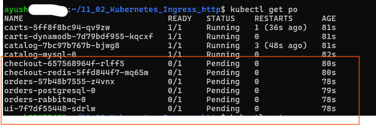
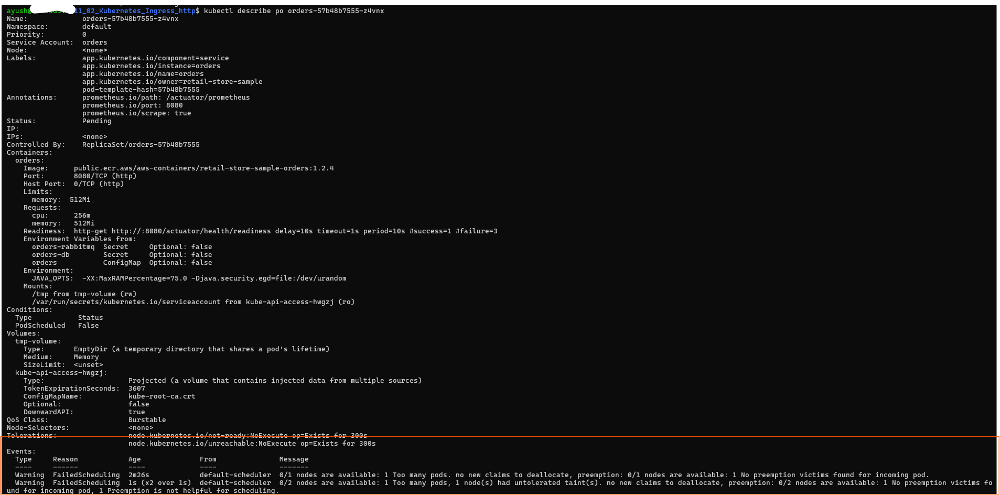
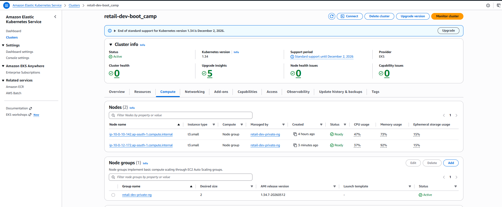
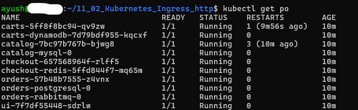


---

- verifying resources

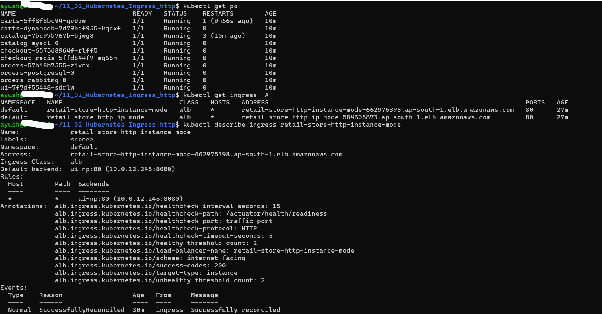
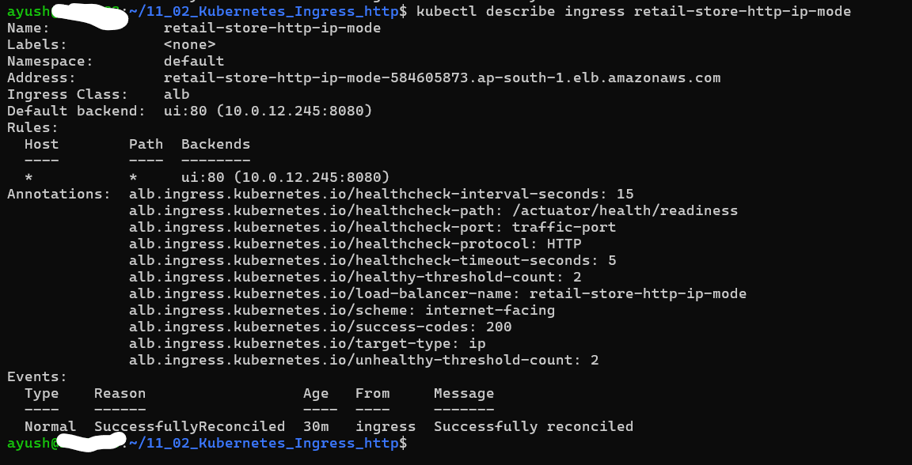


### target-type: instance
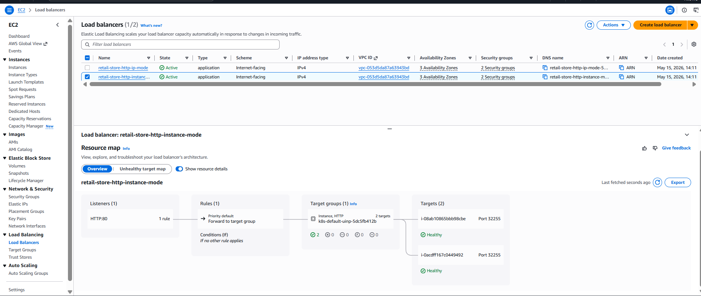
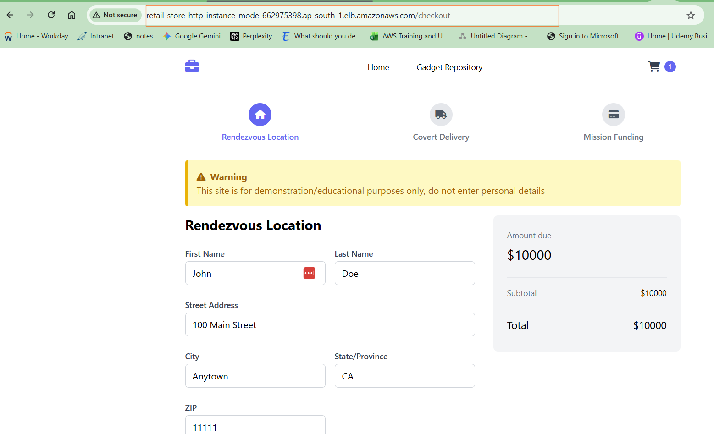

### target-type: ip
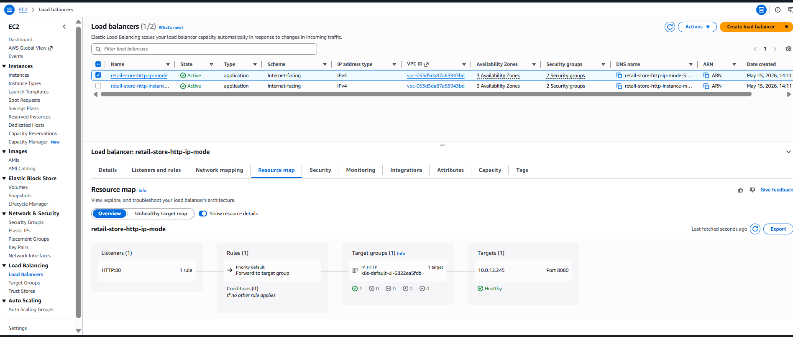
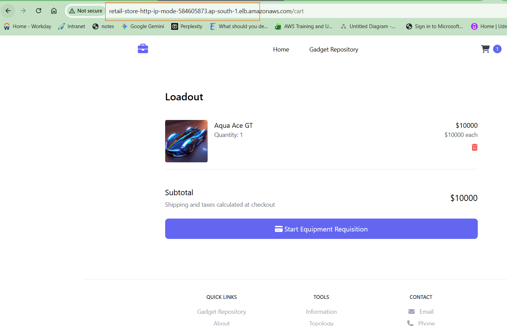
