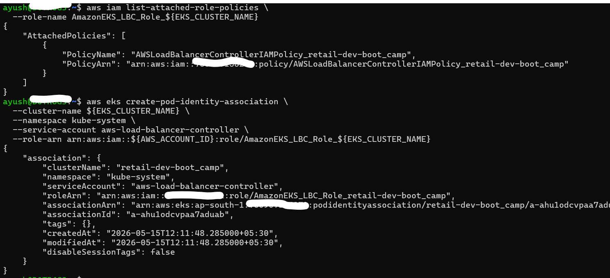
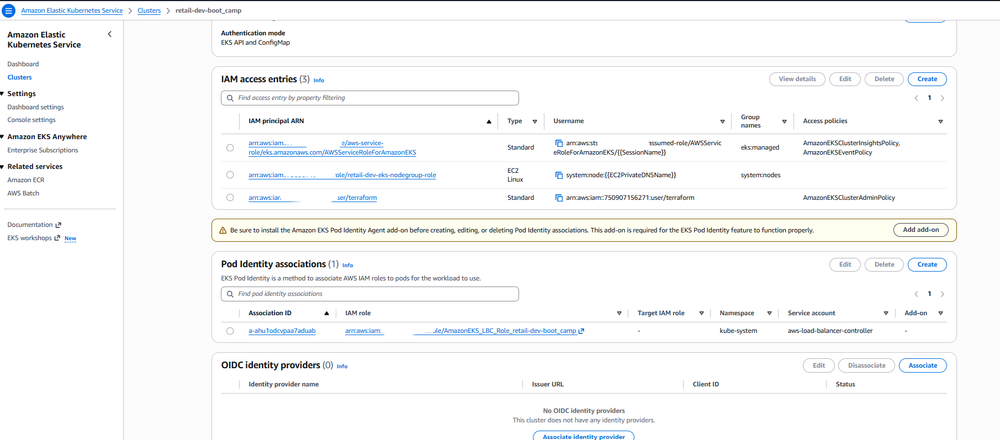
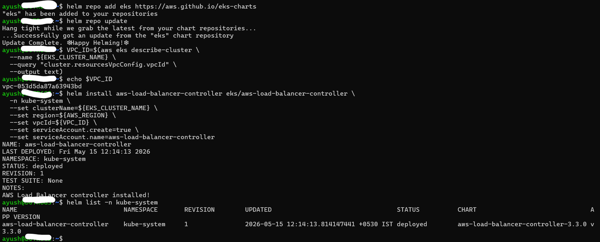

## IAM Role and Policy Setup

### Export Environment Variables

```bash
# Replace the placeholders below with your actual values
export AWS_REGION="ap-south-1"
export EKS_CLUSTER_NAME="
retail-dev-boot_camp"
export AWS_ACCOUNT_ID=$(aws sts get-caller-identity --query Account --output text)

# Confirm values
echo $AWS_REGION
echo $EKS_CLUSTER_NAME
echo $AWS_ACCOUNT_ID
```

---

### Create IAM Policy for LBC

Download the official IAM policy:

```bash
curl -o aws-load-balancer-controller-policy.json \
https://raw.githubusercontent.com/kubernetes-sigs/aws-load-balancer-controller/main/docs/install/iam_policy.json
```

Create the policy in IAM:

```bash
aws iam create-policy \
  --policy-name AWSLoadBalancerControllerIAMPolicy_${EKS_CLUSTER_NAME} \
  --policy-document file://aws-load-balancer-controller-policy.json
```

 This policy allows the Load Balancer Controller to manage AWS resources such as Elastic Load Balancers, Target Groups, and Security Groups.

---

### Create Trust Policy File

```bash
cat <<EOF > aws-load-balancer-controller-trust-policy.json
{
  "Version": "2012-10-17",
  "Statement": [
    {
      "Effect": "Allow",
      "Principal": {
        "Service": "pods.eks.amazonaws.com"
      },
      "Action": [
        "sts:AssumeRole",
        "sts:TagSession"
      ]
    }
  ]
}
EOF
```

 This trust policy allows the **EKS Pod Identity Agent** to assume this role on behalf of the Load Balancer Controller Pod.

---

### Create IAM Role and Attach Policy

```bash
# Create the IAM Role
aws iam create-role \
  --role-name AmazonEKS_LBC_Role_${EKS_CLUSTER_NAME} \
  --assume-role-policy-document file://aws-load-balancer-controller-trust-policy.json

# Attach the LBC IAM Policy
aws iam attach-role-policy \
  --role-name AmazonEKS_LBC_Role_${EKS_CLUSTER_NAME} \
  --policy-arn arn:aws:iam::${AWS_ACCOUNT_ID}:policy/AWSLoadBalancerControllerIAMPolicy_${EKS_CLUSTER_NAME}

# Verify attachment
aws iam list-attached-role-policies \
  --role-name AmazonEKS_LBC_Role_${EKS_CLUSTER_NAME}
```

---

###  Create EKS Pod Identity Association

```bash
aws eks create-pod-identity-association \
  --cluster-name ${EKS_CLUSTER_NAME} \
  --namespace kube-system \
  --service-account aws-load-balancer-controller \
  --role-arn arn:aws:iam::${AWS_ACCOUNT_ID}:role/AmazonEKS_LBC_Role_${EKS_CLUSTER_NAME}
```

This securely links the `aws-load-balancer-controller` ServiceAccount to the IAM Role via **EKS Pod Identity**.

---




## Install AWS Load Balancer Controller (Helm)

### Add Helm Repo and Update

```bash
helm repo add eks https://aws.github.io/eks-charts
helm repo update
```

---

### Install Load Balancer Controller

```bash
# Get VPC ID
VPC_ID=$(aws eks describe-cluster \
  --name ${EKS_CLUSTER_NAME} \
  --query "cluster.resourcesVpcConfig.vpcId" \
  --output text)

# Verify VPC ID
echo $VPC_ID

# Install AWS Load Balancer Controller using HELM
helm install aws-load-balancer-controller eks/aws-load-balancer-controller \
  -n kube-system \
  --set clusterName=${EKS_CLUSTER_NAME} \
  --set region=${AWS_REGION} \
  --set vpcId=${VPC_ID} \
  --set serviceAccount.create=true \
  --set serviceAccount.name=aws-load-balancer-controller  
```


* **`serviceAccount.create=true`** → Creates the ServiceAccount automatically during Helm installation.
* **`serviceAccount.name`** → Uses the same ServiceAccount name linked to your Pod Identity association.
* **`clusterName`** → Specifies the name of your EKS cluster.
* **`vpcId`** → Supplies the EKS cluster’s VPC ID manually (required when IMDS auto-detection is restricted).
* **`region`** → Explicitly sets the AWS Region to help the controller locate cluster and network resources when IMDS access is limited.

---

### Verify Helm Release

List Helm releases:

```bash
helm list -n kube-system
```




Check Helm status:

```bash
helm status aws-load-balancer-controller -n kube-system
```


---

##  Verify Controller Deployment

```bash
# List Pods
kubectl get pods -n kube-system -l app.kubernetes.io/name=aws-load-balancer-controller

```


Check deployment and logs:

```bash
kubectl get deployment -n kube-system aws-load-balancer-controller
kubectl logs -n kube-system -l app.kubernetes.io/name=aws-load-balancer-controller
```

---