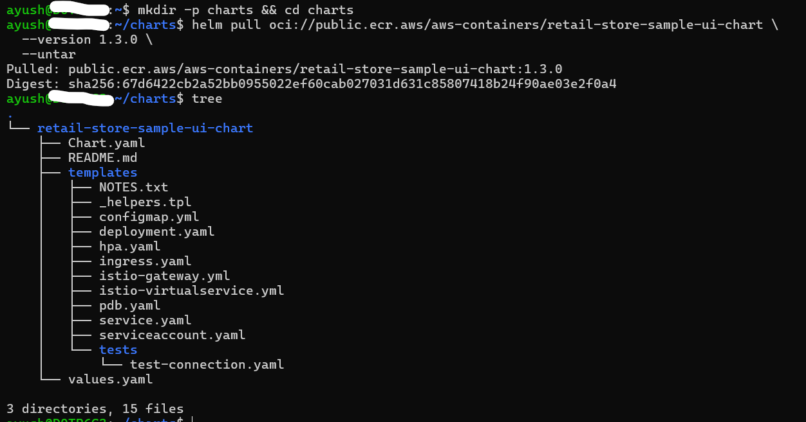
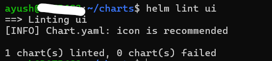
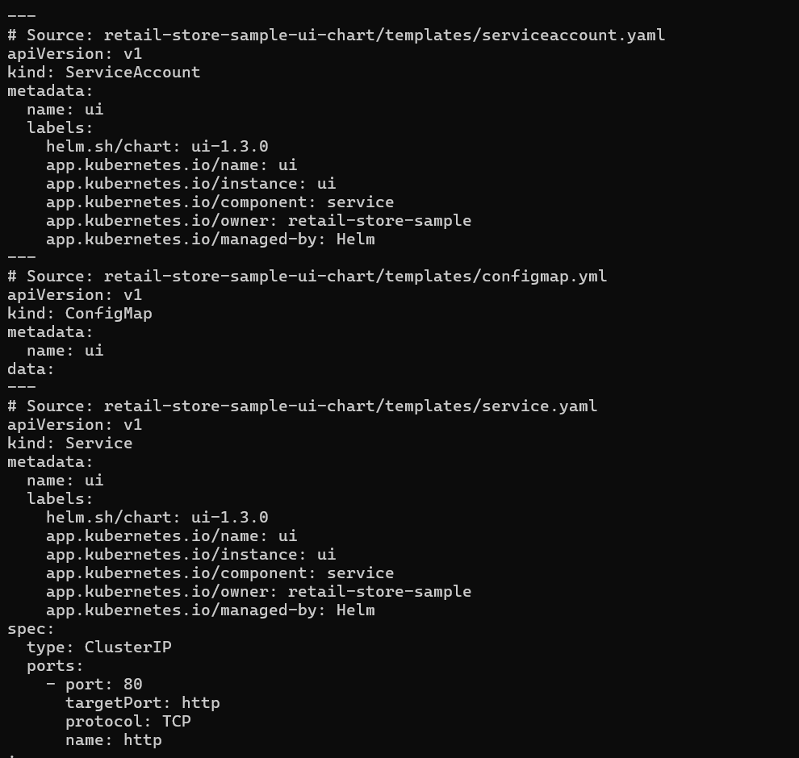
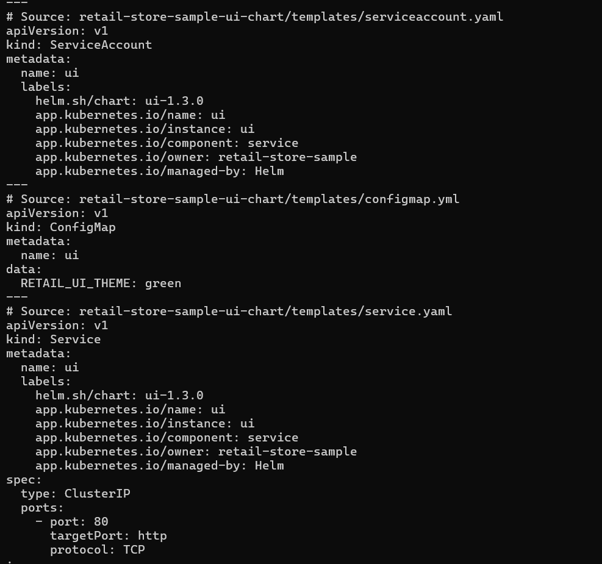

## Pull & Unpack the Chart (OCI → Local Folder)
```bash
# Create a workspace and enter it
mkdir -p charts && cd charts

# Pull the UI chart from ECR Public (OCI) and unpack it
helm pull oci://public.ecr.aws/aws-containers/retail-store-sample-ui-chart \
  --version 1.3.0 \
  --untar

````



> If you’re not using **Istio**, the `istio-*.yml` templates typically remain disabled by default.

**Rename**

```bash
mv retail-store-sample-ui-chart ui
```


---

## Quick Tour — What Each File Does

Typical Helm chart layout (names may vary slightly by publisher):

* **`Chart.yaml`** – Chart metadata: `name`, `description`, `type`, `version` (chart), `appVersion` (app).
* **`values.yaml`** – Default values shipped with the chart (what gets used when you don’t override).
* **`.helmignore`** – Files/paths excluded when packaging.
* **`templates/`** – Where the K8s YAML templates live:

  * `deployment.yaml` – Pod/ReplicaSet spec; references many `.Values.*` keys.
  * `service.yaml` – ClusterIP/LoadBalancer spec and ports.
  * `ingress.yaml` – Ingress rules and annotations (if supported).
  * `configmap.yml` (or similarly named) – App configuration rendered from values.
  * `_helpers.tpl` – Helper templates for names/labels (used across templates).
  * `NOTES.txt` – Post-install notes printed by Helm.
  * Optional: `hpa.yaml`, `serviceaccount.yaml`, `tests/*` (Helm test hooks), `istio-*.yml`.


---

## Discover the Available Knobs (Chart Defaults)

```bash
# See the chart’s default values directly from the registry (handy reference)
helm show values oci://public.ecr.aws/aws-containers/retail-store-sample-ui-chart \
  --version 1.3.0 | less

# Also inspect the local copy you just pulled:
cat ui/values.yaml

# (Optional) extra discovery
helm show chart  oci://public.ecr.aws/aws-containers/retail-store-sample-ui-chart --version 1.3.0
helm show readme oci://public.ecr.aws/aws-containers/retail-store-sample-ui-chart --version 1.3.0
```

---

## Lint & Render (No Cluster Needed)


```bash
# Lint the chart templates
helm lint ui

# Render the chart locally (defaults)
helm template ui ./ui | less

# Render with your custom values (adjust path if your repo differs)
helm template ui ./ui -f ./values-ui.yaml | less

# With custom values + extra debug
helm template ui ./ui -f ./values-ui.yaml --debug | less
```




>

---

## Install Locally From the Unpacked Chart

If you want to run this chart **from source** (not from OCI) to test changes:

```bash

# Install with a different release name to avoid clobbering your previous demo
helm install ui-local ./ui -f ../retailstore-apps/values-ui.yaml

# Check what got created
helm status ui-local --show-resources
kubectl get pods,svc,ing
```

---

## Quick Value Change (Theme → orange)

We’ll make a small change in `values-ui.yaml` and see it reflected in the rendered manifests (and optionally in a running release).

### A) Edit the value

```yaml
app:
  theme: orange
```

*(Edit `.values-ui.yaml` to the above.)*

### B) Re-render locally (no cluster needed)

```bash
helm template ui ./ui -f ./values-ui.yaml | less
# See where theme appears
helm template ui ./ui -f ./values-ui.yaml | grep -ni theme
```


### C) Apply to a running release from the local chart

```bash
# Install/upgrade a local test release
helm upgrade --install ui-local ./ui -f .values-ui.yaml

# Verify the effective values
helm get values ui-local --all
helm get values ui-local --all | grep theme

# List pods
kubectl get pods
```

> If pods don’t restart automatically (some charts put theme into a ConfigMap/env without changing the pod template), do a quick restart:

```bash
# Restart pods reliably via release label (works across naming templates)
kubectl rollout restart deploy -l app.kubernetes.io/instance=ui-local

# Verify
kubectl get pods

```

---

## Helm Tests (If the Chart Ships Them)

* Some charts include **test hooks** under `templates/tests/*`.
* In our chart, we have `templates/tests/test-connection.yaml`.

```bash
# Helm test
helm test ui-local
```

> Note: `helm test` runs after a release is installed and ready.

--- 

## Uninstall ui-local Helm Release
```bash
# Uninstall
helm uninstall ui-local
```

---

## Handy Reference Commands (Cheat-Sheet)

```bash
# Pull (OCI) + unpack
helm pull oci://public.ecr.aws/aws-containers/retail-store-sample-ui-chart --version 1.3.0 --untar

# Show chart metadata & defaults from registry
helm show chart  oci://public.ecr.aws/aws-containers/retail-store-sample-ui-chart --version 1.3.0
helm show values oci://public.ecr.aws/aws-containers/retail-store-sample-ui-chart --version 1.3.0
helm show readme oci://public.ecr.aws/aws-containers/retail-store-sample-ui-chart --version 1.3.0

# Lint + render from local source
helm lint ui
helm template ui ./ui -f ../retailstore-apps/values-ui.yaml --debug

# Install from local source (separate release name)
helm install ui-local ./ui -f ../retailstore-apps/values-ui.yaml
helm status ui-local --show-resources
```