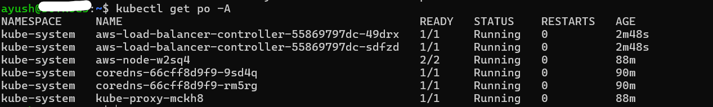
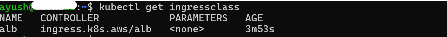
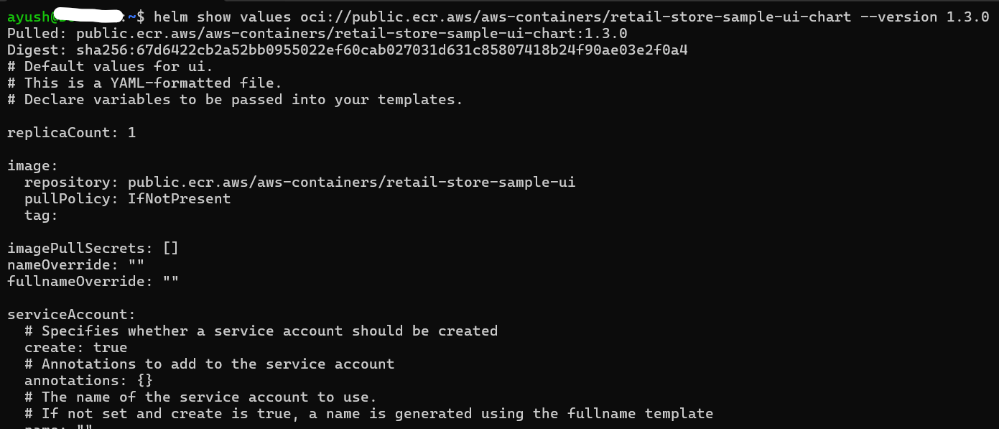
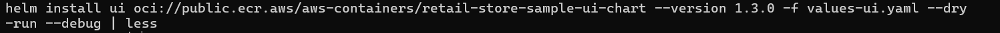
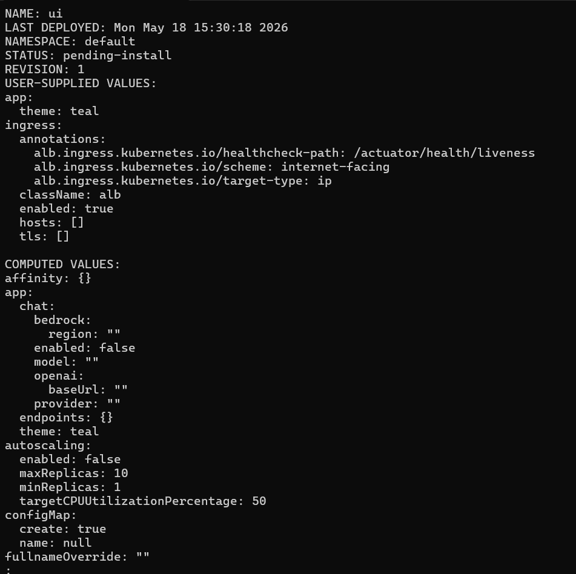
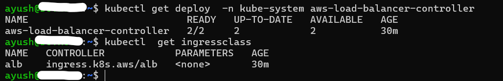
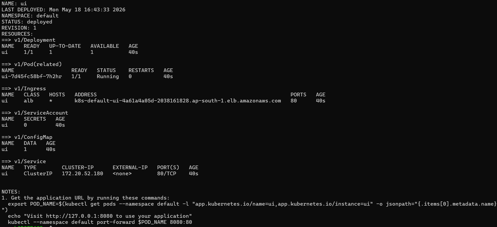
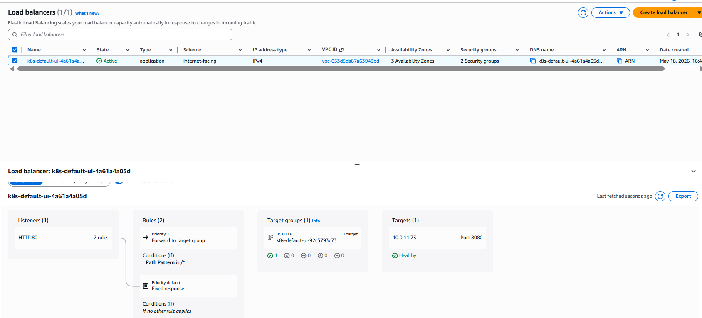
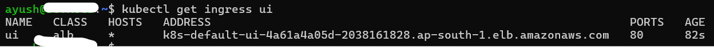
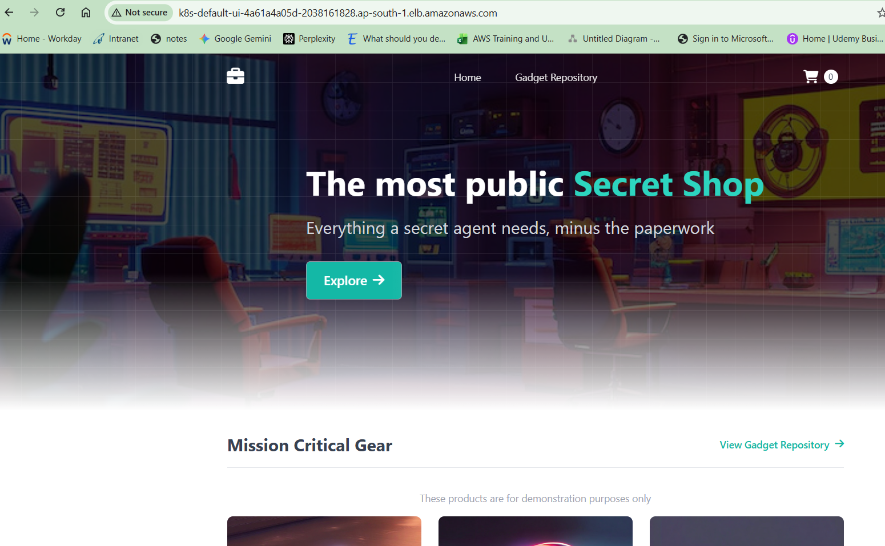

## ALB Ingress prerequisites :

- AWS Load Balancer Controller (installed & IAM/IRSA configured)
- Subnets tagged for ALB (usually already done in cluster networking)
- An IngressClass in the cluster (default or explicitly referenced via className)


## Inspect & preview:

```bash
# See chart default values (great for discovering knobs)
helm show values oci://public.ecr.aws/aws-containers/retail-store-sample-ui-chart --version 1.3.0

# Dry-run to preview what will be applied
cd retailstore-apps
helm install ui oci://public.ecr.aws/aws-containers/retail-store-sample-ui-chart --version 1.3.0 -f values-ui.yaml --dry-run --debug | less

```





## Install Helm Release with Custom Values

```bash
# Verify if AWS Load Balancer Controller installed
kubectl get deploy  -n kube-system aws-load-balancer-controller
kubectl get pods -n kube-system

# Verify Default Ingressclass configured
kubectl get ingressclass
Observation: "alb" should be default ingressclass


# Helm Install
helm install ui oci://public.ecr.aws/aws-containers/retail-store-sample-ui-chart \
  --version 1.3.0 \
  -f values-ui.yaml
```



---

## Verify Ingress and ALB

```bash
# List Helm Release
helm list

# This gives a nice summary of resources created by the release.
helm status ui --show-resources

# After install/upgrade, see effective values
helm get values ui --all

# Shows all Kubernetes manifests (raw YAML) rendered and applied by Helm:
helm get manifest ui

# Pods created by the release
kubectl get pods

# Services (expect ClusterIP for internal communication)
kubectl get svc

# Ingress (ALB will be created by the controller)
kubectl get ingress

# Describe the Ingress to view ALB details and events
kubectl describe ingress ui
```



**Observation:**

* AWS Load Balancer Controller provisions an **internet‑facing ALB**
* The app is accessible over **HTTP (port 80)** using the ALB’s DNS name

---

## Access Application

```bash
# Get the ALB DNS name
kubectl get ingress ui 
```



---

## Uninstall Helm Release

```bash
# Uninstall Helm Release
helm uninstall ui
```

---

## Helm Chart Reference
- [Retail Store Helm Chart - UI App](https://gallery.ecr.aws/aws-containers/retail-store-sample-ui-chart)

---