### Install Retail UI Helm Chart (Default Settings)
By default, the chart installs with its own service configuration.

```bash
# Authenticate to Public ECR
## Helm needs a valid authentication token to pull OCI charts from Amazon ECR Public.
aws ecr-public get-login-password --region us-east-1 | helm registry login -u AWS --password-stdin public.ecr.aws


# Install Retail UI Helm Chart (version 1.0.0)
helm install ui oci://public.ecr.aws/aws-containers/retail-store-sample-ui-chart \
  --version 1.0.0
```

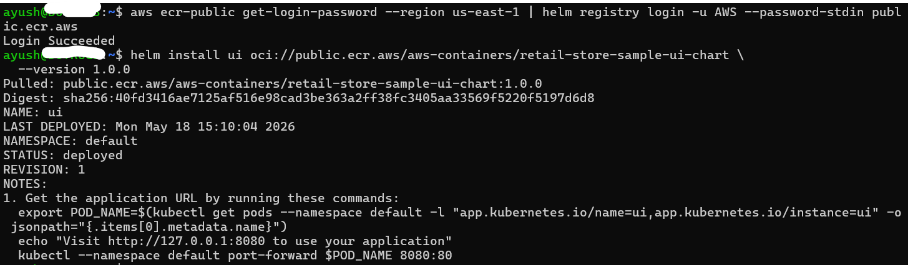

---
### Helm Chart Referece
- [Retail Store Helm Chart - UI App](https://gallery.ecr.aws/aws-containers/retail-store-sample-ui-chart)

---

### List Helm Releases

```bash
# List Helm releases (default table output)
helm list
helm ls

# List Helm releases in YAML or JSON
helm list --output=yaml
helm list --output=json

# List Helm releases for a specific namespace (if not using default)
helm list -n default
```
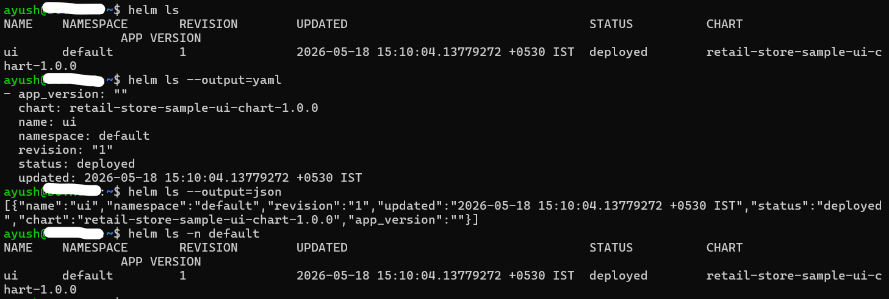
---

### Verify Kubernetes Resources

After Helm installs the chart, Kubernetes resources are created automatically.

```bash
# List Pods created by the 'ui' release
kubectl get pods

# List Services created by the 'ui' release
kubectl get svc
```

By default, the **Retail UI chart exposes a ClusterIP service**.
To access it from your local machine, use port-forward:

```bash
# Port-forward to access the application locally (adjust service name if different)
kubectl port-forward svc/ui 30080:80

# Access the Retail UI application
http://localhost:30080
```
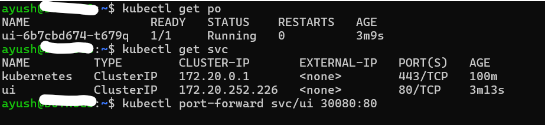
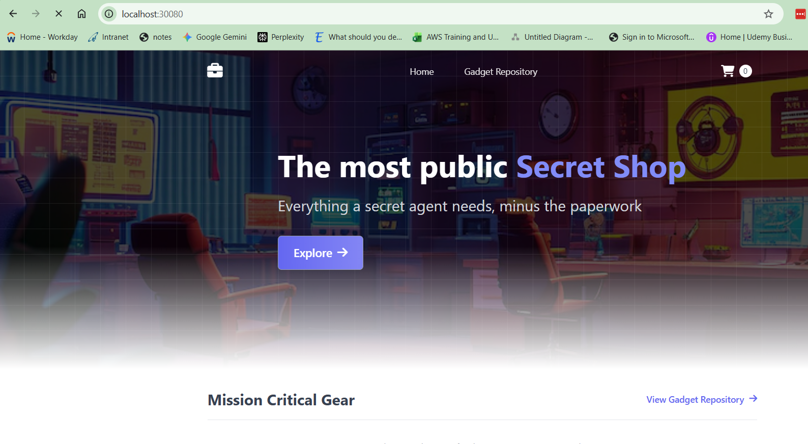


---

### Upgrade Retail UI Release
- [Retail UI - Documentation](https://github.com/stacksimplify/retail-store-sample-app-aws/tree/main/src/ui)
```bash
# Upgrade to a new chart version (1.2.4) and change app theme (example)
helm upgrade ui oci://public.ecr.aws/aws-containers/retail-store-sample-ui-chart \
  --version 1.2.4 \
  --set app.theme=orange

# Check release history
helm history ui

# Watch Pods during rollout
kubectl get pods -w

#  Port-forward again to access the app
kubectl port-forward svc/ui 30080:80
# Then browse:
 http://localhost:30080
```
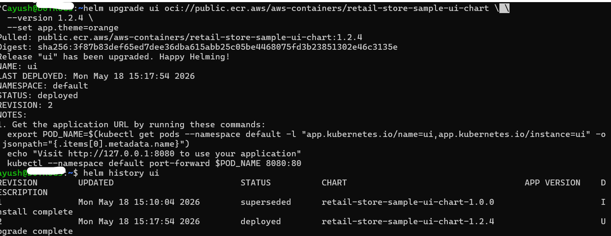
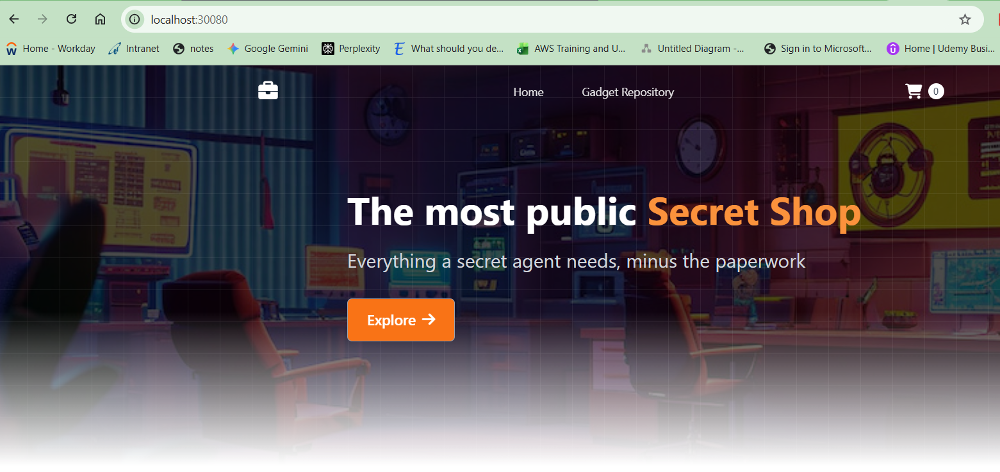


---

### Print Helm Values & Manifests

To verify which values are in effect and what Kubernetes resources were created:

```bash
# Print only overridden values
helm get values ui

# Print all values (defaults + overrides)
helm get values ui --all

# Print rendered Kubernetes manifests (Deployment, Service, etc.)
helm get manifest ui
```

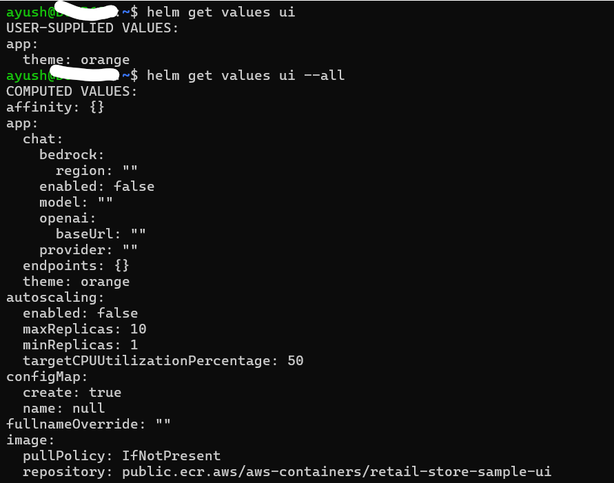
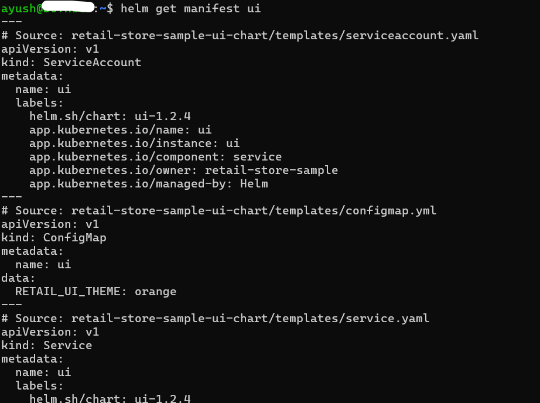

---

### Rollback to Previous Release

```bash
# Show release history
helm history ui

# Roll back to revision 1
helm rollback ui 1

# Verify rollback
helm list
helm history ui
kubectl get pods -w

# (If service is ClusterIP) Port-forward to access the application
kubectl port-forward svc/ui 30080:80
# http://localhost:30080
```


* `helm rollback ui` → rolls back to the last successful release.
* `helm rollback ui 1 --dry-run` → preview rollback without applying.

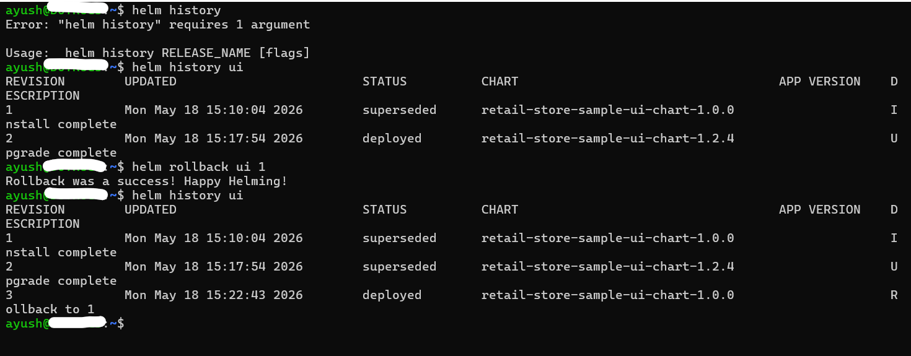

---

### Update Application Theme

You can update application values (like theme) during an upgrade.

 Pods may not restart automatically because ConfigMap/env changes don’t always trigger a rollout.
If that happens, restart the Deployment manually.

```bash
# First Upgrade to latest version
helm upgrade ui oci://public.ecr.aws/aws-containers/retail-store-sample-ui-chart \
  --version 1.3.0
  
# Change theme to green (stays on chart version 1.3.0)
helm upgrade ui oci://public.ecr.aws/aws-containers/retail-store-sample-ui-chart \
  --version 1.3.0 \
  --set app.theme=green

# If pods don't restart automatically, trigger a rollout:
kubectl rollout restart deployment/ui

# Verify pods
kubectl get pods

# (Port-forward to access the app
kubectl port-forward svc/ui 30080:80
 http://localhost:30080

```
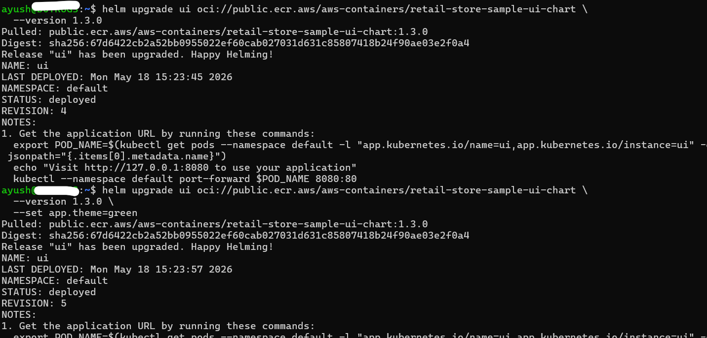
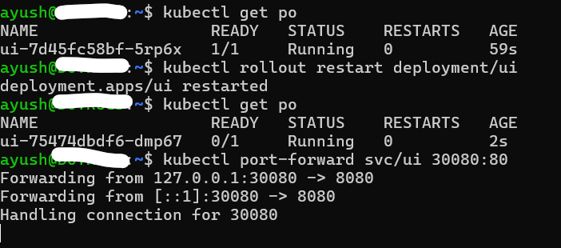
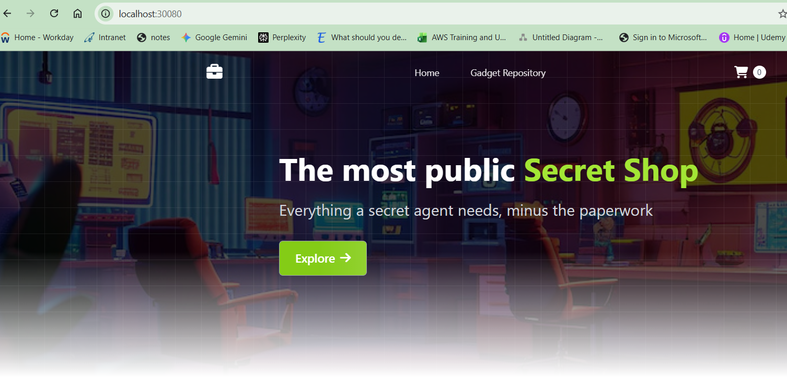

---

### Uninstall Retail UI Release

```bash
# List Helm releases
helm ls

# Uninstall the 'ui' release
helm uninstall ui
```
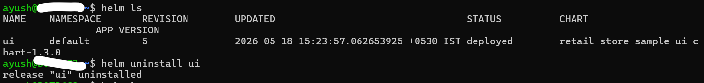
---
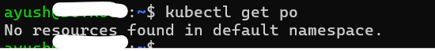
