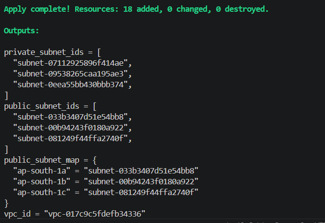
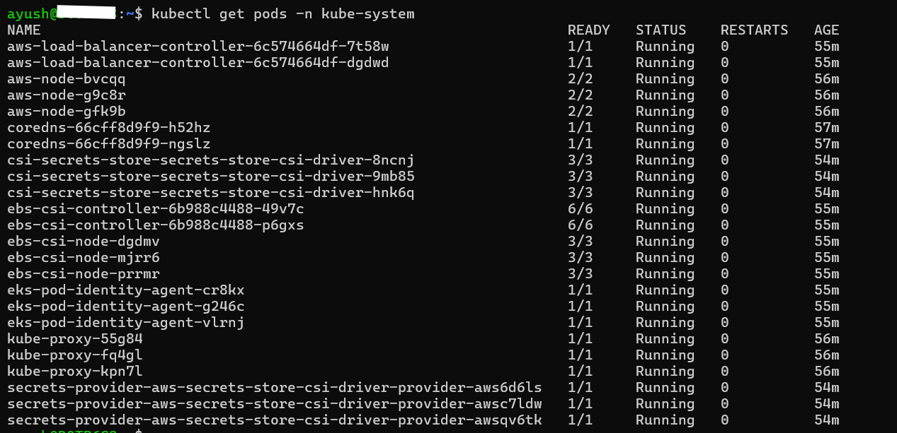
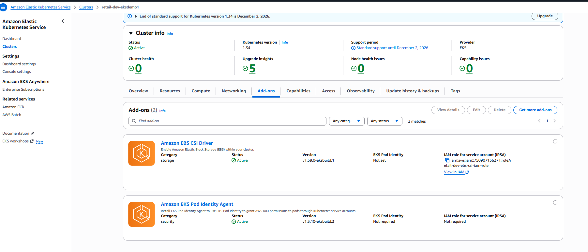
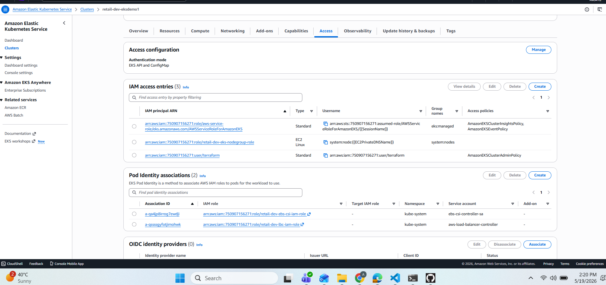
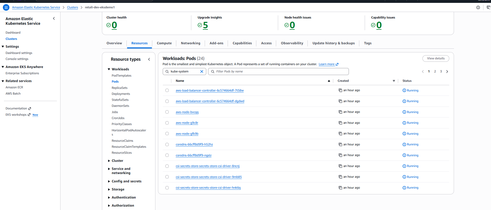

# Terraform_EKS_Cluster_with_AddOns


| AddOn                                  | Purpose                                                                      |
| -------------------------------------- | ---------------------------------------------------------------------------- |
| **Pod Identity Agent**                 | Enables Pods to assume IAM roles securely without storing credentials.       |
| **AWS Load Balancer Controller (LBC)** | Manages ALBs/NLBs for Ingress resources and Service type LoadBalancer.       |
| **EBS CSI Driver**                     | Enables dynamic provisioning of Amazon EBS volumes for Stateful workloads.   |
| **Secrets Store CSI Driver + ASCP**    | Mounts AWS Secrets Manager / SSM Parameter Store secrets directly into Pods. |

---


```
Terraform_EKS_Cluster_with_AddOns/
│
├── VPC_terraform-manifests/                # Stage 1 - Networking foundation
│   ├── versions.tf                         # Terraform + provider versions
│   ├── variables.tf                        # Input variables for VPC
│   ├── vpc.tf                              # VPC, subnets, route tables, NAT gateways, etc.
│   ├── outputs.tf                          # VPC outputs (IDs, subnet lists, etc.)
│   ├── terraform.tfvars                       # Environment-specific variable values
│   │
│   └── modules/
│       └── vpc/                               # Reusable VPC module
│           ├── datasources-and-locals.tf
│           ├── main.tf
│           ├── outputs.tf
│           ├── variables.tf
│           └── README.md
│
│
├── EKS_terraform-manifests_with_addons/    # Stage 2 - EKS + AddOns deployment
│   ├── versions.tf                         # Terraform and AWS provider versions
│   ├── variables.tf                        # EKS input variables (cluster name, region)
│   ├── remote-state.tf                     # Remote backend (S3 + DynamoDB)
│   ├── datasources_and_locals.tf           # Data lookups (VPC, subnets, etc.)
│   ├── eks_tags.tf                         # Common tagging for EKS resources
│   ├── eks_cluster_iamrole.tf              # IAM Role for EKS Control Plane
│   ├── eks_cluster.tf                      # Main EKS cluster resource
│   ├── eks_nodegroup_iamrole.tf            # IAM role for EKS node group
│   ├── eks_nodegroup_private.tf            # Private worker node group
│   ├── eks_outputs.tf                     # Cluster outputs (kubeconfig, ARNs, etc.)
│
│   # --- Pod Identity Agent ---
│   ├── podidentityagent-eksaddon.tf       # Installs EKS Pod Identity Agent addon
│   ├── helm-and-kubernetes-providers.tf   # Helm & Kubernetes providers for subsequent addons
│   ├── podidentity-assumerole.tf          # Common IAM assume-role policy for Pod Identity
│
│   # --- AWS Load Balancer Controller (LBC) ---
│   ├── lbc-iam-policy-datasources.tf
│   ├── lbc-iam-policy-and-role.tf
│   ├── lbc-eks-pod-identity-association.tf
│   ├── lbc-helm-install.tf
│
│   # --- Amazon EBS CSI Driver ---
│   ├── ebscsi-iam-policy-and-role.tf
│   ├── ebscsi-eks-pod-identity-association.tf
│   ├── ebscsi-eksaddon.tf
│
│   # --- Secrets Store CSI Driver + AWS Provider (ASCP) ---
│   ├── secretstorecsi-helm-install.tf
│   ├── secretstorecsi-ascp-helm-install.tf
│
│   ├── terraform.tfvars                       # Default variables for EKS deployment
│   │
│   └── env/                                   # Environment overrides
        ├── dev.tfvars
        ├── staging.tfvars
        └── prod.tfvars


```


### Execution Flow

1. **Stage-1 → VPC**

   * Run automatically via `create-cluster.sh`
   * Provisions VPC, subnets, NATs, and outputs network IDs

2. **Stage-2 → EKS Cluster + AddOns**

   * Uses VPC outputs from remote state
   * Builds EKS Cluster, NodeGroups, IAM roles
   * Installs:

     * `EKS Pod Identity Agent`
     * `AWS Load Balancer Controller`
     * `Amazon EBS CSI Driver`
     * `Secrets Store CSI Driver + ASCP`

3. **Post-Deploy**

   * Update kubeconfig
   * Verify add-on pods under `kube-system`
   * Confirm IAM Pod Identity associations

4. **Teardown**

   * Run `destroy-cluster.sh`
   * Destroys EKS first, then VPC


---

## Configure Remote Backend 


#### Example:

```hcl
terraform {
  required_version = ">= 1.0.0"

  required_providers {
    aws = {
      source  = "hashicorp/aws"
      version = ">= 6.0"
    }
  }

  # Remote Backend Configuration
  backend "s3" {
    bucket         = "tfstate-dev-us-east-1-jpjtof"     #  Update your S3 bucket name
    key            = "vpc/dev/terraform.tfstate"        #  Update key path (vpc/dev or eks/dev)
    region         = "us-east-1"                        #  Update region if required
    encrypt        = true
    use_lockfile   = true
  }
}

provider "aws" {
  region = var.aws_region
}
```

 **Why:**
Terraform uses the S3 bucket to store and manage the remote state securely.
* Update the **`bucket`** name as per your environment
* Update the **`key`** path (e.g., `vpc/staging/terraform.tfstate` or `eks/prod/terraform.tfstate`)


---

## Provision the EKS Cluster

### Create VPC
```bash
# Change Directory 
cd VPC_terraform-manifests

# Initialize Terraform
terraform init

# Validate syntax
terraform validate

# Preview the plan
terraform plan

# Apply configuration 
terraform apply -auto-approve
```


### Create EKS Cluster
```bash
# Change Directory 
cd EKS_terraform-manifests_with_addons

# Initialize Terraform
terraform init

# Validate syntax
terraform validate

# Preview the plan
terraform plan

# Apply configuration 
terraform apply -auto-approve
```

---

## Configure kubectl
It may take a few minutes for all add-on pods (especially ASCP and EBS CSI) to transition to `Running` state. Use `kubectl get pods -n kube-system -w` to watch in real time.

```bash
# Update kubeconfig
aws eks update-kubeconfig --name <cluster_name> --region <aws_region>
aws eks update-kubeconfig --name retail-dev-eksdemo1 --region ap-south-1

# Verify nodes
kubectl get nodes

# Verify all AddOn pods
kubectl get pods -n kube-system
```


---

## Review AddOns on AWS Console

1. Navigate to **EKS → Add-ons**
2. You’ll see:
   * `eks-pod-identity-agent`
   * `aws-ebs-csi-driver`
   
3. Under **Workloads → Pods (kube-system)**, verify:

   * `aws-load-balancer-controller`
   * `csi-secrets-store-*`
   * `secrets-provider-aws-*`
   
   
   

---


| AddOn                        | Install Type | Namespace   | Resource Type   |
| ---------------------------- | ------------ | ----------- | --------------- |
| **Pod Identity Agent**       | EKS AddOn    | kube-system | `aws_eks_addon` |
| **LBC**                      | Helm         | kube-system | `helm_release`  |
| **EBS CSI Driver**           | EKS AddOn    | kube-system | `aws_eks_addon` |
| **Secrets Store CSI + ASCP** | Helm         | kube-system | `helm_release`  |


---


- `resolve_conflicts_on_create / update = "OVERWRITE":`
  -  Remember how you just manually enabled this addon in the AWS console? If you run terraform apply right now, Terraform might notice it's already there and throw a "Resource Already Exists" error. Setting this to OVERWRITE tells Terraform: "If there is a conflict between what's manually in AWS and what's in this code, overwrite AWS and let Terraform take control."


- `host (The Address)`

  - This points directly to the secure HTTPS API URL endpoint of your EKS control plane (e.g., https://xxxxxx.gr7.us-east-1.eks.amazonaws.com). This is the gateway where all kubectl commands are sent.

- `cluster_ca_certificate (The Security Handshake)`

  - This is the root Certificate Authority (CA) public key for your cluster. AWS exports this data in a secure, encrypted base64 text string. The base64decode() function decodes it into a raw certificate so your local Terraform client knows it can safely trust the AWS EKS server without middleman security risks.


- `token`

  - This feeds the short-lived token generated by the aws_eks_cluster_auth data source directly into the providers. Every time Terraform runs a plan or apply operation, it attaches this token to show the cluster it has legitimate administrative permissions.


- `syncSecret`
    ```bash
    syncSecret:
    enabled: true

    ```
  - Depending on which specific tool or chart you are deploying (such as an External Secrets Operator, a backup tool, or a certificate manager), turning on syncSecret usually handles one of two common engineering tasks:

  - `Cross-Namespace Syncing:` By default, Kubernetes Secrets are strictly isolated inside a single namespace. Enabling this flag tells the operator to automatically mirror a specific secret (like a shared database password or docker registry pull key) from a secure master namespace into other working namespaces so your application pods can read it.

   - `External Cloud Syncing: `If this chart interacts with cloud tools, setting this to true tells the operator to continuously watch a secure external vault (like AWS Secrets Manager or Azure Key Vault) and dynamically generate a matching local Kubernetes Secret manifest inside your cluster whenever the cloud values change.  