## Folder Structure

```
03_AWS_Data_Plane/
├── AWS_Data_Plane_terraform-manifests
│   # ------------------------------------------------------------
│   # COMMON BASE FILES (VPC, EKS Remote States, Variables)
│   # ------------------------------------------------------------
│   ├── versions.tf
│   ├── variables.tf
│   ├── vpc_remote_state.tf
│   ├── eks_remote_state.tf
│   ├── datasources_and_locals.tf
│
│   # ------------------------------------------------------------
│   # COMMON IAM & CSI INTEGRATION
│   # ------------------------------------------------------------
│   ├── podidentity_assumerole.tf              # Generic assume role for Pod Identity
│   ├── secretstorecsi_iam_policy.tf           # Policy for Secrets Store CSI Driver
│
│   # ------------------------------------------------------------
│   # CATALOG MICROSERVICE — Amazon RDS MySQL
│   # ------------------------------------------------------------
│   ├── catalog_rds_mysql_security_group.tf     # SG for RDS MySQL
│   ├── catalog_rds_mysql_dbsubnet_group.tf     # DB Subnet Group for RDS
│   ├── catalog_rds_mysql_credentials.tf        # Store DB credentials in AWS Secrets Manager
│   ├── catalog_rds_mysql_dbinstance.tf         # RDS MySQL instance creation
│   ├── catalog_sa_iam_role.tf                  # IAM Role for Catalog SA (Pod Identity)
│   ├── catalog_sa_eks_pod_identity_association.tf # Pod Identity Association
│
│   # ------------------------------------------------------------
│   # CART MICROSERVICE — Amazon DynamoDB
│   # ------------------------------------------------------------
│   ├── cart_dynamoDB_iam_policy_and_role.tf    # IAM policy & role for Cart service
│   ├── cart_eks_pod_identity_association.tf    # Pod Identity for Cart
│   ├── cart_dynamodb_table.tf                  # DynamoDB Table (Items)
│
│   # ------------------------------------------------------------
│   # CHECKOUT MICROSERVICE — Amazon ElastiCache (Redis/Valkey)
│   # ------------------------------------------------------------
│   ├── checkout_redis_security_group.tf        # SG for Redis cluster
│   ├── checkout_redis_subnet_group.tf          # Subnet group for Redis
│   ├── checkout_redis_cluster.tf               # Redis cluster definition
│
│   # ------------------------------------------------------------
│   # ORDERS MICROSERVICE — Amazon RDS PostgreSQL + Amazon SQS
│   # ------------------------------------------------------------
│   ├── orders_postgresql_security_group.tf     # SG for PostgreSQL
│   ├── orders_postgresql_db_subnet_group.tf    # Subnet group for RDS PostgreSQL
│   ├── orders_postgresql_dbinstance.tf         # RDS PostgreSQL instance
│   ├── orders_postgresql_sa_iam_role.tf        # IAM Role for Orders SA
│   ├── orders_postgresql_sa_eks_pod_identity_association.tf  # Pod Identity Association
│   ├── orders_aws_sqs_queue.tf                 # SQS queue for order events
│   ├─ orders_aws_sqs_iam_policy.tf            # IAM policy for Orders Pod to access SQS
```


---

## Foundation Terraform Configs 

| File | Purpose |
|------|----------|
| **versions.tf** | Defines Terraform, AWS provider, and backend versions |
| **variables.tf** | Centralized variables for region, environment, and naming |
| **vpc_remote_state.tf** | Reads VPC outputs (subnets, VPC ID) from remote backend |
| **eks_remote_state.tf** | Reads EKS cluster outputs (OIDC, cluster name, etc.) |
| **datasources_and_locals.tf** | Fetches account info, and defines common locals like tags, names, ARNs |

These files act as the **base layer** for all downstream AWS resources.

---

## Common IAM & Security 

| File | Description |
|------|--------------|
| **podidentity_assumerole.tf** | Creates IAM role trusted by the **EKS Pod Identity Agent**, enabling pods to assume AWS roles securely. |
| **secretstorecsi_iam_policy.tf** | Creates IAM policy for **Secrets Store CSI Driver** to read secrets from **AWS Secrets Manager** and attach to pods. |

These are **shared IAM components** used by multiple services (Catalog, Orders, etc.).

---

## Catalog → AWS RDS MySQL

| File | Description |
|------|--------------|
| **catalog_rds_mysql_security_group.tf** | Security group for RDS MySQL allowing ingress from EKS nodes. |
| **catalog_rds_mysql_dbsubnet_group.tf** | DB subnet group using private subnets from VPC. |
| **catalog_rds_mysql_credentials.tf** | Creates AWS Secrets Manager secret for DB username/password. |
| **catalog_rds_mysql_dbinstance.tf** | Provisions RDS MySQL instance for Catalog microservice. |
| **catalog_sa_iam_role.tf** | IAM role allowing the Catalog service account to access DB credentials. |
| **catalog_sa_eks_pod_identity_association.tf** | Associates the Catalog service account with its IAM role using Pod Identity. |

**Outcome:** Catalog microservice securely connects to **AWS RDS MySQL** using **Secrets Manager** + **Pod Identity**.

---

## Cart → AWS DynamoDB

| File | Description |
|------|--------------|
| **cart_dynamoDB_iam_policy_and_role.tf** | Defines IAM policy & role granting full access to DynamoDB table. |
| **cart_eks_pod_identity_association.tf** | Associates Cart’s service account with its IAM role. |
| **cart_dynamodb_table.tf** | Creates DynamoDB table named **Items** for Cart microservice persistence. |

**Outcome:** Cart microservice reads/writes data directly to **AWS DynamoDB** — fully serverless, no credentials in code.

---

## Checkout → AWS ElastiCache (Redis)

| File | Description |
|------|--------------|
| **checkout_redis_security_group.tf** | Creates SG allowing access from EKS worker nodes. |
| **checkout_redis_subnet_group.tf** | Creates subnet group for Redis within private subnets. |
| **checkout_redis_cluster.tf** | Provisions an ElastiCache Redis cluster for checkout caching. |

**Outcome:** Checkout microservice uses **AWS ElastiCache Redis** for session/state caching.

---

## Orders → AWS RDS PostgreSQL

| File | Description |
|------|--------------|
| **orders_postgresql_security_group.tf** | SG for RDS PostgreSQL allowing access from EKS. |
| **orders_postgresql_db_subnet_group.tf** | Subnet group for PostgreSQL DB. |
| **orders_postgresql_dbinstance.tf** | Creates RDS PostgreSQL instance. |
| **orders_postgresql_sa_iam_role.tf** | IAM role for Orders service account to fetch DB credentials. |
| **orders_postgresql_sa_eks_pod_identity_association.tf** | Pod Identity mapping for Orders. |

**Outcome:** Orders microservice connects to **AWS RDS PostgreSQL** using **Secrets Manager** + **Pod Identity**.

---

## Orders → AWS SQS (Messaging)

| File | Description |
|------|--------------|
| **orders_aws_sqs_queue.tf** | Creates SQS queue for order messages (`retail-dev-orders-queue`). |
| **orders_aws_sqs_iam_policy.tf** | Grants required SQS permissions to Orders IAM role. |

**Outcome:** Orders service publishes messages to **SQS queue** for asynchronous order processing.

---


## Verify Resources (AWS Console)

* **RDS → MySQL & PostgreSQL instances**
* **DynamoDB → Items table**
* **ElastiCache → Redis cluster**
* **SQS → retail-dev-orders-queue**
* **IAM → Roles & Pod Identity associations**
* **Secrets Manager → retailstore-db-secret-1**

Everything should align with your EKS microservices integration.

---

#### first i have deployed all resources that deployed in **Day-12**
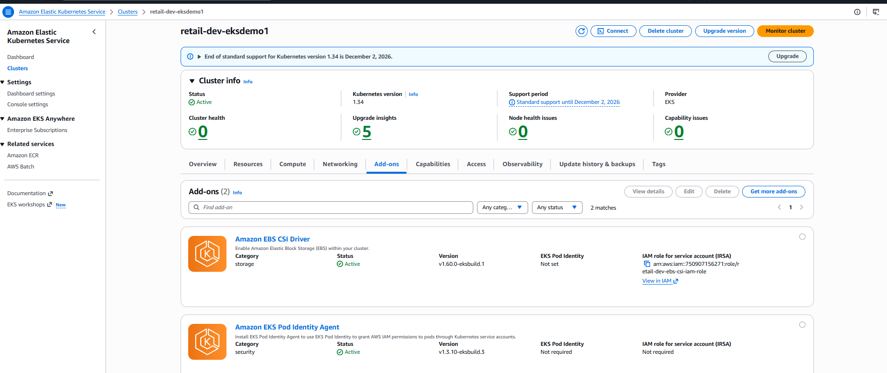
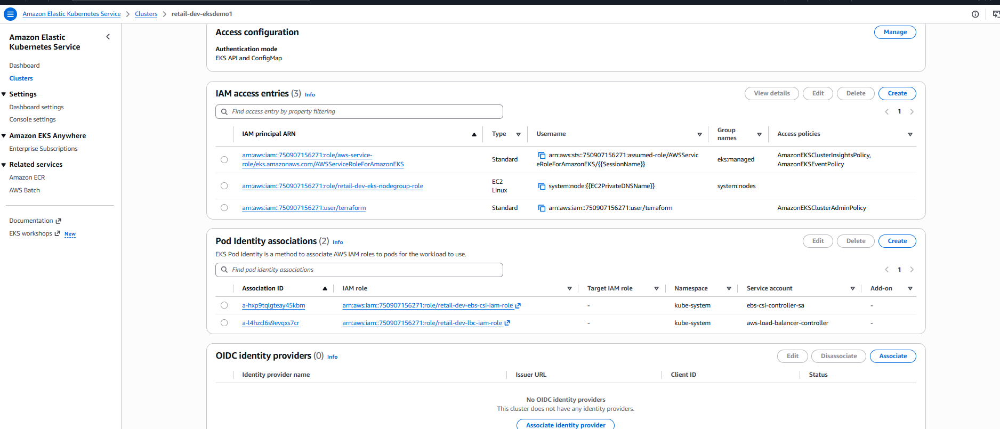
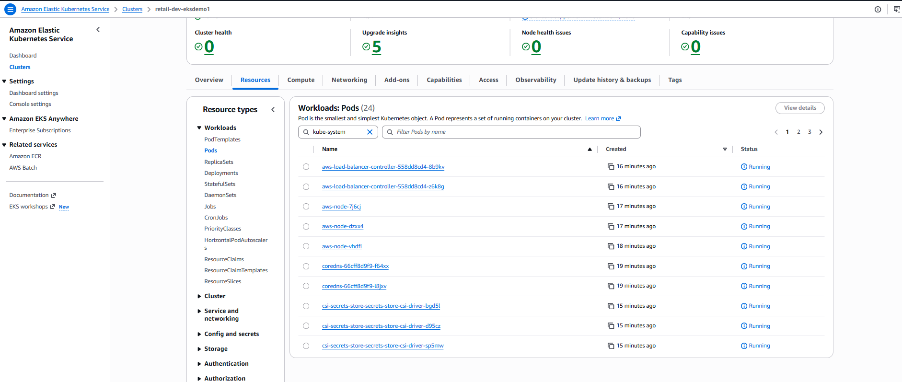
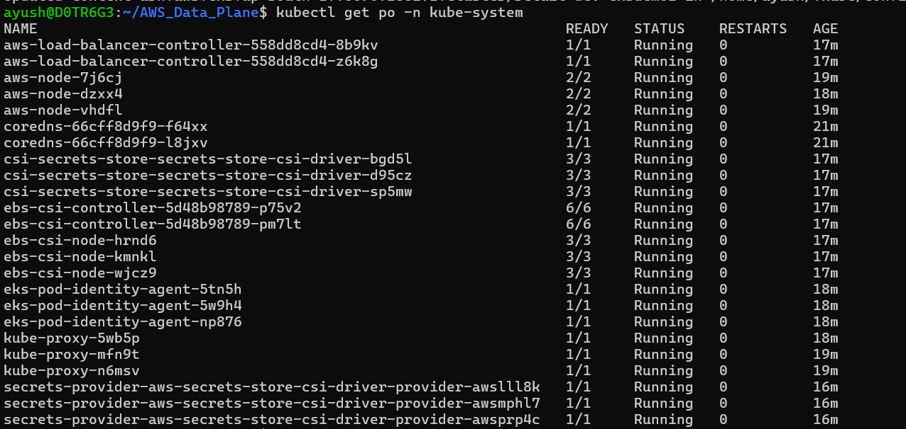

-  created  secret separately via console or via AWS CLI. because those will not be present in any of my IAC files infrastructure as code files.

    ```bash
    aws secretsmanager create-secret \
    --name retailstore-db-secret-1 \
    --region $AWS_REGION \
    --description "MySQL credentials for Catalog microservice" \
    --secret-string '{
        "username": "****",
        "password": "****"
    }'

    ```
    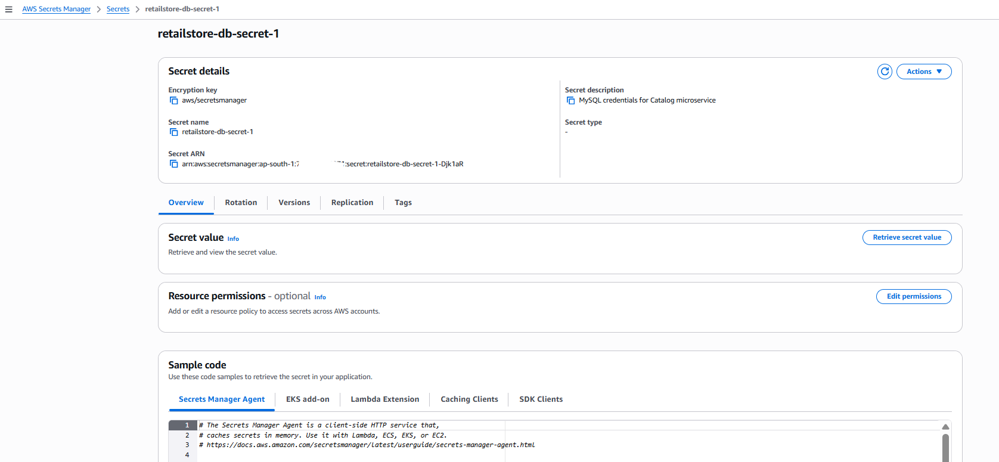


#### Now deployed AWS_Data_Plane

```bash
terraform init
terraform plan
terraform validate
terraform apply -auto-approve

```
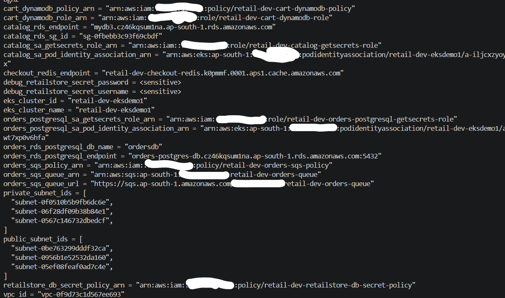
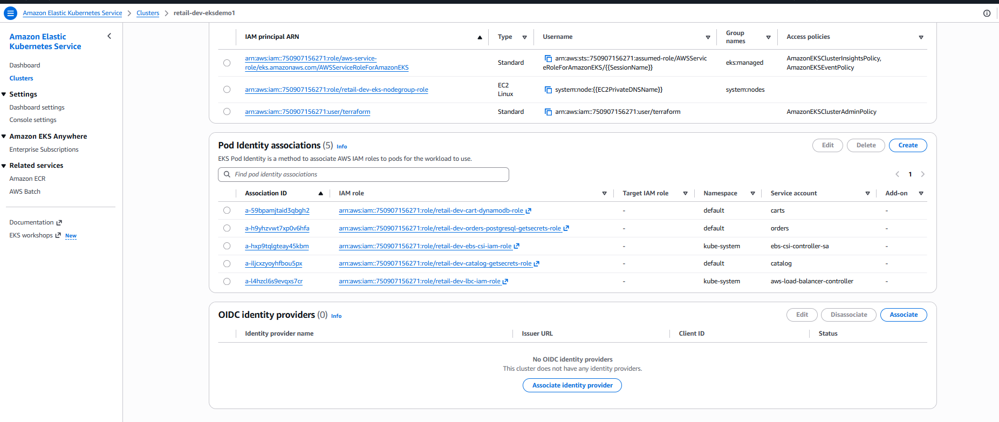
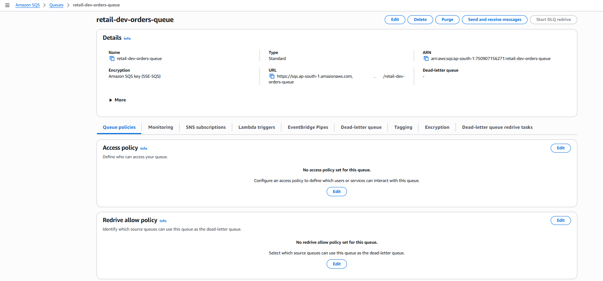
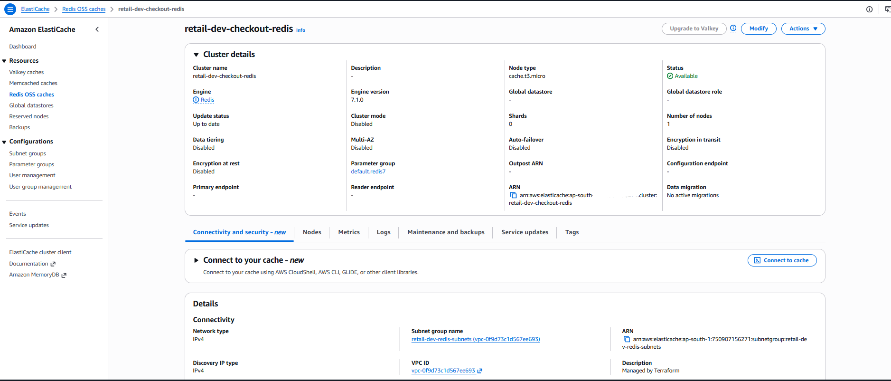
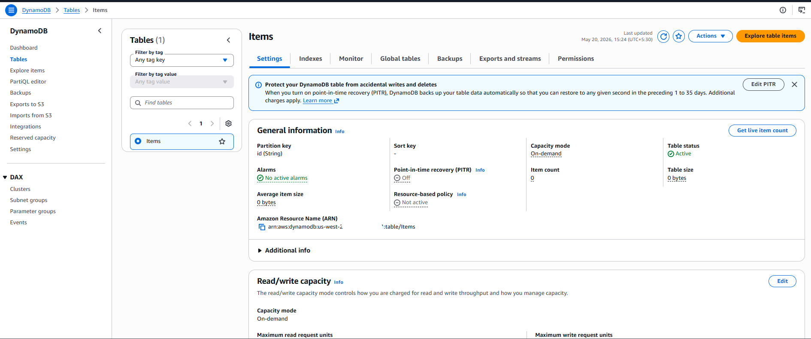
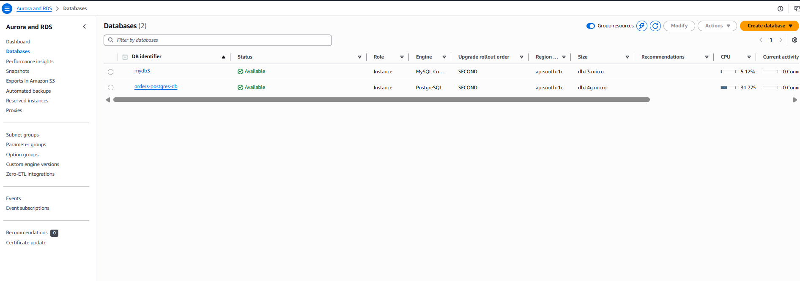


