# Deploy Retail Store Microservices with AWS Dataplane
## Step-01: Introduction
In this section, we will **connect all Retail Store microservices** — Catalog, Cart, Checkout, and Orders — to their equivalent **AWS Data Plane components**.

The goal is to replace local in-cluster databases with **fully managed AWS services** for a production-grade architecture.

| **Microservice** | **AWS Data Plane Service** | **Purpose** |
|------------------|----------------------------|--------------|
| **Catalog** | **Amazon RDS MySQL** | Stores product catalog data |
| **Cart** | **Amazon DynamoDB** | Manages user shopping cart data |
| **Checkout** | **Amazon ElastiCache (Redis)** | Caches shipping rates and checkout data |
| **Orders** | **Amazon RDS PostgreSQL + Amazon SQS** | Stores order data and handles order messaging events |

Each microservice will be configured to use its respective AWS service endpoint — either via **ConfigMap**, **ExternalName Service**, or **Secrets Store CSI** for credentials.


## Folder Structure

```
04_Microservices_with_AWS_Data_Plane/
├── README.md                                                      # Project overview and setup instructions
└── RetailStore_k8s_manifests_with_Data_Plane/
    │
    ├── 01_secretproviderclass/                                    # AWS Secrets Manager integration configs
    │   ├── 01_catalog_db_secretproviderclass.yaml                # Syncs catalog MySQL credentials from AWS Secrets Manager
    │   └── 02_orders_db_secretproviderclass.yaml                 # Syncs orders PostgreSQL credentials from AWS Secrets Manager
    │
    ├── 02_RetailStore_Microservices/                              # Core microservices deployments
    │   │
    │   ├── 01_catalog/                                            # Product catalog service (MySQL backend)
    │   │   ├── 01_catalog_service_account.yaml                   # ServiceAccount with EKS Pod Identity for AWS Secrets Manager access
    │   │   ├── 02_catalog_configmap.yaml                         # Database connection configs (host, port, db name)
    │   │   ├── 03_catalog_deployment.yaml                        # Deployment with CSI secrets mount for secret readiness
    │   │   ├── 04_catalog_clusterip_service.yaml                 # Internal service for catalog API (port 80)
    │   │   └── 05_catalog_mysql_externalname_service.yaml        # ExternalName service pointing to RDS MySQL endpoint
    │   │
    │   ├── 02_cart/                                               # Shopping cart service (DynamoDB backend)
    │   │   ├── 01_cart_service_account.yaml                      # ServiceAccount with EKS Pod Identity for DynamoDB access
    │   │   ├── 02_cart_configmap.yaml                            # DynamoDB table name and region configs
    │   │   ├── 03_cart_deployment.yaml                           # Stateless deployment for cart operations
    │   │   └── 04_cart_clusterip_service.yaml                    # Internal service for cart API
    │   │
    │   ├── 03_checkout/                                           # Checkout service (ElastiCache Redis backend)
    │   │   ├── 01_checkout_service_account.yaml                  # ServiceAccount with EKS Pod Identity for ElastiCache access
    │   │   ├── 02_checkout_configmap.yaml                        # Redis endpoint and configuration
    │   │   ├── 03_checkout_deployment.yaml                       # Handles order processing and payment workflows
    │   │   └── 04_checkout_clusterip_service.yaml                # Internal service for checkout API
    │   │
    │   ├── 04_orders/                                             # Order management service (PostgreSQL + SQS backend)
    │   │   ├── 01_orders_service_account.yaml                    # ServiceAccount with EKS Pod Identity for AWS Secrets Manager + SQS access
    │   │   ├── 02_orders_configmap.yaml                          # PostgreSQL connection and SQS queue configs
    │   │   ├── 03_orders_deployment.yaml                         # Deployment with CSI secrets mount + init container for secret readiness
    │   │   └── 04_orders_clusterip_service.yaml                  # Internal service for orders API
    │   │
    │   └── 05_ui/                                                 # Frontend web application
    │       ├── 01_ui_service_account.yaml                        # ServiceAccount for UI pods
    │       ├── 02_ui_configmap.yaml                              # Backend service endpoints configuration
    │       ├── 03_ui_deployment.yaml                             # Frontend deployment
    │       └── 04_ui_clusterip_service.yaml                      # Internal service for UI (exposed via Ingress)
    │
    ├── 03_ingress/                                                # External access configuration
    │   └── 01_ingress_http_ip_mode.yaml                          # AWS Load Balancer Controller Ingress (HTTP, IP mode for routing to UI)
    │
    ├── 04_Verification_Pods/                                      # Troubleshooting and debugging pods
    │   ├── 01_catalog_mysql_client_pod.yaml                      # MySQL client pod to test catalog database connectivity
    │   ├── 02_cart_dynamodb_awscli_pod.yaml                      # AWS CLI pod to test DynamoDB table access
    │   ├── 03_checkout_elasticache_redis_client_pod.yaml         # Redis CLI pod to test ElastiCache connectivity
    │   ├── 04_orders_postgresql_client_pod.yaml                  # PostgreSQL client pod to test orders database connectivity
    │   ├── 05_orders_sqs_awscli_pod.yaml                         # AWS CLI pod to test SQS queue access
    │   └── Verification-Pods.md                                   # Instructions for using verification pods
    │
    └── Verification-Pods.md                                       # Top-level verification guide

```

---

## 01_secretproviderclass

We already configured the **AWS Secrets Manager CSI Driver** and **Pod Identity Agent** in earlier steps.

Now, we’ll deploy the **SecretProviderClass** manifest that syncs secrets from AWS Secrets Manager into native Kubernetes secrets for **Orders** and **Catalog** microservices.

This allows the application pods to securely retrieve database credentials at runtime.

Run the below command to deploy the SecretProviderClass manifest:

```bash
# Folder Structure
01_secretproviderclass/
├── 01_catalog_db_secretproviderclass.yaml
└── 02_orders_db_secretproviderclass.yaml

# Change Directory 
cd RetailStore_k8s_manifests_with_Data_Plane

# Deploy
kubectl apply -f 01_secretproviderclass/
```

This manifest ensures that:

* The Secrets Store CSI driver fetches credentials from AWS Secrets Manager.
* They are automatically synced to a native Kubernetes Secret (`orders-db`, `catalog-db`).
* Pods mount these secrets directly as environment variables.
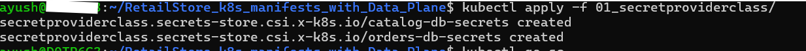

---

## Deploy UI and Ingress (Base Setup)

Before integrating backends, we’ll first deploy the **UI** and **Ingress** components.
This helps us verify the frontend accessibility via a Load Balancer before wiring up backend services.

### Files Used

```
02_RetailStore_Microservices/05_ui/
03_ingress/01_ingress_http_ip_mode.yaml
```

### Deploy Commands

```bash
# Deploy
kubectl apply -f 02_RetailStore_Microservices/05_ui/
kubectl apply -f 03_ingress/

# Access Application
http://ALB-DNS-NAME
http://ALB-DNS-NAME/topology
```
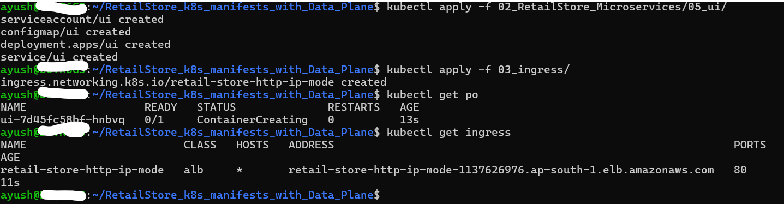
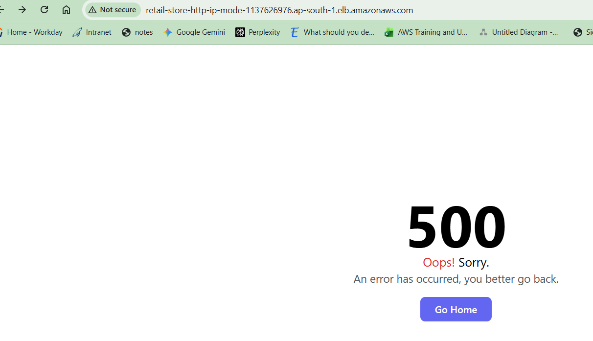
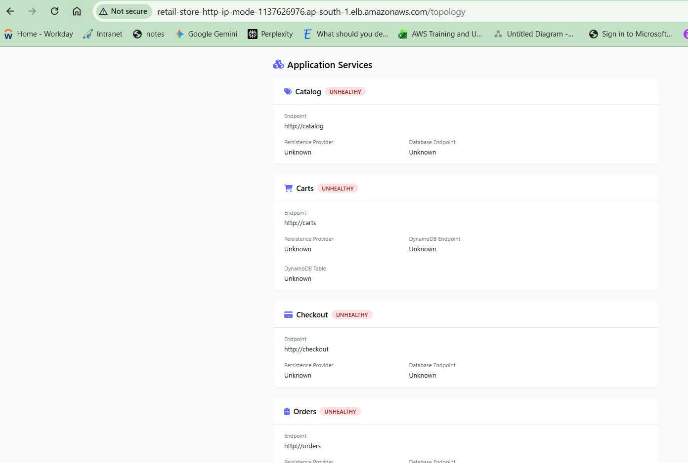

> The `/topology` endpoint displays internal microservice wiring — useful for verifying which services are up.

---

## Deploy Catalog → AWS RDS MySQL

### Files

```
# Folder Structure
02_RetailStore_Microservices/01_catalog/
  ├── 01_catalog_service_account.yaml
  ├── 02_catalog_configmap.yaml
  ├── 03_catalog_deployment.yaml
  ├── 04_catalog_clusterip_service.yaml
  └── 05_catalog_mysql_externalname_service.yaml
```

### Key Configuration

We’ll point the Catalog service to the **RDS MySQL endpoint** using an **ExternalName Service** (`05_catalog_mysql_externalname_service.yaml`).

This ExternalName service acts as a **DNS alias** inside the cluster, mapping to the RDS endpoint (e.g., `mydb3.cxojydmxwly6.us-east-1.rds.amazonaws.com`).

### Why ExternalName Service?

| **Option**               | **Pros**                                       | **Cons**                                      |
| ------------------------ | ---------------------------------------------- | --------------------------------------------- |
| **ExternalName Service** | Simple DNS alias; no code or ConfigMap changes | No control over env variable injection        |
| **ConfigMap update**     | Explicit control; endpoint visible in YAML     | Manual update required on DB endpoint changes |

Here, we use **ExternalName** for **Catalog** just to demonstrate the approach.
For **Orders → PostgreSQL**, we’ll use **ConfigMap** updates instead, so students see both options in action.

### Deploy Commands

```bash
# Deploy
kubectl apply -f 02_RetailStore_Microservices/01_catalog/

# Access Application
http://ALB-DNS-NAME
http://ALB-DNS-NAME/topology
```
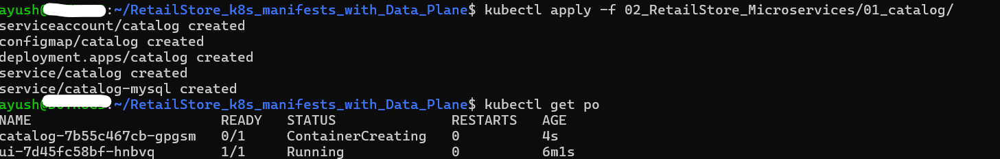
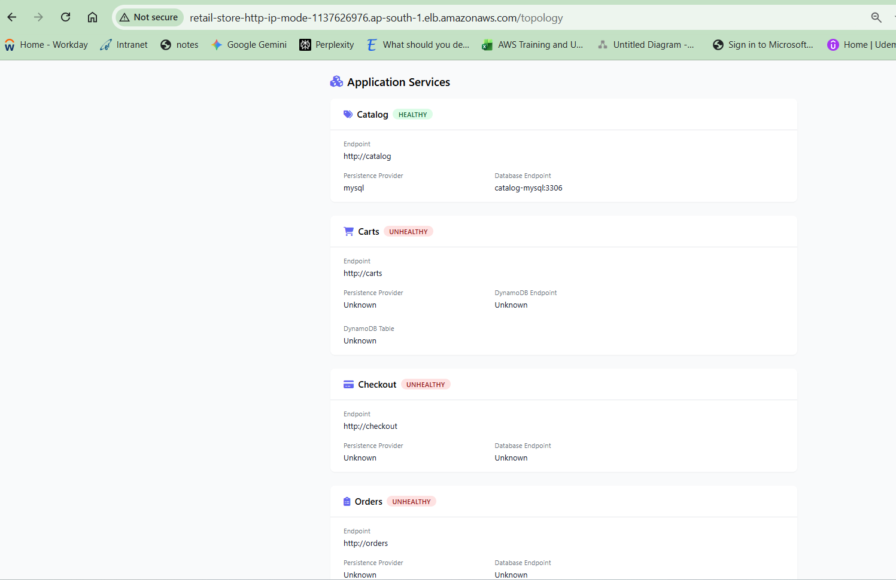


### Data Verification Catalog -> AWS RDS MySQL Database


```bash
# Step-01: Create Pod
kubectl apply -f 04_Verification_Pods/01_catalog_mysql_client_pod.yaml
kubectl get pods

# Step-02: Connect to Pod
kubectl exec -it catalog-mysql-client -- bash

# Step-03: Verify Environment Variables
env
env | grep MYSQL
echo $MYSQL_HOST   # It has port appended (catalog-mysql:3306)

# Step-04: Connect to MySQL DB
mysql -h $(echo $MYSQL_HOST | cut -d: -f1) -u $MYSQL_USER -p$MYSQL_PASSWORD 
# (or)
# Connect directly using explicit endpoint or extenralname service
mysql -h catalog-mysql -u $MYSQL_USER -p$MYSQL_PASSWORD 

# Step-05: Verify Data
SHOW DATABASES;
USE catalogdb;
SHOW TABLES;
SELECT * FROM products;
SELECT * FROM products LIMIT 5;
EXIT

# Step-06: exit pod
exit
```
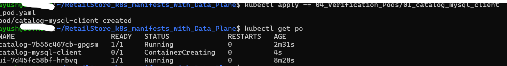
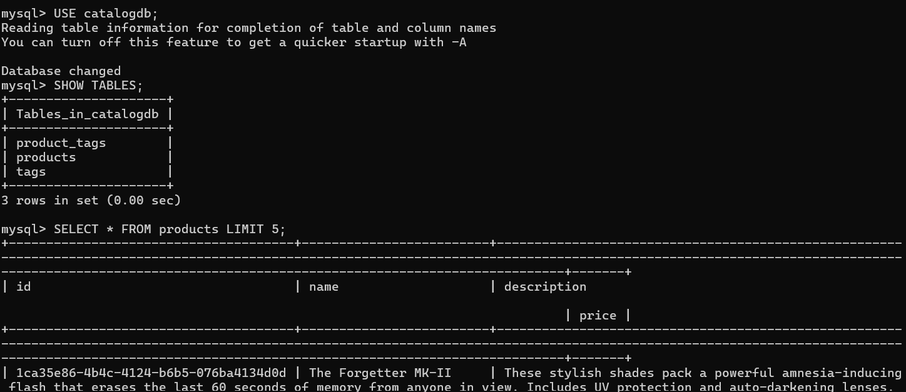


---

##  Deploy Cart → AWS DynamoDB

### Files

```
02_RetailStore_Microservices/02_cart/
  ├── 01_cart_service_account.yaml
  ├── 02_cart_configmap.yaml
  ├── 03_cart_deployment.yaml
  └── 04_cart_clusterip_service.yaml
```

The Cart microservice uses **Amazon DynamoDB** to persist shopping cart data.

We’ll update the **ConfigMap** to include:

* Real **AWS DynamoDB endpoint**
* Region (`us-west-2`)
* Table name and other parameters

### Deploy Commands

```bash
# Deploy
kubectl apply -f 02_RetailStore_Microservices/02_cart/

# Access Application
http://ALB-DNS-NAME
http://ALB-DNS-NAME/topology
```
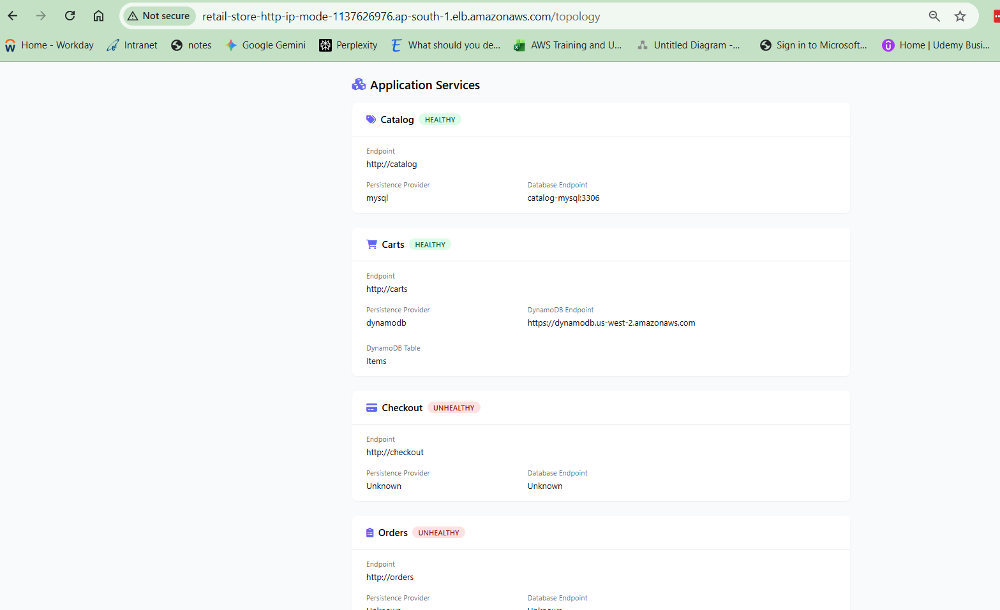
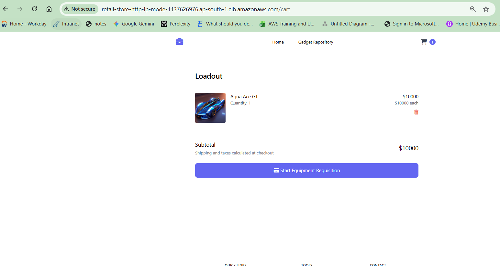
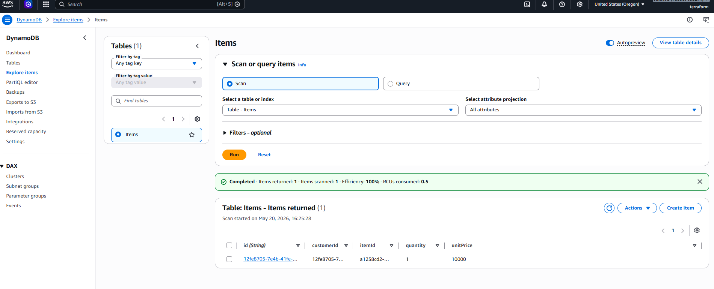
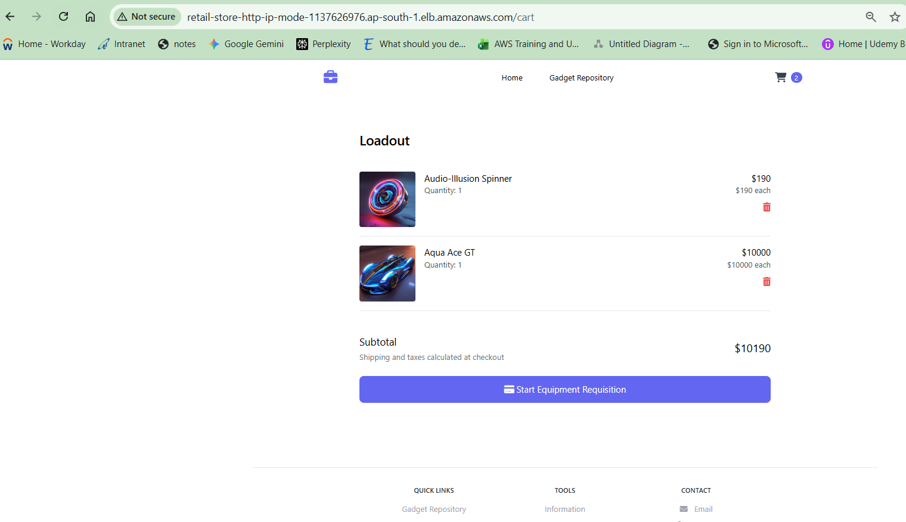
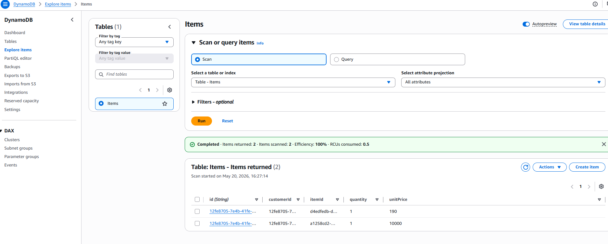
### Verification Carts -> AWS Dynamodb

Access the Retail Store UI → Add an item to cart → Confirm that “Add to Cart” works without backend error.

Run the DynamoDB verification pod:

```bash
# Deploy

```

```bash
# Step-01: Create Pod
kubectl apply -f 04_Verification_Pods/02_cart_dynamodb_awscli_pod.yaml
kubectl get pods

# Step-02: Connect to Pod
kubectl exec -it carts-dynamodb-client -- bash

# Step-03: Verify AWS Configuration
aws sts get-caller-identity
aws configure list
echo $AWS_REGION

# Step-04: List DynamoDB Tables
aws dynamodb list-tables --region $AWS_REGION

# Step-05: Describe the 'Items' Table
aws dynamodb describe-table \
  --table-name Items \
  --region $AWS_REGION \
  --output table

# Step-06: Scan the Table for All Items
aws dynamodb scan \
  --table-name Items \
  --region $AWS_REGION \
  --output table

# Step-07: Exit pod
exit
```
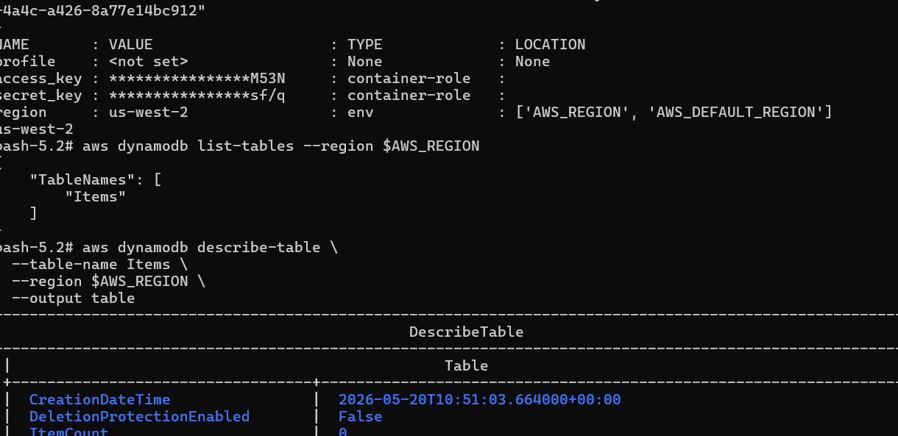

---

##  Deploy Checkout → AWS ElastiCache (Redis)

### Files

```
02_RetailStore_Microservices/03_checkout/
  ├── 01_checkout_service_account.yaml
  ├── 02_checkout_configmap.yaml
  ├── 03_checkout_deployment.yaml
  └── 04_checkout_clusterip_service.yaml
```

The **Checkout** microservice uses **AWS ElastiCache (Redis)** for caching shipping rates and order checkout sessions.

We’ll update the **ConfigMap** to include:

* The **Redis endpoint** from ElastiCache (primary node endpoint)
  Example:

  ```
  RETAIL_CHECKOUT_PERSISTENCE_REDIS_HOST: retail-dev-checkout-redis.lwndbu.0001.use1.cache.amazonaws.com
  RETAIL_CHECKOUT_PERSISTENCE_REDIS_PORT: "6379"
  ```

### Deploy Commands

```bash
# Deploy
kubectl apply -f 02_RetailStore_Microservices/03_checkout/

# Access Application
http://ALB-DNS-NAME
http://ALB-DNS-NAME/topology
```
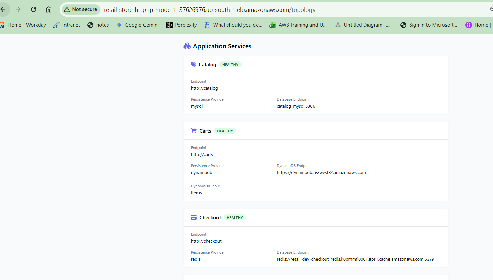
  


#### Verification :  Checkout -> AWS ElastiCache Redis
Access the Retail Store UI → Add products → Proceed to checkout → Verify shipping rates and delivery options load correctly.

Run Redis client pod to validate data persistence:
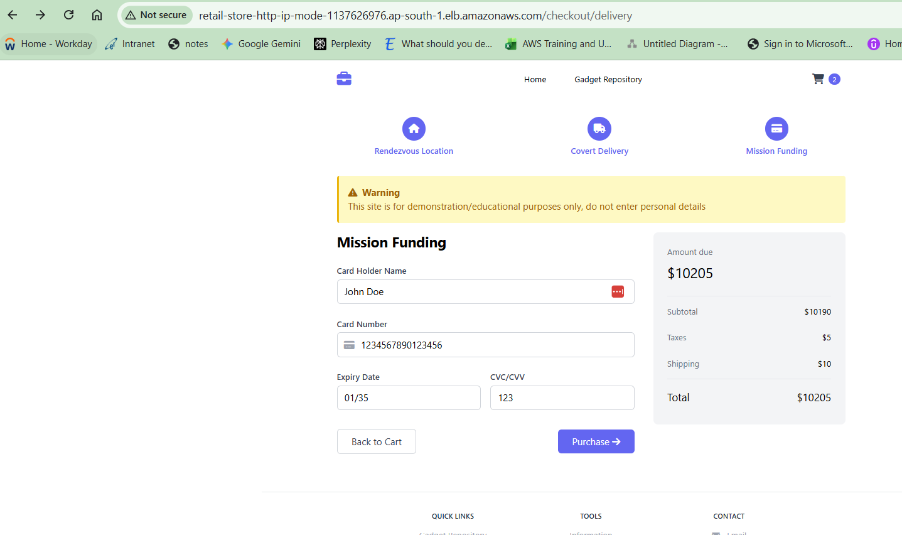
```bash
# Step-01: Create Pod
kubectl apply -f 04_Verification_Pods/03_checkout_elasticache_redis_client_pod.yaml
kubectl get pods

# Step-02: Connect to Pod
kubectl exec -it checkout-redis-client -- bash

# Step-03: Verify Environment Variables
env | grep REDIS
echo $REDIS_URL

# Step-04: Extract REDIS_HOST and REDIS_PORT
## Since redis-cli doesn’t accept URLs directly, extract host and port:
## Extract hostname and port from the REDIS_URL
REDIS_HOST=$(echo $REDIS_URL | sed -E 's#redis://([^:]+):([0-9]+)#\1#')
REDIS_PORT=$(echo $REDIS_URL | sed -E 's#redis://([^:]+):([0-9]+)#\2#')
echo $REDIS_HOST
echo $REDIS_PORT

# Step-05: Connect to AWS ElastiCache / Redis
redis-cli -h $REDIS_HOST -p $REDIS_PORT

# Step-06: Verify Data
## PING  → Test connectivity; returns PONG if Redis is reachable
PING

## DBSIZE → Shows total number of keys in the current database
DBSIZE

## KEYS * → Lists all keys (use only for quick checks, not on large datasets)
KEYS *

## GET <KEY> → Retrieves the value for a specific key (e.g., cached checkout data)
GET 

## SCAN 0 → Non-blocking iterator to explore keys in batches (safer than KEYS *)
SCAN 0

## QUIT → Exit redis-cli prompt
QUIT

# Step-07: exit pod
exit
```
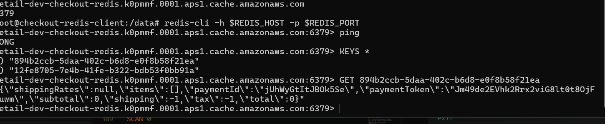


---

## Deploy Orders → AWS RDS PostgreSQL + SQS

### Files

```
02_RetailStore_Microservices/04_orders/
  ├── 01_orders_service_account.yaml
  ├── 02_orders_configmap.yaml
  ├── 03_orders_deployment.yaml
  └── 04_orders_clusterip_service.yaml
```

The **Orders** microservice connects to:

* **Amazon RDS PostgreSQL** for order data persistence
* **Amazon SQS** for order event messaging

### Configuration Highlights

**ConfigMap** (`02_orders_configmap.yaml`) includes:

```yaml
RETAIL_ORDERS_PERSISTENCE_PROVIDER: postgres
RETAIL_ORDERS_PERSISTENCE_ENDPOINT: orders-postgres-db.cxojydmxwly6.us-east-1.rds.amazonaws.com:5432
RETAIL_ORDERS_PERSISTENCE_NAME: ordersdb
RETAIL_ORDERS_MESSAGING_PROVIDER: sqs
RETAIL_ORDERS_MESSAGING_SQS_TOPIC: retail-dev-orders-queue
```

We are using **ConfigMap** here instead of **ExternalName**, to show variety and because the Orders microservice needs both RDS and SQS configuration keys in environment variables.

### Deploy Commands

```bash
# Deploy
kubectl apply -f 02_RetailStore_Microservices/04_orders/

# Access Application
http://ALB-DNS-NAME
http://ALB-DNS-NAME/topology
```
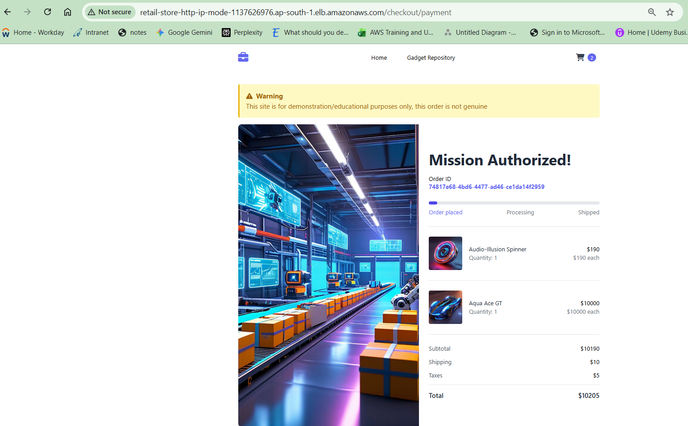
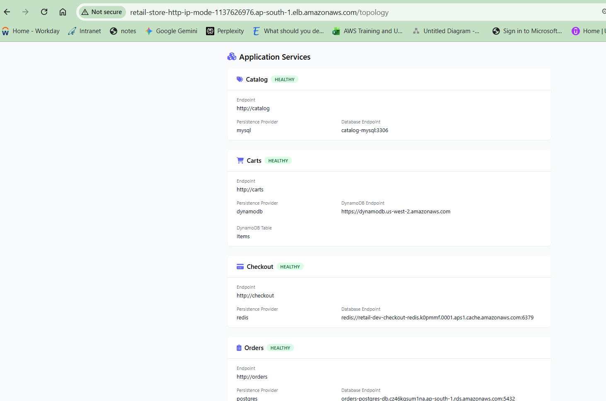


### Verification

####  Database Connectivity  : Orders -> AWS RDS PostgreSQL Database

Deploy PostgreSQL client pod and connect to RDS PostgreSQL:
```bash
# Step-01: Create Pod
kubectl apply -f 04_Verification_Pods/04_orders_postgresql_client_pod.yaml
kubectl get pods

# Step-02: Connect to Pod
kubectl exec -it orders-postgresql-client -- bash

# Step-03: Verify Environment Variables
env
env | grep PG
echo $PGHOST   # It has port appended (orders-postgres-db.cxojydmxwly6.us-east-1.rds.amazonaws.com:5432)

# Step-04: Connect to PostgreSQL DB
psql -h $(echo $PGHOST | cut -d: -f1) -p 5432 -U $PGUSER -d $PGDATABASE
# [or]
# Connect directly using explicit endpoint
psql -h orders-postgres-db.cxojydmxwly6.us-east-1.rds.amazonaws.com -p 5432 -U $PGUSER -d $PGDATABASE


## PostgreSQL Verification Commands for ordersdb (from inside the client pod)

# Step-05: List all databases
\l

# Step-06: Connect to ordersdb (if not already)
\c ordersdb

# Step-07: List all tables in public schema
\dt

# Step-08: Describe table structure (example: orders table)
\d orders

# Step-09: View first 10 records from orders table
SELECT * FROM orders LIMIT 10;

# Step-10: Check total row count in orders table
SELECT COUNT(*) FROM orders;

# Step-11: Exit from psql session
\q

# Step-12: exit pod
exit
```
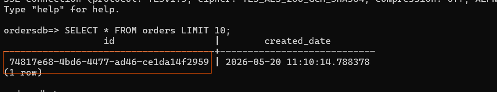
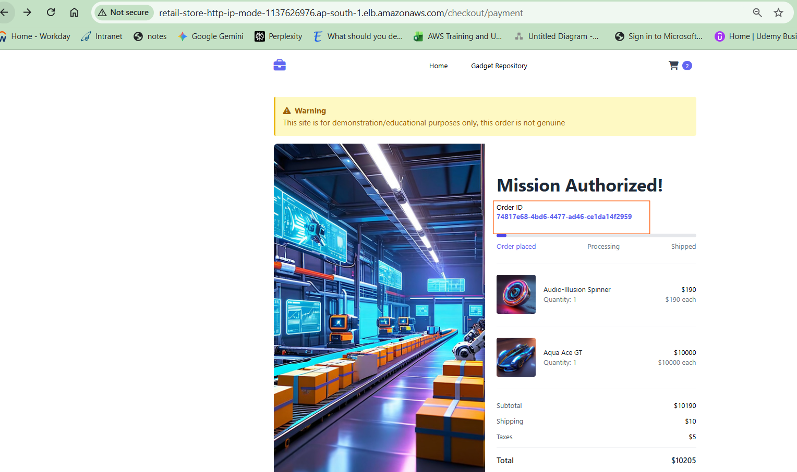


####  SQS Queue Validation
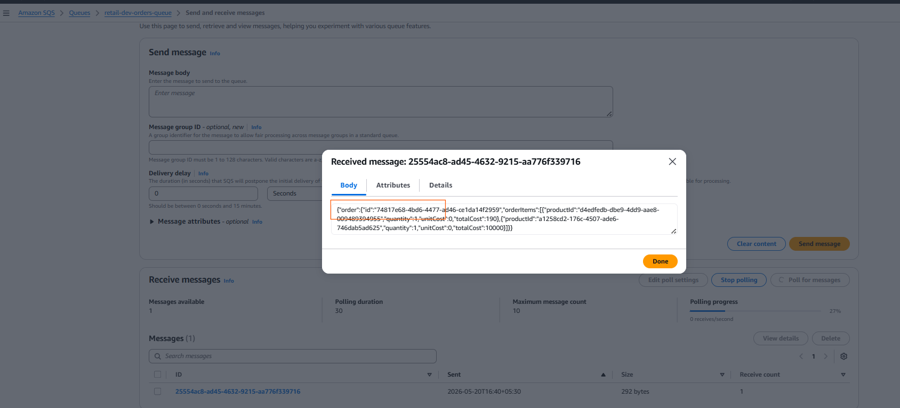


---

## Final End-to-End Verification

Now that all microservices are integrated with AWS data plane services, open the Ingress URL and walk through the complete user flow:

1. Access the Retail Store via Ingress URL.
2. Perform full flow:
   * Browse products (Catalog → MySQL)
   * Add items to cart (Cart → DynamoDB)
   * Checkout (Checkout → Redis)
   * Place Order (Orders → PostgreSQL + SQS)
3. Observe logs and confirm successful transactions across all backends.

If everything works, the app should now represent a **fully cloud-native architecture** using AWS managed services for persistence, caching, and messaging.

---

## Clean-up (Optional)

To remove all deployed Kubernetes resources:

```bash
# Delete Kubernetes Resources
kubectl delete -f 02_RetailStore_Microservices/04_orders/
kubectl delete -f 02_RetailStore_Microservices/03_checkout/
kubectl delete -f 02_RetailStore_Microservices/02_cart/
kubectl delete -f 02_RetailStore_Microservices/01_catalog/
kubectl delete -f 02_RetailStore_Microservices/05_ui/
kubectl delete -f 03_ingress/
kubectl delete -f 01_secretproviderclass/
```
>  Always destroy the AWS data plane resources after verifying the demo to avoid unwanted charges.

To remove AWS data plane resources (when demo is done):

---


