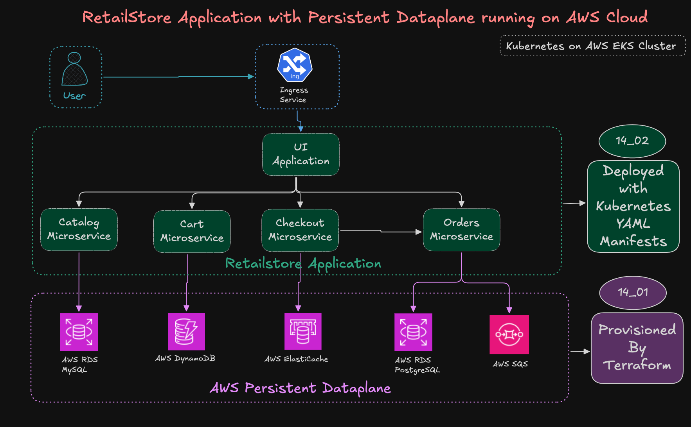

## Why Separate Persistent Dataplane?
```bash
Reason 1 — Separation of concerns:
App layer  → stateless (pods)
Data layer → stateful (AWS services)

Reason 2 — Independent scaling:
Scale app  → add more pods
Scale data → increase RDS instance

Reason 3 — Independent lifecycle:
Delete EKS cluster → data SAFE 
Upgrade K8s        → data SAFE 
Deploy new app     → data SAFE 

Reason 4 — Managed by AWS:
No manual DB administration
AWS handles:
    Backups
    Patching
    High availability
    Failover
    Encryption


```


