## Terraform
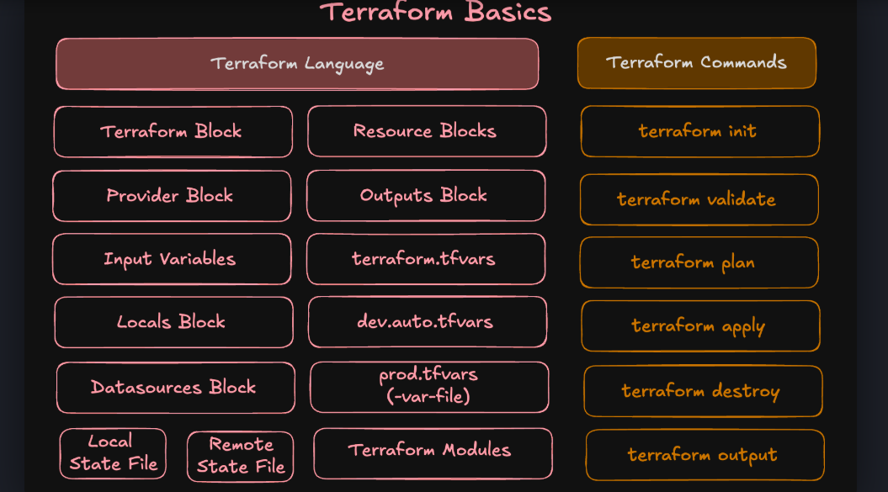
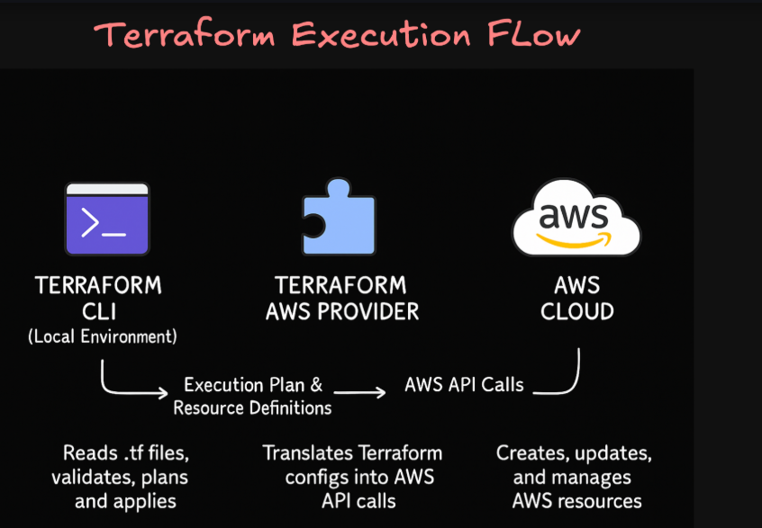


#### Terraform Command

```bash
# Initialize Terraform (downloads provider plugins)
terraform init

# Terraform configuration files to follow a canonical format and style
terraform fmt # Formats all .tf files in the current directory only.
terraform fmt -recursive # Formats files in the current directory and all subdirectories.

`-check`	# Checks if files are already formatted without modifying them. Returns a non-zero exit code if changes are needed, making it ideal for CI/CD pipelines.

# Validate configuration
terraform validate

# See execution plan
terraform plan

# Create resources
terraform apply -auto-approve

# show output
terraform show

# save plan as a file
terraform plan -out=planfile

aws s3 ls | grep devopsdemo

# Destroy resources
terraform destroy -auto-approve

```

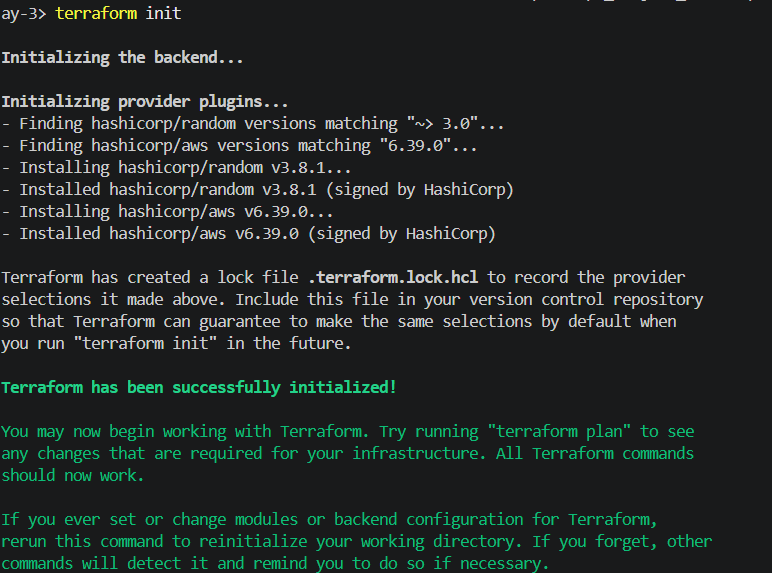

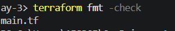
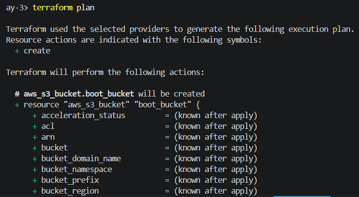
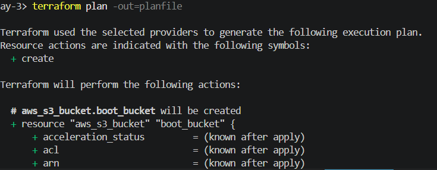
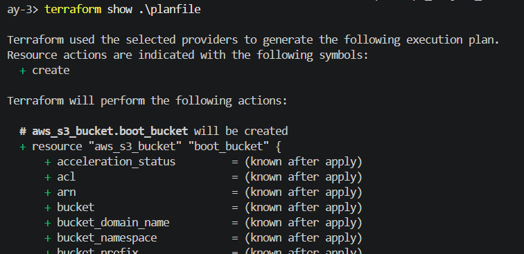
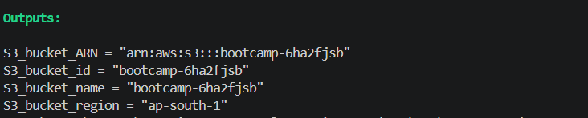
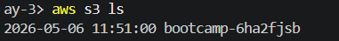
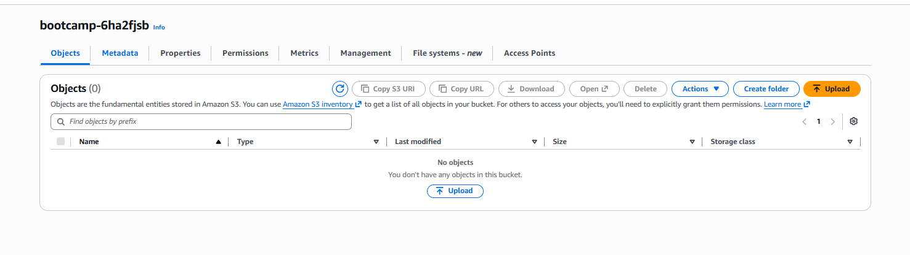
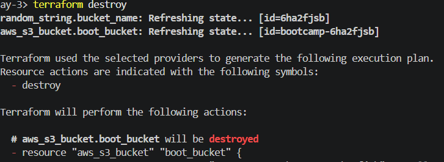


####  variables, loops, Functions, Datasources

| Comparison          | Key Difference                                           |
| ------------------- | -------------------------------------------------------- |
| `list` vs `set`     | List is ordered, set is unordered                        |
| `list` vs `tuple`   | List = same type, tuple = mixed types                    |
| `map` vs `object`   | Map = dynamic keys, object = fixed schema                |
| `set` vs `list`     | Set removes duplicates                                   |
| `object` vs `tuple` | Object uses named attributes, tuple uses index positions |


| Data Type | Common Usage              |
| --------- | ------------------------- |
| `string`  | names, regions            |
| `number`  | instance count, disk size |
| `bool`    | feature enable/disable    |
| `list`    | subnet IDs, SG IDs        |
| `set`     | unique AZs                |
| `map`     | tags                      |
| `object`  | structured module configs |
| `tuple`   | fixed mixed values        |
| `any`     | reusable generic modules  |
| `null`    | optional arguments        |

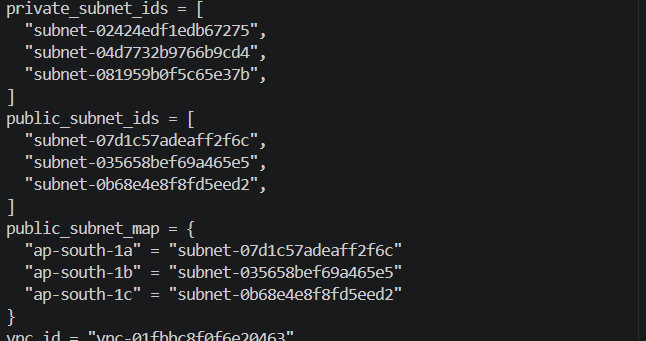
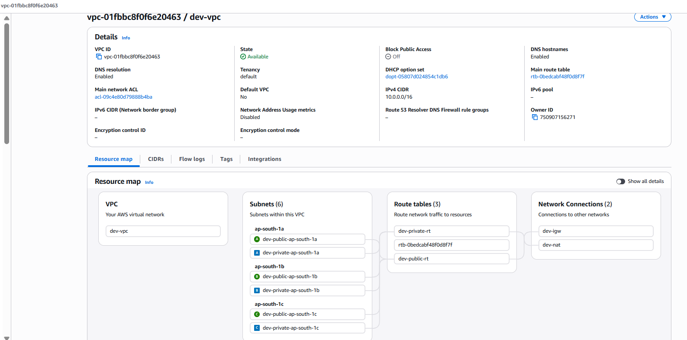


#### Terraform State 

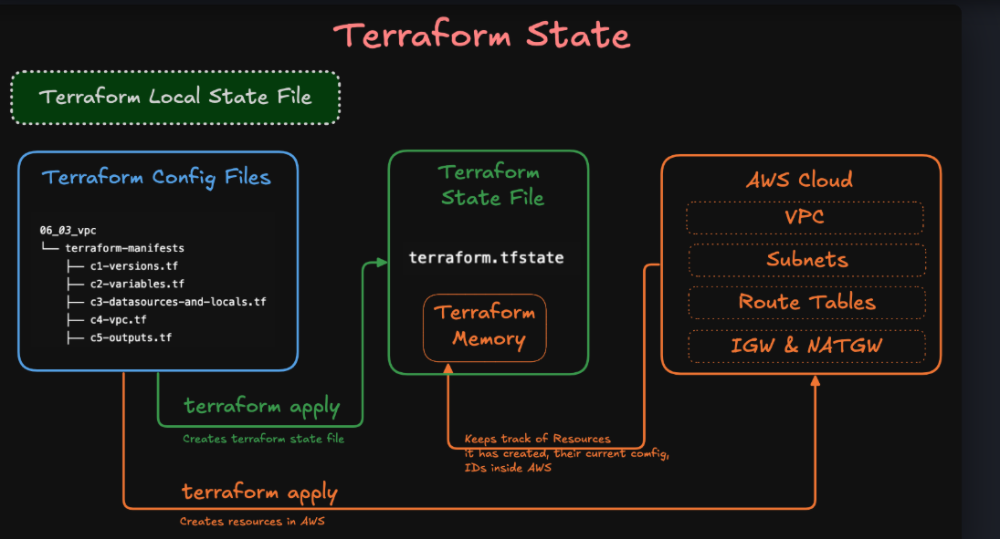
```bash
terraform state list # view which resources are currently being tracked 
terraform show # Terraform state in a human-readable
```


#### Terraform Precedence
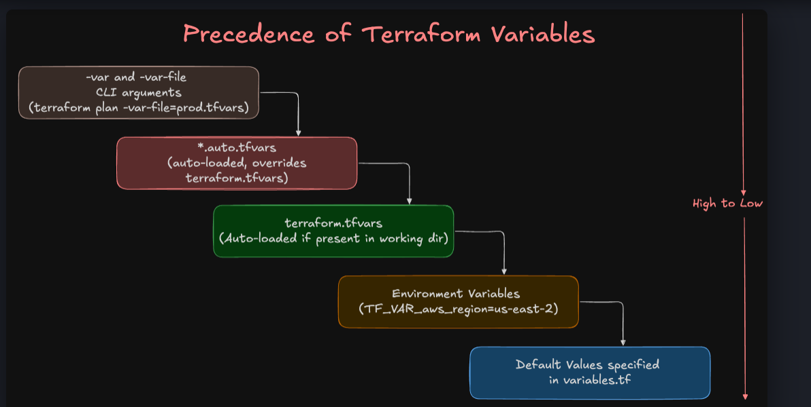