## Remote backend
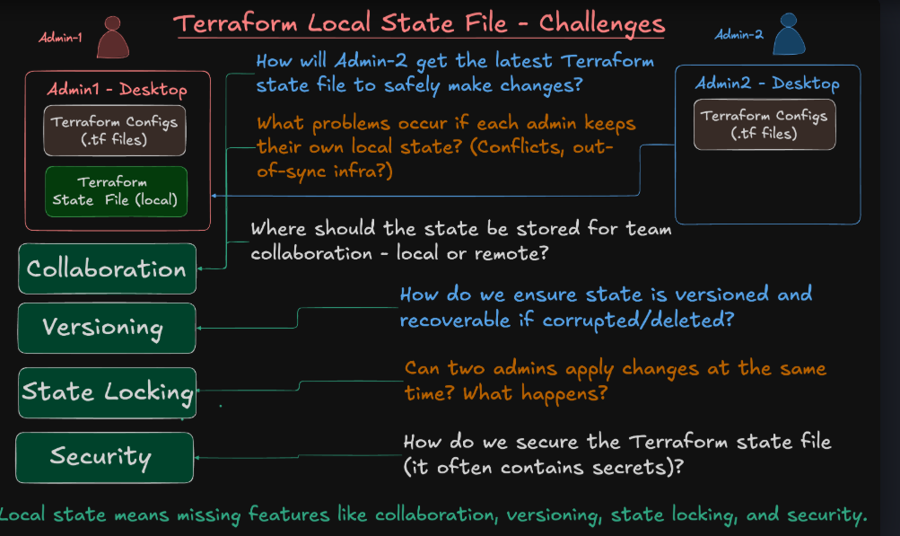
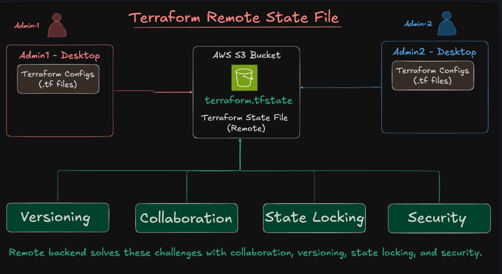

#### Create S3 Bucket for Remote Backend using terraform

- Use default_tags in Provider (Instead of repeating tags in every resource, define them once in the provider)
```bash
provider "aws" {
  region = "ap-south-1"

  default_tags {
    tags = {
      Terraform   = "true"
      Environment = "production"
      Project     = "my-app"
      Owner       = "devops-team"
    }
  }
}cd 

```
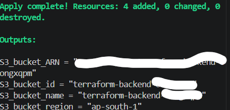
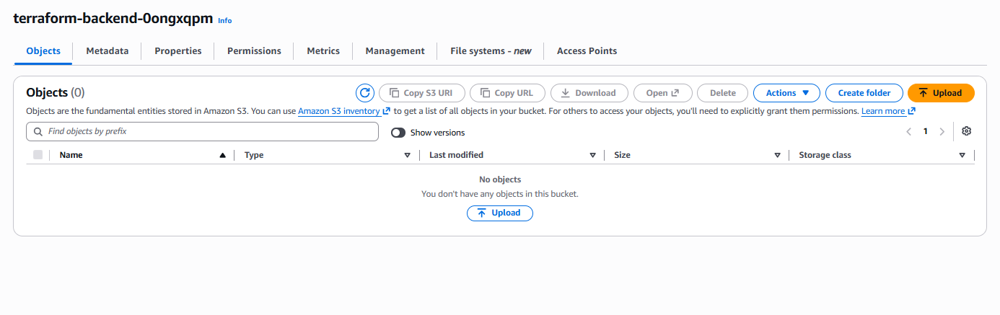


#### Terraform Remote Backend with S3 Bucket to creat vpc

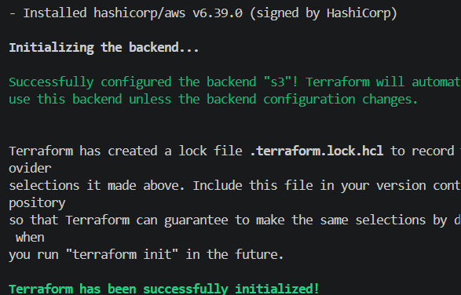
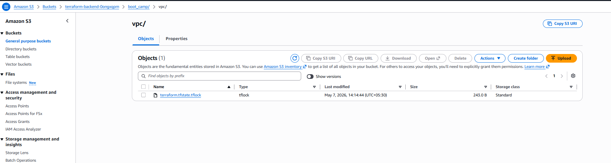
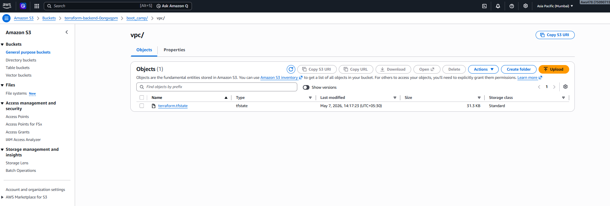
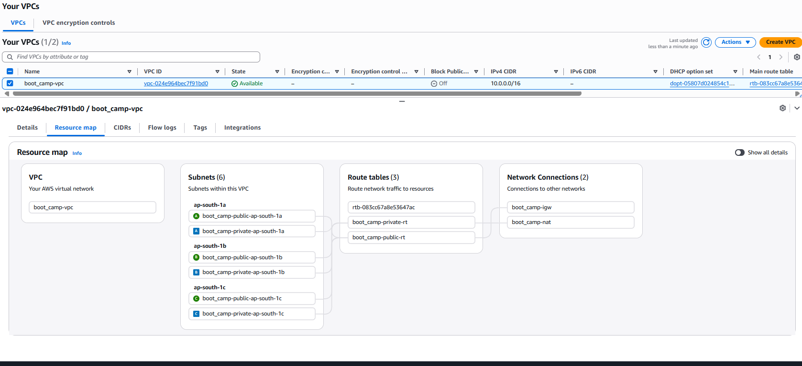

- again running terraform apply 
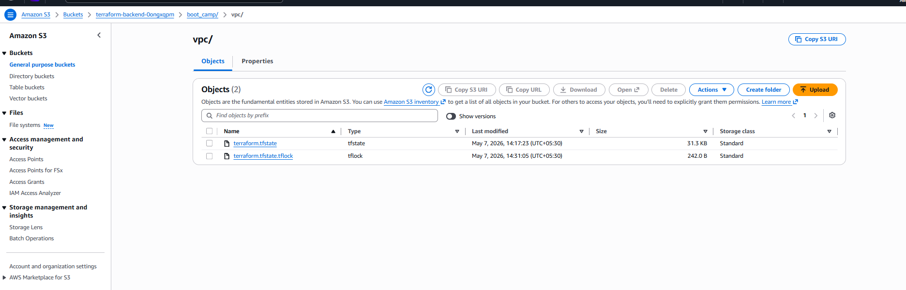
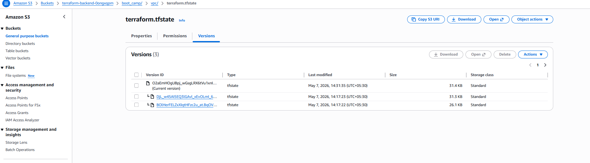


#### Terraform Modules

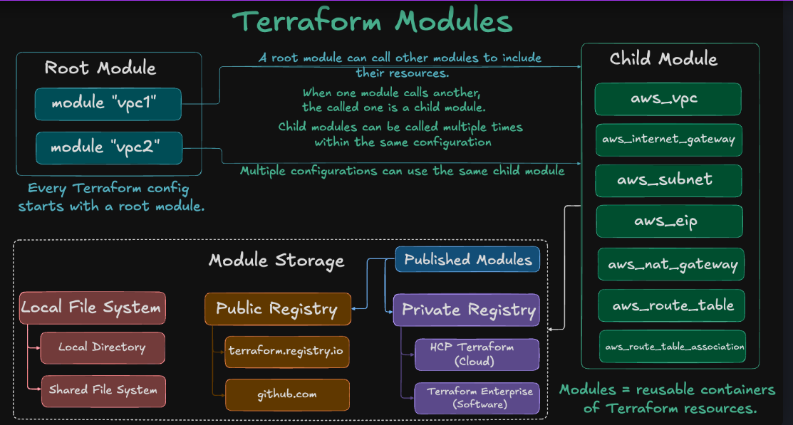
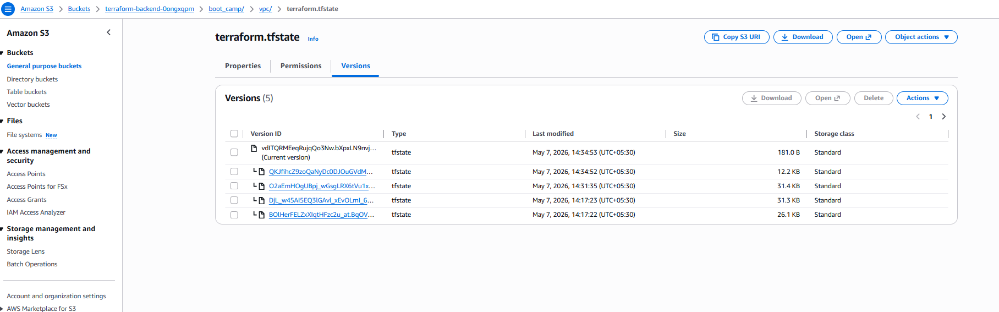


- created vpc using module

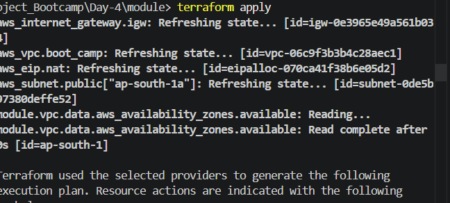

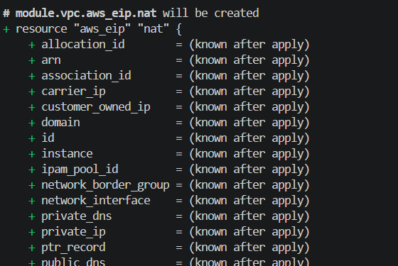


