## Kubernetes
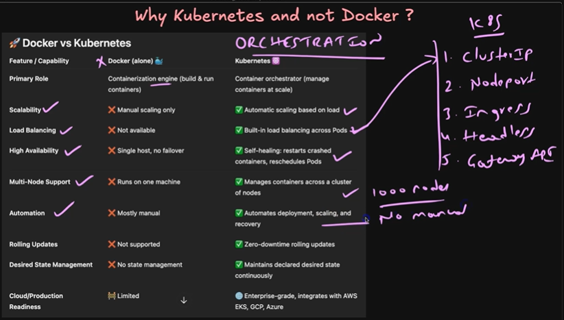
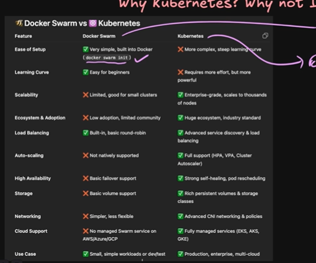
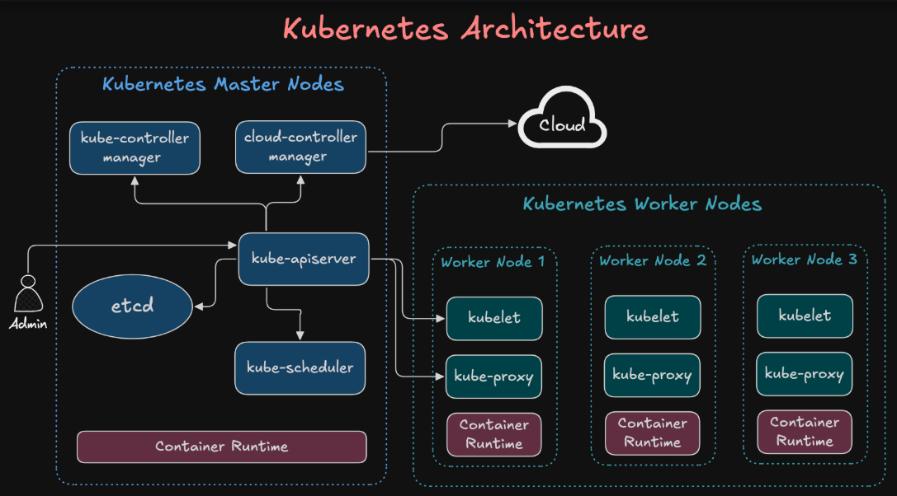


```bash
etcd - Distributed key-value database that stores all Kubernetes cluster state and configuration information.

kube-apiserver - Main entry point of the Kubernetes control plane that handles all API requests and cluster communication.

kube-controller-manager - Runs controllers that continuously monitor and maintain the desired state of cluster resources.

cloud-controller-manager - Integrates Kubernetes with cloud provider services like load balancers, storage, and node management.

kube-scheduler - Selects the most suitable worker node for newly created pods based on resource availability and constraints.

container-runtime  - Software responsible for pulling container images and running containers on nodes (e.g., containerd, CRI-O).

kubelet - Agent running on each worker node that communicates with the API server and ensures containers are running properly.

kube-proxy - Network component that manages pod communication and routes traffic to services across the cluster.

```

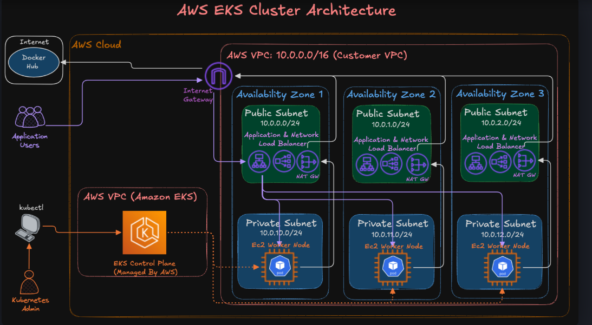
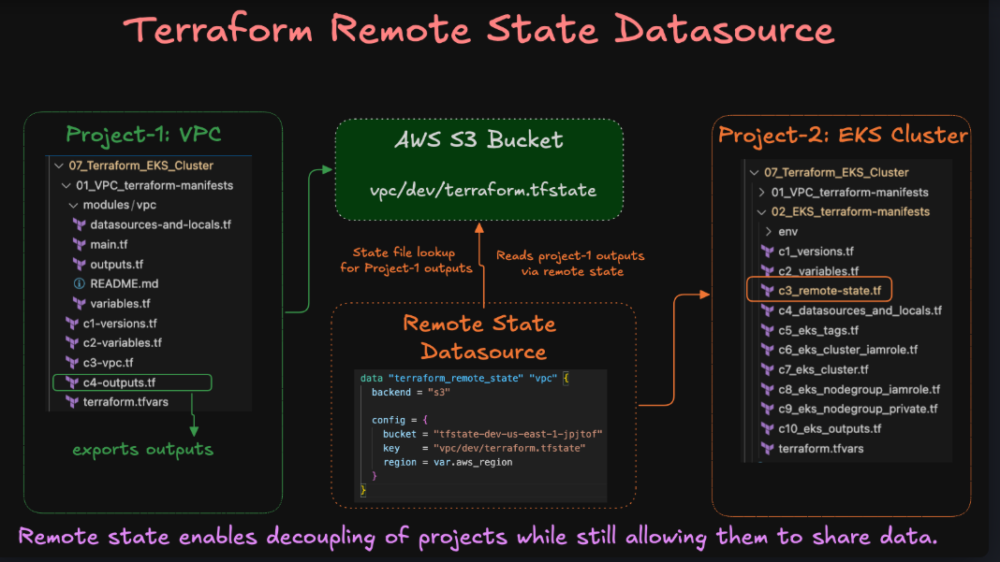


- created EKs cluster using terraform
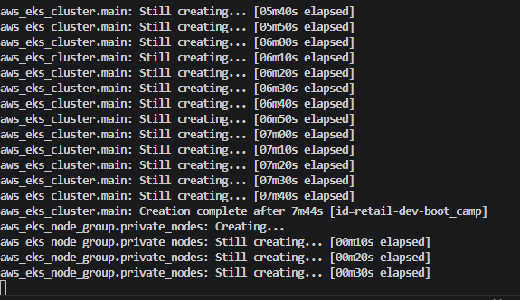
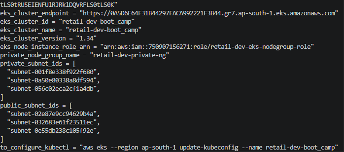
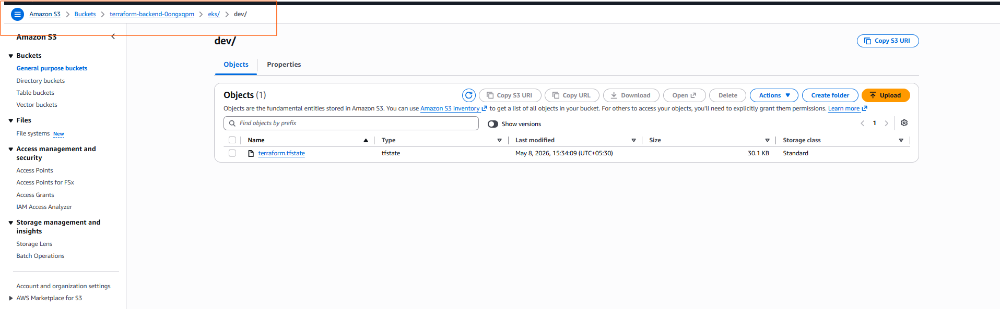
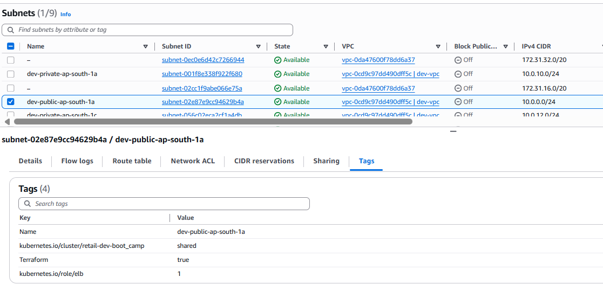
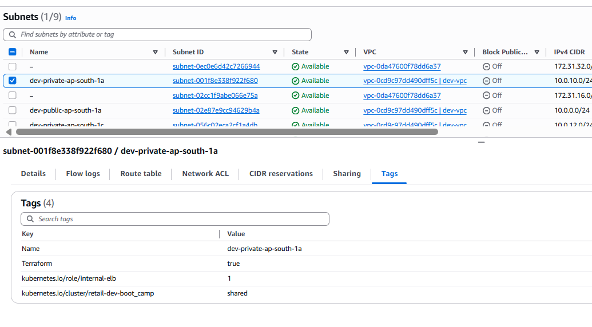
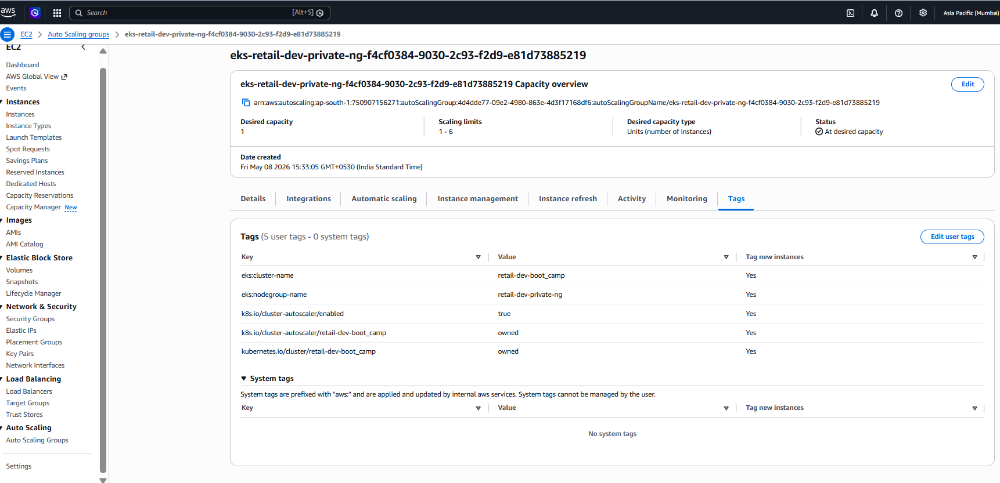
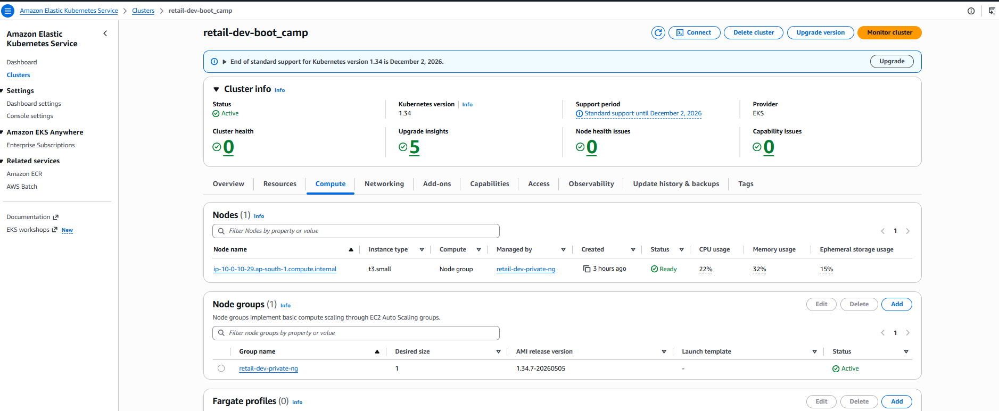

