## Kubernetes Pods

- `Pods `are the smallest deployable unit in Kubernetes.
- Each Pod wraps one or more containers that share:
  - Network (same IP)
  - Storage (shared volumes)
  - Lifecycle (scheduled together)

- `Liveness Probe (livenessProbe):` Checks if the application is "alive." It restarts deadlocked or crashed containers.

- `Readiness Probe (readinessProbe):` Checks if the application is "ready" to serve requests. It prevents traffic from going to a pod that is initializing, overloading, or waiting on dependencies


- `Requests (Guaranteed Minimum):` Kubernetes guarantees this amount of CPU or memory for the container. If a node has enough free requested resources, the pod will be scheduled there.

- `Limits (Maximum Allowed):` The maximum amount of resource a container can consume. If a container exceeds its memory limit, it may be OOM (Out Of Memory) killed. If it exceeds its CPU limit, it will be throttled.

- `Init Container` A special container that runs before your main application container starts. It must complete successfully before the main app launches.


- commands

```bash
kubectl apply -f catalog_pod.yaml # deploy pod.yaml file
kubectl get pods
kubectl describe pod catalog-pod # describe the pod 
# Including:image, ports, state, events, mounts, restart count 
kubectl logs --previous mypod -c nginx # Previous crashed container logs
kubectl logs -f catalog-pod
# if run two container inside the pod then we need to specify container name
kubectl logs -f catalog-pod -c container name
# Expose the Pod locally using:
kubectl port-forward pod/catalog-pod 7080:8080
kubectl exec -it catalog-pod  -- sh # Connect Inside the Pod
kubectl exec -it catalog-pod -c container name  -- sh # to connect specific container inside the pod
kubectl delete pod catalog-pod # delete the pod
```
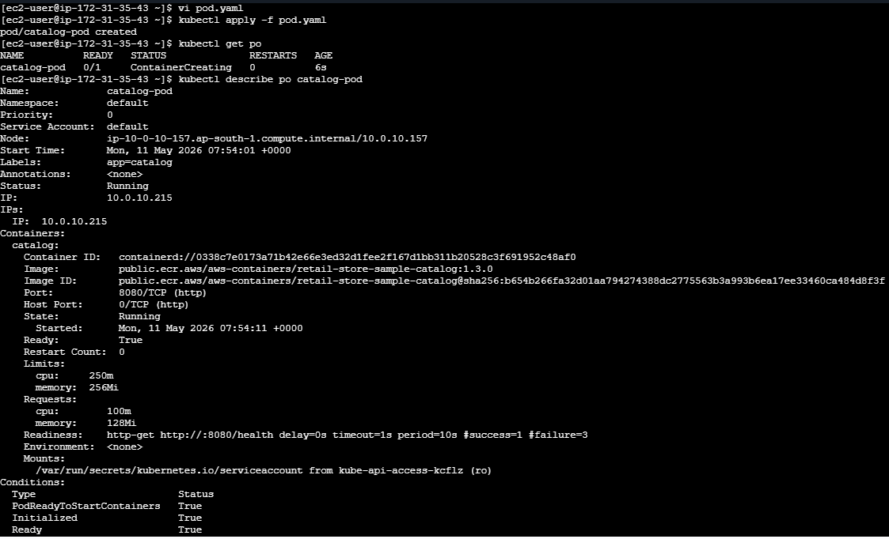
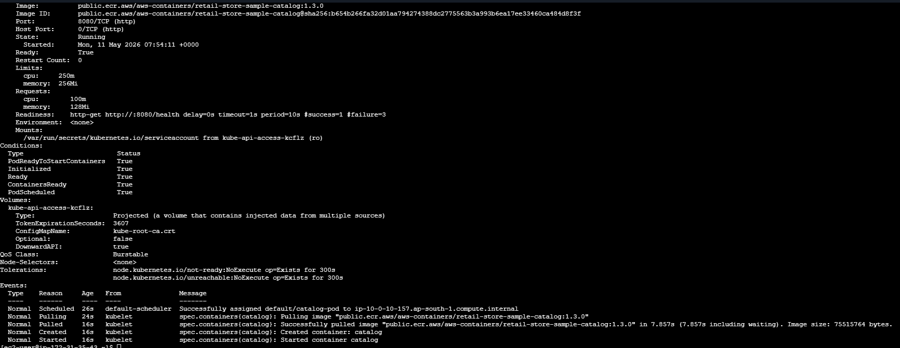
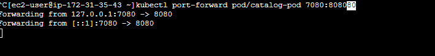
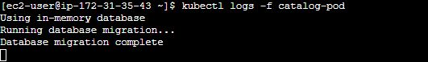
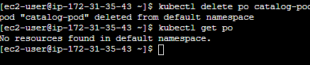


## Kubernetes Deployments
- self healing
- rolling updates
- rollout


- `Deployment` - A Kubernetes API object that declaratively manages the lifecycle of a ReplicaSet and its Pods — defining the desired state (image, replicas, update strategy) and continuously reconciling actual state to match it. Supports RollingUpdate and Recreate strategies for zero-downtime deployments and one-command rollbacks.

- `ReplicaSet` - A Kubernetes controller that ensures a specified number of identical Pod replicas are running at any given time using a label selector. It continuously watches the cluster and creates or deletes Pods to match the desired replica count. Rarely created directly — owned and managed by a Deployment.

- `Service` - A Kubernetes API object that provides a stable virtual IP (ClusterIP), DNS name, and port mapping to a dynamic set of Pods matched by a label selector. Abstracts away individual Pod IPs (which change on restart) and performs load balancing across all healthy matching Pods. Supports four types — ClusterIP, NodePort, LoadBalancer, and ExternalName.
---

#### Deployment Strategies

- RollingUpdate (Default) 
   ```bash
     strategy:
      type: RollingUpdate
      rollingUpdate:
       maxSurge: 1
       maxUnavailable: 0
     # Zero downtime
     # Gradual rollout
     # Easy rollback
     # Two versions run simultaneously (brief period)
     # maxUnavailable: 0 = "Kubernetes is not allowed to remove even ONE old pod until a new pod is fully ready and healthy" 
     # maxSurge: 1 means "Allow 1 EXTRA pod above desired count during update" pod before removing any old pod
   ```

- Recreate 

    ```bash
      strategy:
        type: Recreate
       # Has downtime (all pods killed first, then new ones created)
       # Only one version runs at a time
       # Simpler
       # Use only when two versions CANNOT run together

    ```

  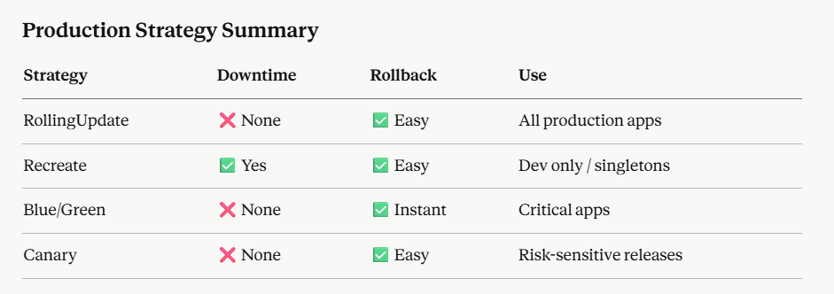    

---
#### Security Context Highlights

| Setting                        | Description                                                 |
| ------------------------------ | ----------------------------------------------------------- |
| `runAsNonRoot: true`           | Runs container as non-root user                             |
| `readOnlyRootFilesystem: true` | Prevents writes to filesystem                               |
| `capabilities.drop: [ALL]`     | Removes unnecessary Linux capabilities                      |
| `fsGroup: 1000`                | Ensures shared volume files are accessible to non-root user |

---

#### Deploy the Catalog Microservice

```bash
kubectl apply -f 01_catalog_deployment.yaml
```

---

#### Verify Deployment, ReplicaSet, and Pod

```bash
kubectl get deployment
kubectl get replicaset
kubectl get pods -o wide
```

Check rollout status:

```bash
kubectl rollout status deployment/catalog
```

Describe the Pod to view probes and security context:

```bash
kubectl describe pod <pod-name>
```
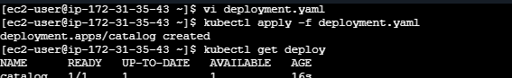
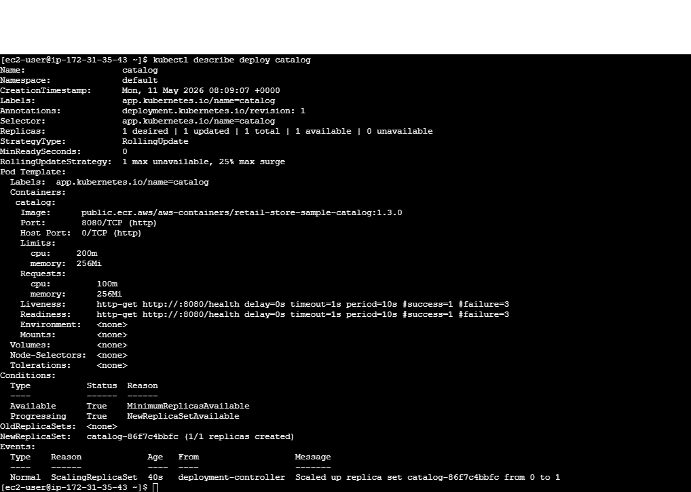
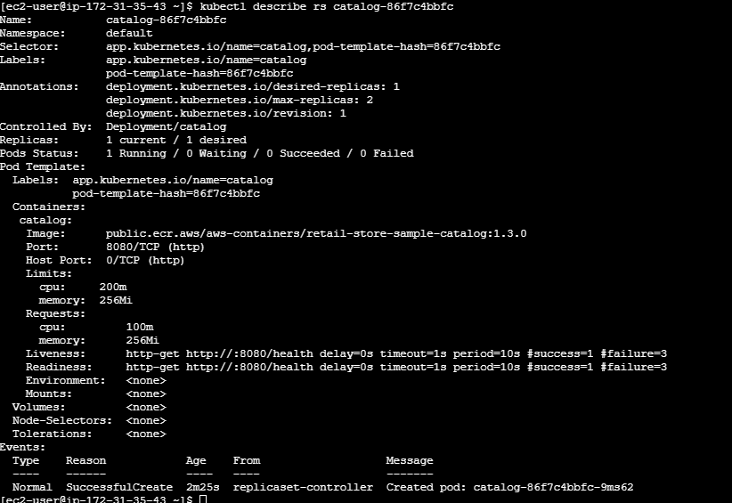
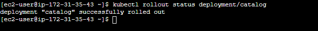
---

####  Access the Application via Port Forwarding
```
# Expose the Pod locally using:
kubectl port-forward deploy/catalog 7080:8080

# Topology Endpoint
http://localhost:7080/topology

# Health Endpoint
http://localhost:7080/health

# Catalog - Get Products
http://localhost:7080/catalog/products

# Catalog - Get Products By ID
http://localhost:7080/catalog/products/d77f9ae6-e9a8-4a3e-86bd-b72af75cbc49

# Catalog - Get Size
http://localhost:7080/catalog/size

# Catalog - Get Tags
http://localhost:7080/catalog/tags
```

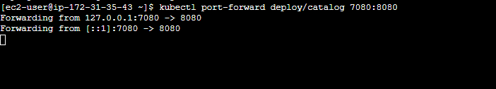

---

#### Scaling the Deployment

##### Scale Up (1 → 3 replicas)

```bash
kubectl scale deployment catalog --replicas=3
```

Check:

```bash
kubectl get pods -o wide
```

You should now see **3 running Pods**.

##### Scale Down (3 → 1 replica)

```bash
kubectl scale deployment catalog --replicas=1
```

Check again:

```bash
kubectl get pods
```

Kubernetes terminates extra Pods gracefully.

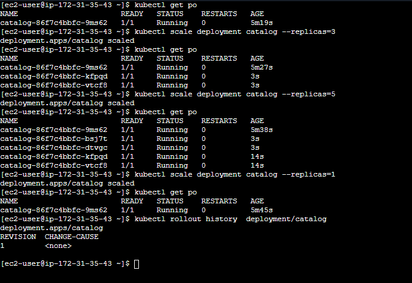
---

#### Rolling Update (Upgrade App Version)

##### Scale Up (1 → 3 replicas)
We’ll now simulate a **version upgrade** from `1.3.0` to `1.1.0`.

```bash
kubectl scale deployment catalog --replicas=3
```

##### Update the Deployment image

```bash
# List Deployment Revisions
kubectl rollout history deployment/catalog

# Update the Deployment
kubectl set image deployment/catalog catalog=public.ecr.aws/aws-containers/retail-store-sample-catalog:1.1.0

# List Deployment Revisions
kubectl rollout history deployment/catalog
```

Verify rollout status:

```bash
kubectl rollout status deployment/catalog
```

You’ll see Pods being updated **one by one** (rolling update).

Confirm new version:

```bash
kubectl get pods -o wide
kubectl describe pod <pod-name> | grep Image
```
---
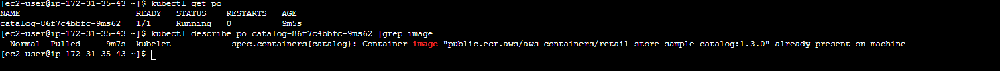
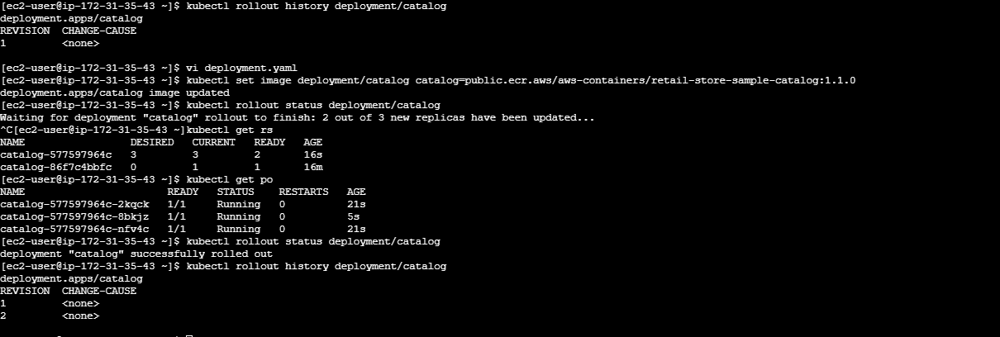


#### Rollback to Previous Version (1.3.0)

If something goes wrong, roll back easily:

```bash
# Rollback to previous version
kubectl rollout undo deployment/catalog

# List Deployment Revisions
kubectl rollout history deployment/catalog
```

or rollback to a specific revision:

```bash
# List Deployment Revisions
kubectl rollout history deployment/catalog

# rollback to a specific revision
kubectl rollout undo deployment/catalog --to-revision=<X>

# List Deployment Revisions
kubectl rollout history deployment/catalog
```

Check the version after rollback:

```bash
kubectl describe deployment catalog | grep Image
```
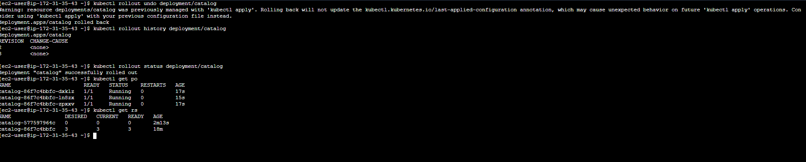
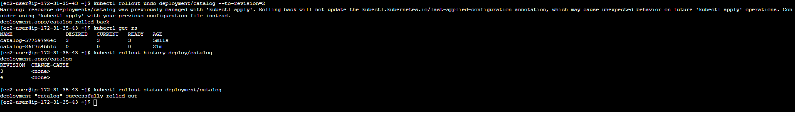
---

#### Cleanup

```bash
kubectl delete deployment catalog
```
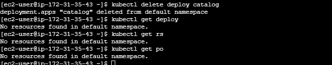
---


| Feature              | Description                                           |
| -------------------- | ----------------------------------------------------- |
| **Deployment**       | Manages Pods & ensures desired state                  |
| **ReplicaSet**       | Keeps specified number of Pods running                |
| **Rolling Update**   | Gradual version upgrade with zero downtime            |
| **Rollback**         | Instantly revert to previous working version          |
| **Scaling**          | Scale Pods up/down using a single command             |
| **Probes**           | Keep Pods healthy & automatically restarted if needed |
| **Security Context** | Enforces least privilege and non-root execution       |

---


## Kubernetes Service

- commands
```bash
kubectl apply -f catalog_clusterip_service.yaml
kubectl get svc
kubectl describe svc catalog-service
kubectl run test --image=curlimages/curl -it --rm -- sh
curl http://catalog-service:8080/topology
curl http://catalog-service:8080/catalog/products

```

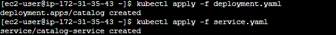
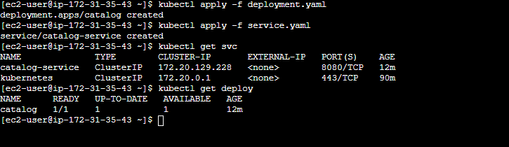
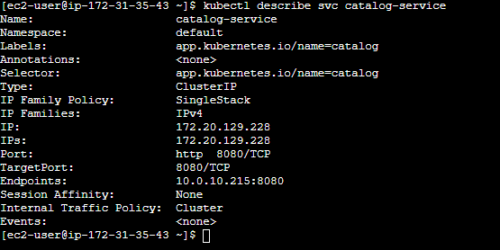

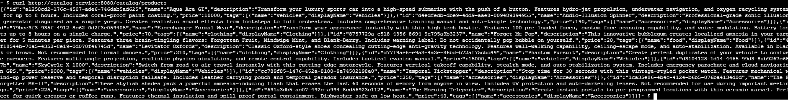


```bash
# Delete k8s Resources
kubectl delete svc catalog-service
kubectl delete deploy catalog

### OR ###

# Delete using YAML files
kubectl delete -f catalog_k8s_manifests

```

## Kubernetes ConfigMap

- `ConfigMap` is a Kubernetes object used to store and manage non-sensitive configuration data separately from container images, allowing applications to consume configuration dynamically through environment variables or mounted files.


- commands

```bash
kubectl apply -f configmap


```
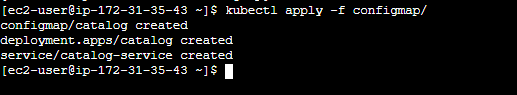
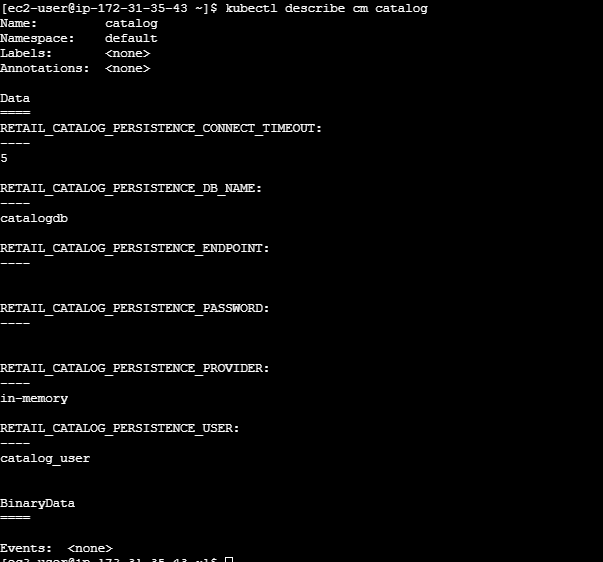
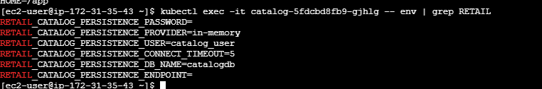
