## Kubernetes StatefulSets

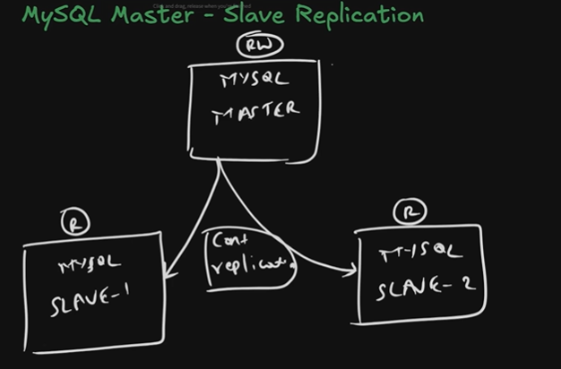
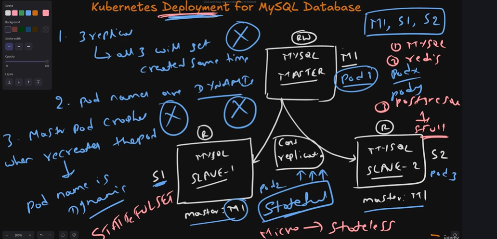
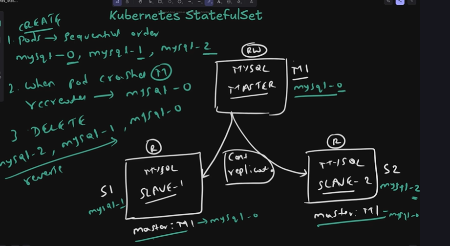


- `StatefulSet` runs a group of Pods, and maintains a sticky identity for each of those Pods. This is useful for managing applications that need persistent storage or a stable, unique network identity.

ControllerRevision

### What is Stateless vs Stateful?

### Stateless Application
An application that does **not store any data** between requests.
Every request is independent — the app does not remember previous interactions.

```
User Request 1 → Pod-A → Response
User Request 2 → Pod-B → Response   ← different pod, same result
User Request 3 → Pod-C → Response   ← no memory of previous requests
```

**Examples:**
- Web servers (Nginx, Apache)
- REST APIs
- Frontend applications
- Microservices

### Stateful Application
An application that **stores and remembers data** between requests.
Each instance has its own unique data that cannot be shared randomly.

```
User Request 1 → mysql-0 (Master) → writes data
User Request 2 → mysql-0 (Master) → reads same data ← must go to same pod!
User Request 3 → mysql-1 (Slave)  → replicates from master
```

**Examples:**
- Databases (MySQL, PostgreSQL, MongoDB)
- Message queues (Kafka, RabbitMQ)
- Caching systems (Redis)
- Elasticsearch

---

## Stateless vs Stateful Comparison

| Feature | Stateless | Stateful |
|---|---|---|
| Stores data |  No |  Yes |
| Pod identity matters |  No |  Yes |
| Any pod can serve request |  Yes |  No |
| Scaling is easy |  Yes |  Complex |
| Pod names | Random | Stable (mysql-0) |
| Storage | Shared/None | Dedicated per pod |
| Kubernetes object | Deployment | StatefulSet |
| Examples | API, Web server | MySQL, Kafka |

---

## Why Do We Need StatefulSet?

### Problem with Deployment for Databases

If you run MySQL using a **Deployment**:

```
Deployment creates:
mysql-abc123  ← random name, random storage
mysql-xyz456  ← random name, random storage
mysql-def789  ← random name, random storage

Problem 1: Pod restarts with NEW name
           mysql-abc123 crashes
           recreated as mysql-pqr999 ← different name!
           loses connection to its data!

Problem 2: No guaranteed start order
           Slave starts before Master → replication fails!

Problem 3: No stable DNS
           Cannot connect to specific pod directly
           Cannot set up master-slave replication!
```

### Solution — StatefulSet

```
StatefulSet creates:
mysql-0  ← stable name, dedicated storage
mysql-1  ← stable name, dedicated storage
mysql-2  ← stable name, dedicated storage

Solution 1: Pod restarts with SAME name
            mysql-0 crashes
            recreated as mysql-0 ← same name!
            reconnects to same data automatically!

Solution 2: Guaranteed sequential start
            mysql-0 starts first (Master ready)
            mysql-1 starts second (Slave-1 connects to Master)
            mysql-2 starts third  (Slave-2 connects to Master)

Solution 3: Stable DNS per pod
            mysql-0.mysql.default.svc.cluster.local
            mysql-1.mysql.default.svc.cluster.local
```

---

## Real World Scenarios

### Scenario 1 — MySQL Master-Slave (Most Common)
```
When to use:
 Production database with read replicas
 High read traffic — distribute reads across slaves
 High availability — if master fails, promote slave

Setup:
mysql-0 → Master  (Read + Write)
mysql-1 → Slave-1 (Read only) → replicates from mysql-0
mysql-2 → Slave-2 (Read only) → replicates from mysql-0
```

### Scenario 2 — Kafka Cluster
```
When to use:
 Event streaming platform
 Each broker needs stable identity for partition leadership
 Consumers track offset per broker

Setup:
kafka-0 → Broker-1 (leads partition 0,1)
kafka-1 → Broker-2 (leads partition 2,3)
kafka-2 → Broker-3 (leads partition 4,5)
```

### Scenario 3 — Elasticsearch Cluster
```
When to use:
 Search engine with data shards
 Each node stores specific shards
 Master node election needs stable identity

Setup:
es-0 → Master node
es-1 → Data node
es-2 → Data node
```

### Scenario 4 — Redis Cluster
```
When to use:
 Distributed caching
 Each node owns specific key slots
 Stable identity needed for cluster membership

Setup:
redis-0 → Primary (slots 0-5460)
redis-1 → Primary (slots 5461-10922)
redis-2 → Primary (slots 10923-16383)
```

---

## How StatefulSet Works

### 1. Pod Creation — Sequential Order
```
StatefulSet replicas: 3

Step 1: Create mysql-0
        Wait until mysql-0 is Running & Ready 
Step 2: Create mysql-1
        Wait until mysql-1 is Running & Ready 
Step 3: Create mysql-2
        Wait until mysql-2 is Running & Ready 

Why sequential?
Master (mysql-0) must be ready
before Slaves (mysql-1, mysql-2) start replication
```

### 2. Pod Crash — Stable Identity
```
Normal Deployment behavior:
mysql-abc123 crashes → recreated as mysql-xyz999
New name = new storage = DATA LOST 

StatefulSet behavior:
mysql-0 crashes → recreated as mysql-0
Same name = same PersistentVolume = DATA SAFE 
```

### 3. Pod Deletion — Reverse Order
```
StatefulSet replicas: 3

Step 1: Delete mysql-2 (Slave-2 removed first)
Step 2: Delete mysql-1 (Slave-1 removed second)
Step 3: Delete mysql-0 (Master removed last)

Why reverse order?
Slaves must be removed before Master
prevents data loss and replication errors
```

### 4. Persistent Storage — One PVC Per Pod
```
mysql-0 → PersistentVolumeClaim: data-mysql-0 → EBS Volume 1
mysql-1 → PersistentVolumeClaim: data-mysql-1 → EBS Volume 2
mysql-2 → PersistentVolumeClaim: data-mysql-2 → EBS Volume 3

Each pod gets its OWN dedicated storage
Even if pod is deleted — PVC is NOT deleted
Data is always safe 
```

### 5. Stable DNS — Headless Service
```
Normal Service DNS:
mysql-service → 10.96.0.1 (single VIP) → random pod

Headless Service DNS:
mysql-0.mysql.default.svc.cluster.local → Pod-0 IP directly
mysql-1.mysql.default.svc.cluster.local → Pod-1 IP directly
mysql-2.mysql.default.svc.cluster.local → Pod-2 IP directly

Slaves use this DNS to find Master:
MASTER_HOST = mysql-0.mysql.default.svc.cluster.local 
```

---

## StatefulSet Architecture

```
                    Headless Service (clusterIP: None)
                              |
              ┌───────────────┼───────────────┐
              ↓               ↓               ↓
           mysql-0         mysql-1         mysql-2
           Master           Slave-1         Slave-2
           (RW)              (R)             (R)
              |               |               |
           PVC-0           PVC-1           PVC-2
           EBS Vol-1       EBS Vol-2       EBS Vol-3

Replication:
mysql-0 ──────────────→ mysql-1
        └──────────────→ mysql-2
```

---

## StatefulSet YAML Example

```yaml
apiVersion: apps/v1
kind: StatefulSet
metadata:
  name: mysql
spec:
  serviceName: mysql          # must match headless service name
  replicas: 3
  selector:
    matchLabels:
      app: mysql
  template:
    metadata:
      labels:
        app: mysql
    spec:
      containers:
      - name: mysql
        image: mysql:8.0
        env:
        - name: MYSQL_ROOT_PASSWORD
          valueFrom:
            secretKeyRef:
              name: mysql-secret
              key: password
        ports:
        - containerPort: 3306
        volumeMounts:
        - name: data
          mountPath: /var/lib/mysql

  volumeClaimTemplates:        # creates PVC per pod automatically
  - metadata:
      name: data
    spec:
      accessModes: ["ReadWriteOnce"]
      storageClassName: gp2
      resources:
        requests:
          storage: 10Gi

---
apiVersion: v1
kind: Service
metadata:
  name: mysql
spec:
  clusterIP: None              # headless service
  selector:
    app: mysql
  ports:
  - port: 3306
```

---

## Deployment vs StatefulSet

| Feature | Deployment | StatefulSet |
|---|---|---|
| Pod names | Random (mysql-abc) | Stable (mysql-0) |
| Pod creation order | Parallel | Sequential (0→1→2) |
| Pod deletion order | Random | Reverse (2→1→0) |
| Pod identity | No identity | Unique stable identity |
| Storage | Shared volume | Dedicated PVC per pod |
| DNS per pod |  No |  Yes |
| Use case | Stateless apps | Stateful apps |
| Scaling | Easy | Complex |
| Examples | API, Web, Nginx | MySQL, Kafka, Redis |

---

## Headless Service 

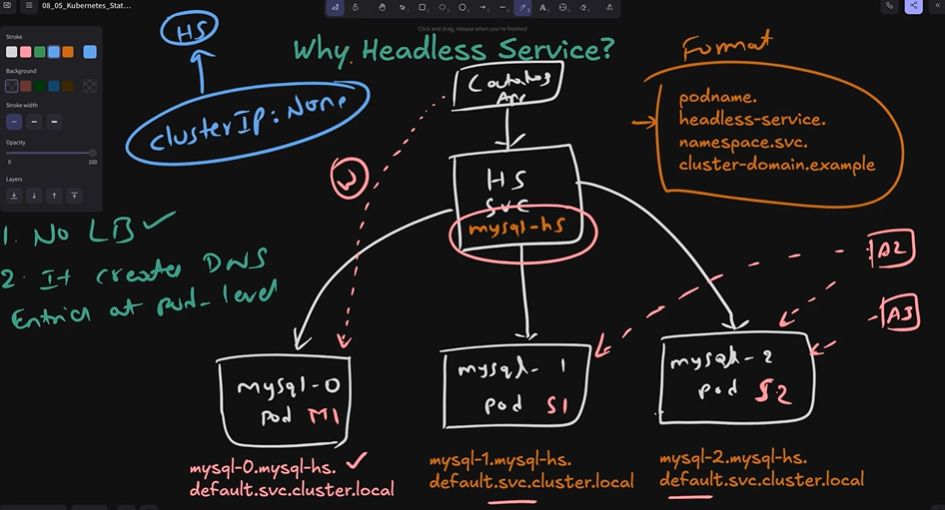


- StatefulSet Features:
  - Stable Network ID: Pods are named sequentially (e.g., web-0, web-1), which remain constant even if rescheduled.
  - Stable Storage: Uses volumeClaimTemplates to ensure each pod gets its own persistent volume, maintaining data across restarts.
  - Ordered Scaling/Updates: Pods are created or terminated one-by-one in order.


- Headless Service Features:

  - No Load Balancing: Unlike standard services, it does not assign a single ClusterIP for load balancing.
   - DNS A Record: Provides direct DNS records for each pod (e.g., podname.servicename.namespace.svc.cluster.local).

        ```bash
        ClusterIP:
        Client → Virtual IP (10.96.0.1) → Kubernetes picks pod
                                        → Pod-1 or Pod-2 or Pod-3
        Client never knows which pod served it

        Headless:
        Client → DNS → Pod-1 IP directly
                    → Pod-2 IP directly
                    → Pod-3 IP directly
        Client talks to specific pod directly
        ```

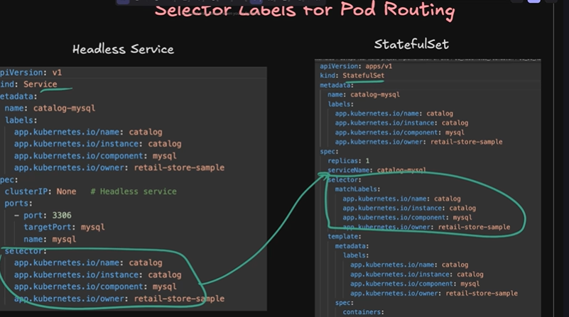

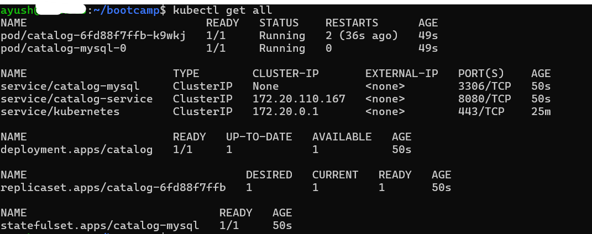
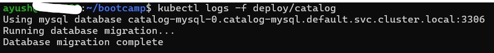


- Test DNS Resolution

```bash
kubectl run dns-test --image=busybox:1.28 -it --rm
nslookup catalog-mysql (statefulset name)
nslookup catalog-mysql-0.catalog-mysql

```
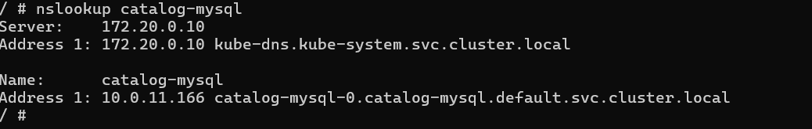
- Scale Up – Ordered Pod Creation

```bash
kubectl scale statefulset catalog-mysql --replicas=3
kubectl get pods -w

```

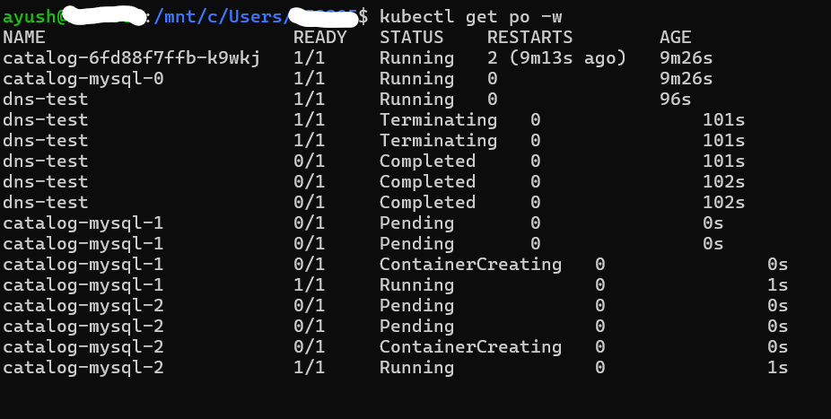

- Scale Down – Reverse Order Deletion

```bash
kubectl scale statefulset catalog-mysql --replicas=1
kubectl get pods -w

```


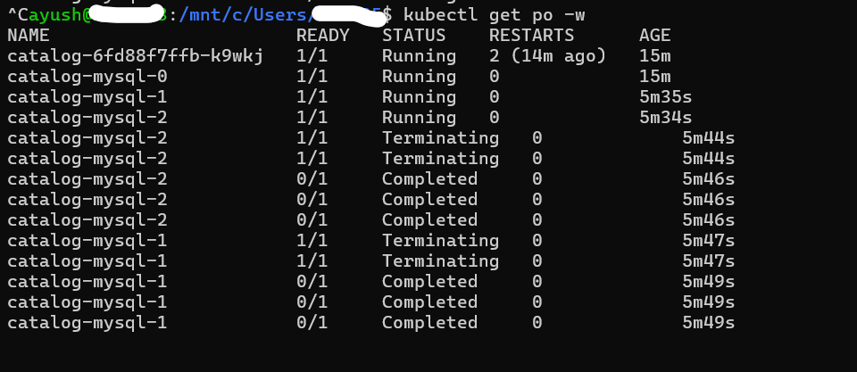


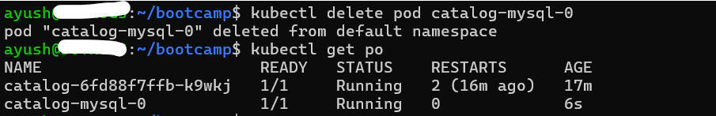


- Verify Database Connection Inside Cluster

```bash
kubectl run mysql-client --rm -it \
  --image=mysql:8.0 \
  --restart=Never \
  -- mysql -h catalog-mysql -u catalog_user -p

```

```bash
SHOW DATABASES;
USE catalogdb;
SHOW TABLES;
SELECT * FROM products;
SELECT * FROM tags;
SELECT * FROM product_tags;
EXIT;

```
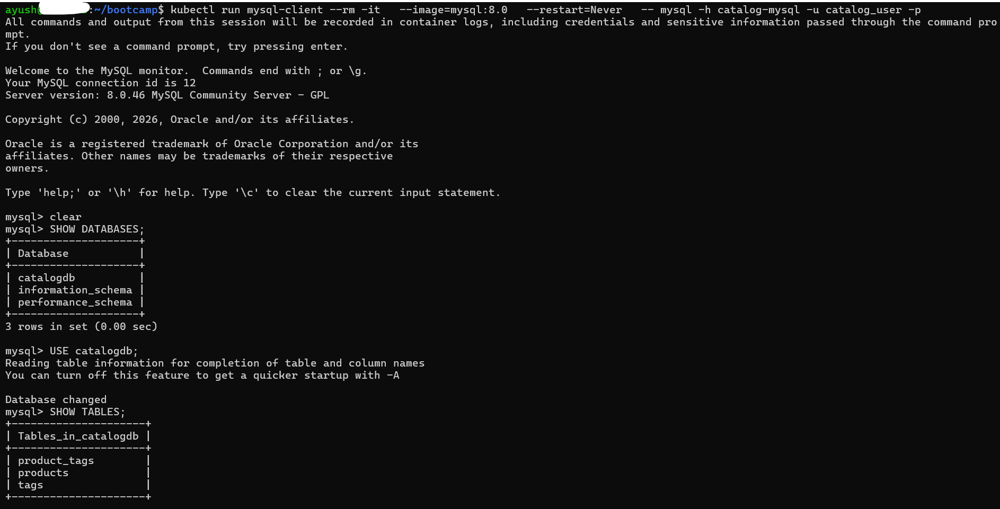
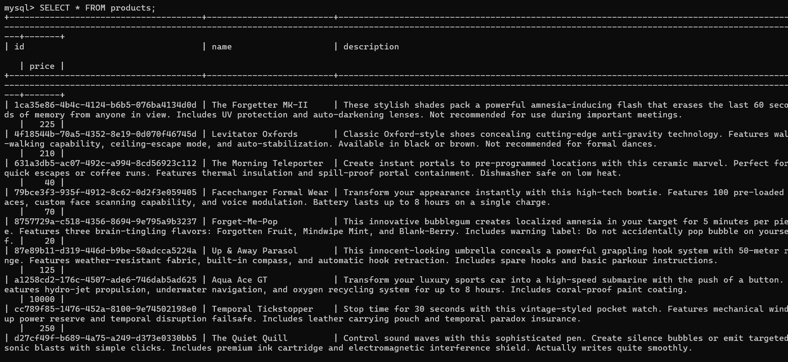

- Access Catalog Application via Port Forwarding
```bash
# Port-forward to Catalog Service
kubectl port-forward svc/catalog-service 7080:8080

# When you access topoligy endpoint expected output
http://localhost:7080/topology

```
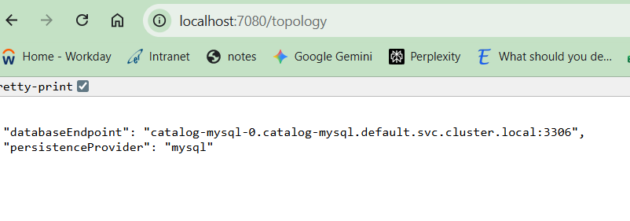
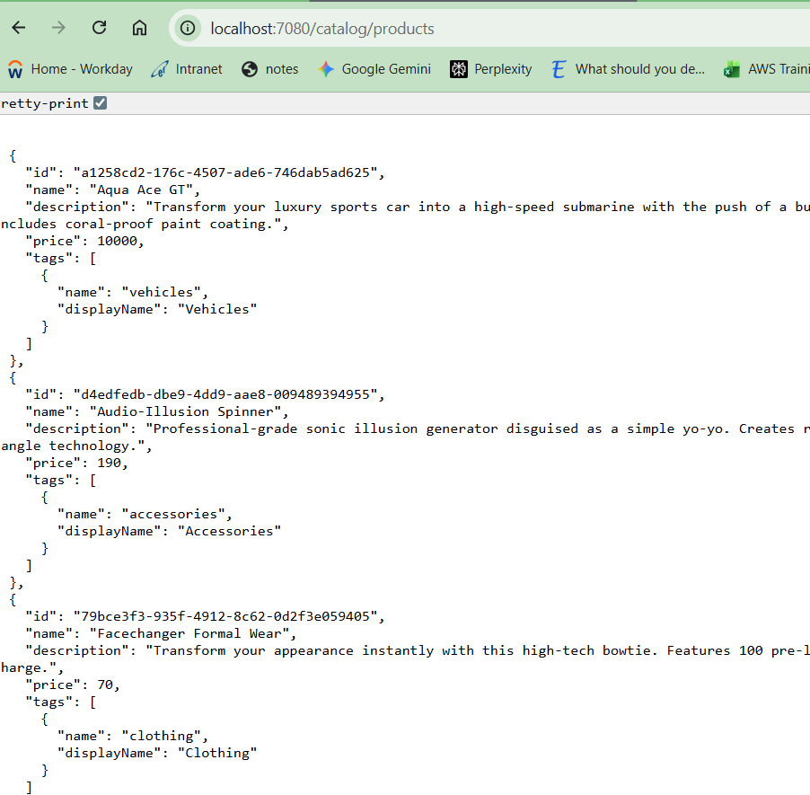


- While a Deployment tracks version history by keeping old ReplicaSets around, a StatefulSet tracks its history using a dedicated internal API object called a `ControllerRevision`.

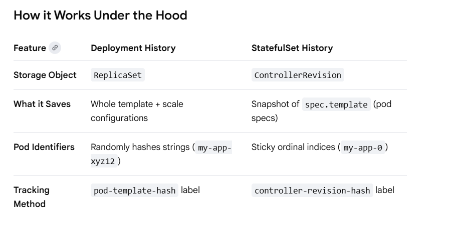