## Kubernetes Secrets

- `ConfigMaps` : A ConfigMap is an API object used to store non-confidential data in key-value pairs. Pods can consume ConfigMaps as environment variables, command-line arguments, or as configuration files in a volume.

- `Secrets` : A Secret is an object that contains a small amount of sensitive data such as a password, a token, or a key. Such information might otherwise be put in a Pod specification or in a container image. Using a Secret means that you don't need to include confidential data in your application code.

  - Because Secrets can be created independently of the Pods that use them, there is less risk of the Secret (and its data) being exposed during the workflow of creating, viewing, and editing Pods. Kubernetes, and applications that run in your cluster, can also take additional precautions with Secrets, such as avoiding writing sensitive data to nonvolatile storage.

  - Secrets are similar to ConfigMaps but are specifically intended to hold confidential data.


#### Apply Manifests and Verify

```bash
kubectl apply -f Secrets
kubectl get secrets
kubectl describe secret catalog-db
kubectl get secret catalog-db -o yaml
kubectl port-forward svc/catalog-service 7080:8080

```
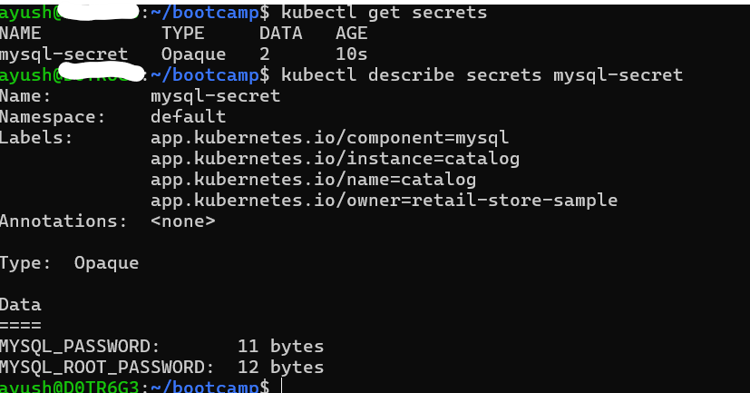
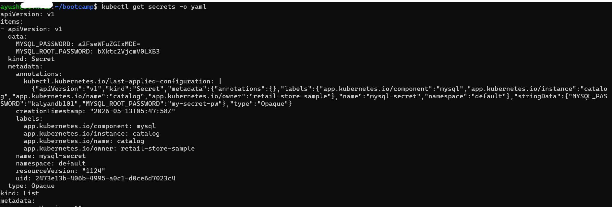
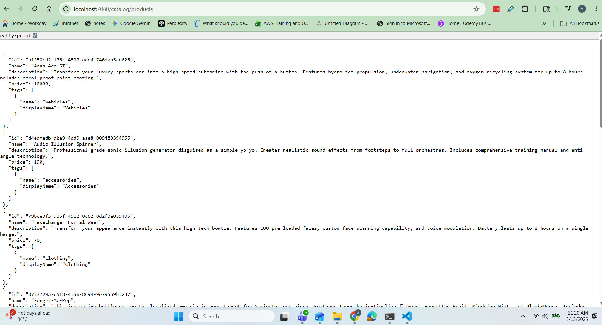

---


## EKS Pod_Identity Agent

- `Amazon EKS Pod Identity` enables pods in your cluster to securely assume IAM roles without managing static credentials or using IRSA annotations

  - Amazon EKS Pod Identity is a security feature that allows Kubernetes pods to securely assume AWS IAM roles, granting them permissions to access AWS services (like S3, DynamoDB) without requiring complex OIDC provider setups. 
  
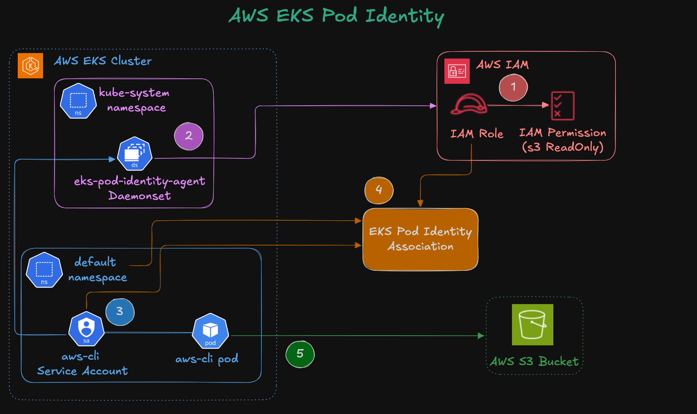


    ```bash
    Step 1: Pod Identity Agent (DaemonSet)
            runs on every node

    Step 2: Pod starts and needs AWS credentials

    Step 3: Pod calls local agent endpoint
            http://169.254.170.23/v1/credentials

    Step 4: Agent calls EKS Auth API
            "This pod is allowed to assume role X"

    Step 5: Agent returns temporary credentials
            AWS_ACCESS_KEY (temporary)
            AWS_SECRET_KEY (temporary)
            AWS_SESSION_TOKEN (temporary)

    Step 6: Pod uses credentials to access AWS
            S3, DynamoDB, SQS etc. 
    ```
    ```bash
    SA = "I am my-app-sa" (identity)
    IAM Role = "my-app-sa can access S3" (permission)
    PIA Agent = "let me verify and give you temp keys" (connector)
    ```


    ```bash
    SETUP (one time):
    IAM Role ←→ SA (linked via Pod Identity Association)
    PIA Agent installed as DaemonSet on all nodes

    RUNTIME (every pod start):

    Pod starts
    ↓
    Pod calls http://169.254.170.23/v1/credentials
    ↓
    PIA Agent (on same node) receives request
    ↓
    PIA Agent → EKS Auth API
    "Is SA my-app-sa linked to IAM Role?"
    ↓
    EKS Auth API → "Yes! Role ARN is xyz"
    ↓
    PIA Agent → AWS STS
    "Give temp credentials for role xyz"
    ↓
    AWS STS → Temp credentials (1 hour)
    ↓
    PIA Agent → Pod
    "Here are your temp credentials"
    ↓
    Pod → AWS Service (S3, DynamoDB etc.)
    "Access Granted" 
    ↓
    After 1 hour → Auto rotates silently 

    ```


#### Install the EKS Pod Identity Agent add-on 

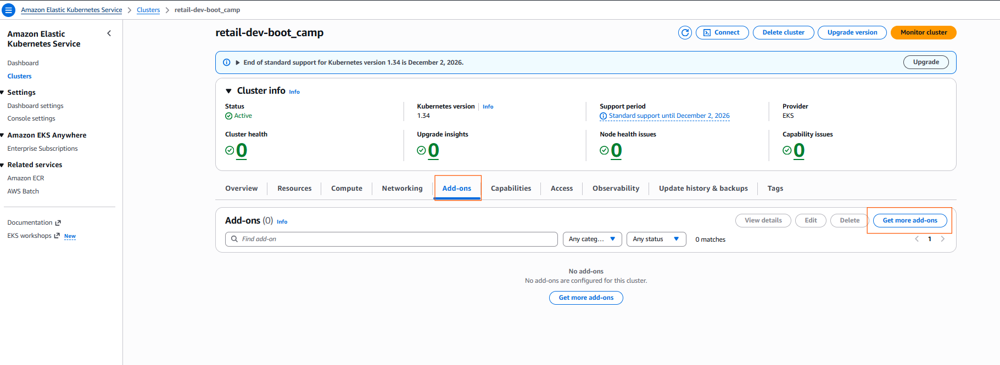
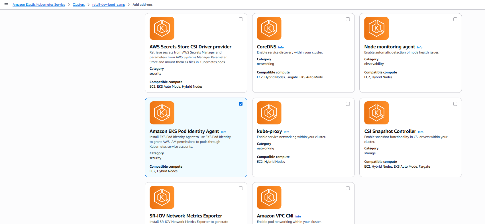
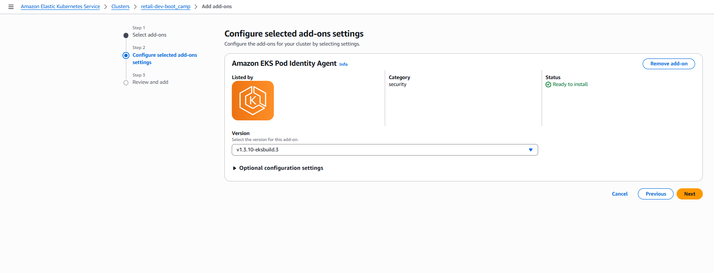
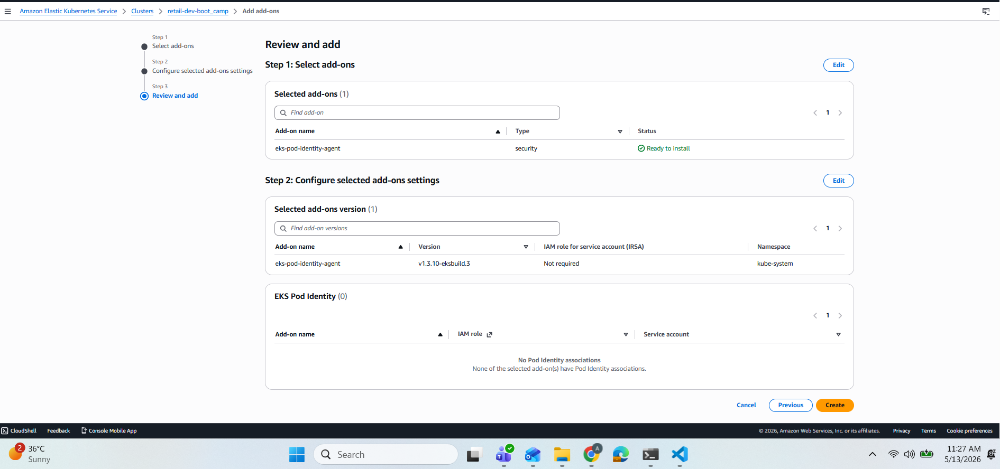
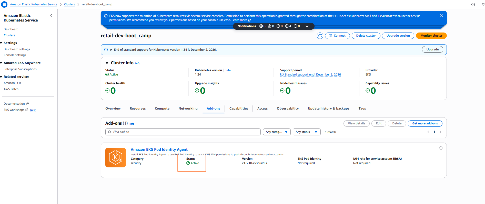
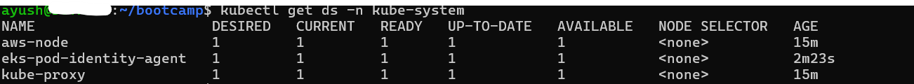

#### Create a Kubernetes AWS CLI Pod in the EKS Cluster and attempt to list S3 buckets 
```bash
kubectl apply -f kube-Sa/
kubectl get pods
kubectl exec -it aws-cli -- aws s3 ls
```
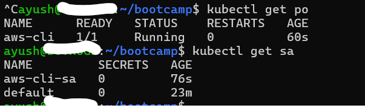
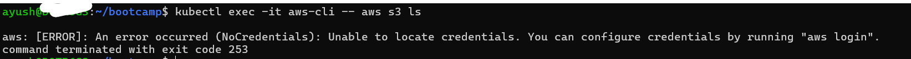

#### Create an IAM Role with trust policy for Pod Identity → allow Pods to access Amazon S3
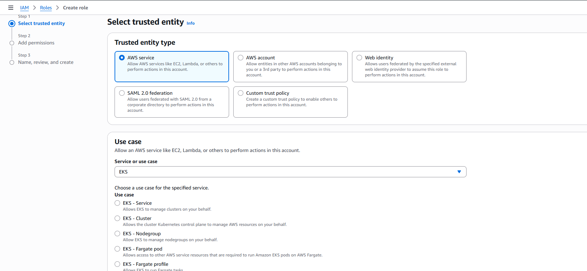
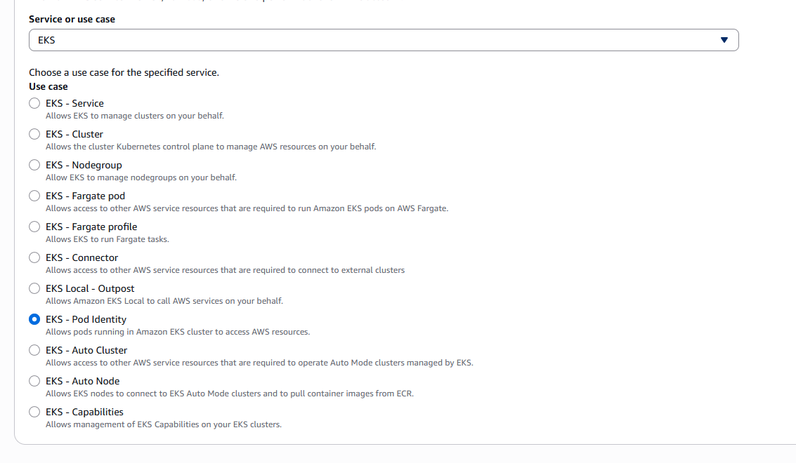
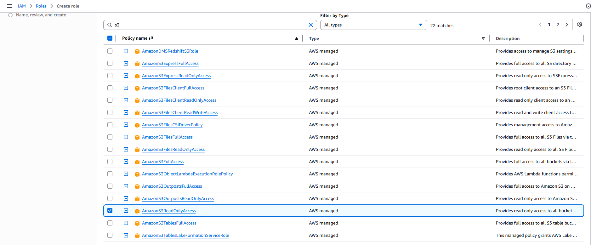
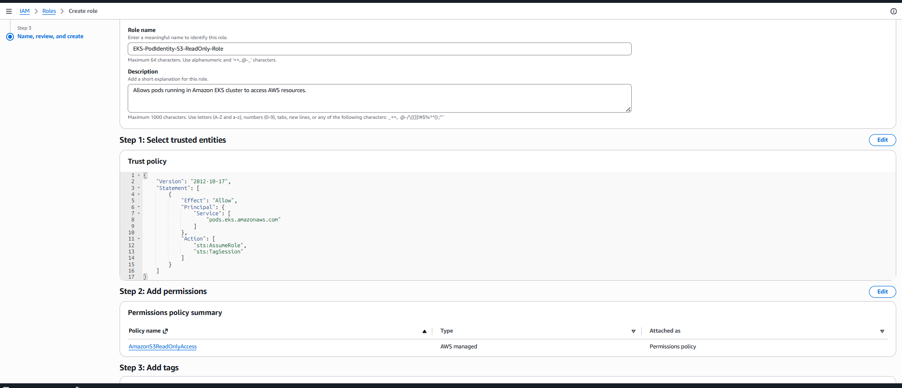
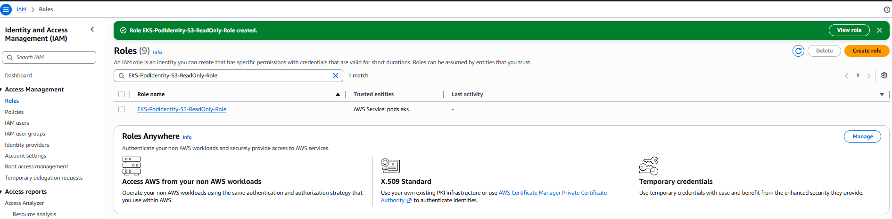


#### Create a Pod Identity Association between the Kubernetes Service Account and IAM Role
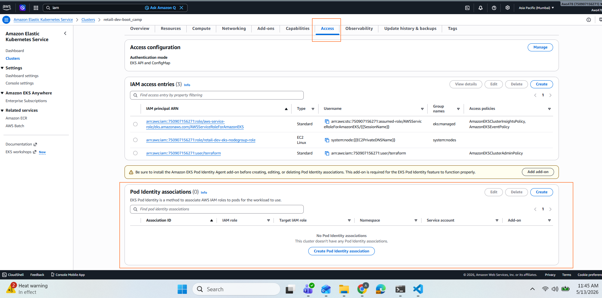
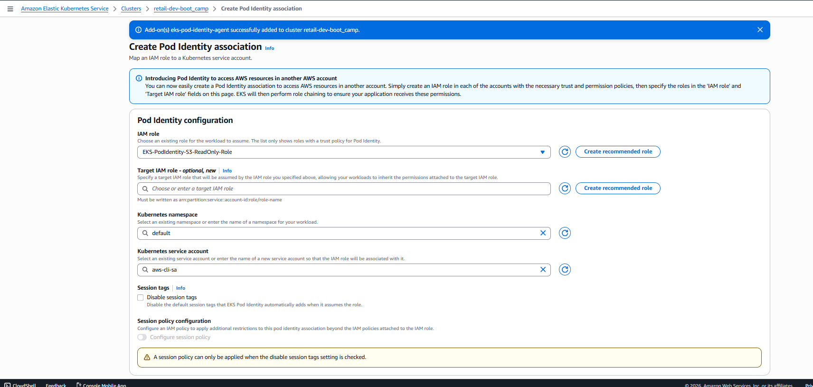
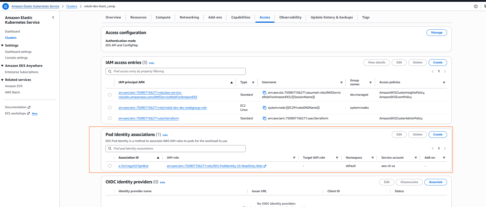
#### Re-test from the AWS CLI Pod, successfully list S3 buckets
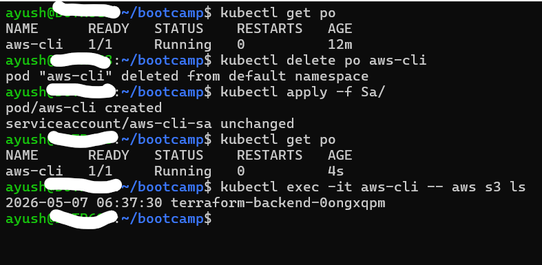

---

## AWS Secrets Manager for EKS Secrets

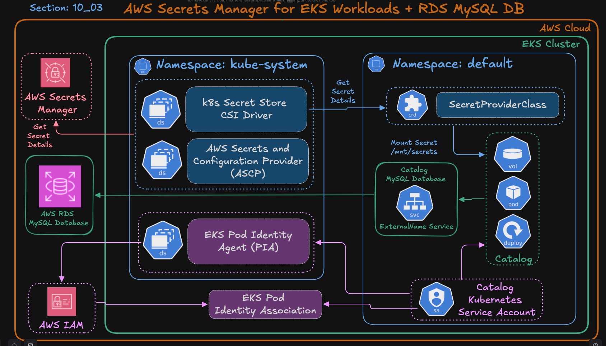

- 1. `Identity and Authentication Flow`
The sequence begins with the Catalog Kubernetes Service Account located in the default namespace. This account is tied to an EKS Pod Identity Association, which leverages the EKS Pod Identity Agent (PIA) and AWS IAM to securely provide the pod with the temporary credentials required to access AWS resources.

- 2. `Configuration via SecretProviderClass`
The Catalog pod refers to a SecretProviderClass (a Custom Resource Definition) within the default namespace. This resource serves as the configuration manifest, specifying which secrets to pull from AWS Secrets Manager and how they should be presented to the application.

- 3. `Secret Retrieval via CSI and ASCP`
When the pod is deployed, the k8s Secret Store CSI Driver (a DaemonSet in the kube-system namespace) triggers the mount process. It communicates with the AWS Secrets and Configuration Provider (ASCP), which uses the pod's identity to call the AWS Secrets Manager API and execute the "Get Secret Details" operation.

- 4. `Mounting to the Workload`
Once the secrets are successfully retrieved from the AWS Cloud, the CSI driver mounts them as a volume at a specific path, such as /mnt/secrets, within the Catalog pod. This enables the application to connect to the AWS RDS MySQL Database using valid credentials without those sensitive details ever being stored in plain text within the Kubernetes ETCD or the container image.


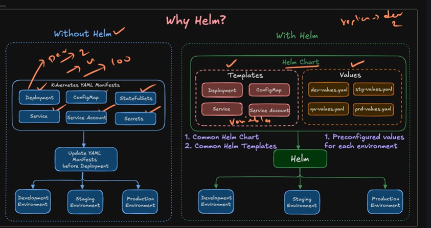
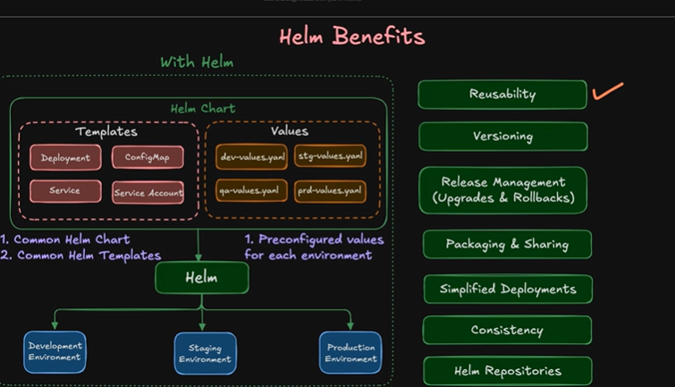

#### AWS_Secrets_Manager_Driver_Setup

- Add Helm Repositories
```bash
# Add Helm Repositories
helm repo add secrets-store-csi-driver https://kubernetes-sigs.github.io/secrets-store-csi-driver/charts
helm repo add aws-secrets-manager https://aws.github.io/secrets-store-csi-driver-provider-aws
helm repo update

# List Helm Repos
helm repo list
```
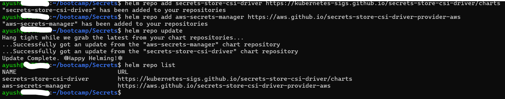


---
- Install the Secrets Store CSI Driver

```bash
# Install the Secrets Store CSI Driver in the kube-system namespace:
helm install csi-secrets-store \
  secrets-store-csi-driver/secrets-store-csi-driver \
  --namespace kube-system \
  --set tokenRequests[0].audience="pods.eks.amazonaws.com"

# List all Helm releases across namespaces:
helm list --all-namespaces

# List releases only in the kube-system namespace:
helm list -n kube-system

# Verify installation status, pods, and resources created by the release:
helm status csi-secrets-store -n kube-system


# Verify pods:
kubectl get pods -n kube-system -l app=secrets-store-csi-driver

```
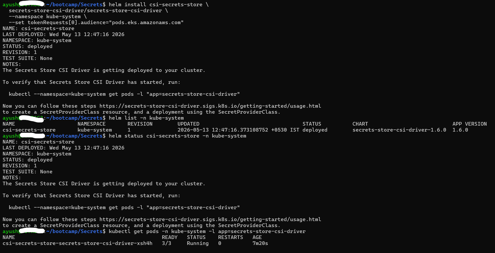


---

-  Install the AWS Secrets and Configuration Provider (ASCP)

```bash
# Install the AWS Secrets Manager CSI Driver Provider in the kube-system namespace.
helm install secrets-provider-aws \
  aws-secrets-manager/secrets-store-csi-driver-provider-aws \
  --namespace kube-system \
  --set secrets-store-csi-driver.install=false

# List installed Helm Releases
helm list -n kube-system

# Inspect the AWS provider Helm release:
helm status secrets-provider-aws -n kube-system

```

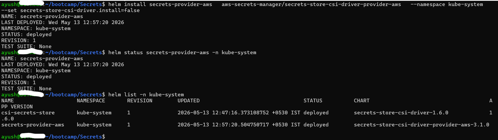
---

```bash
# CSI driver pods
kubectl get pods -n kube-system -l app=secrets-store-csi-driver

# AWS provider (ASCP) pods
kubectl get pods -n kube-system -l app=secrets-store-csi-driver-provider-aws

kubectl get daemonset -n kube-system | grep secrets-store

```
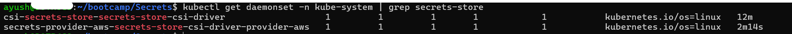


---
-  Export Environment Variables

```bash
# Replace the placeholders below with your actual values
export AWS_REGION="ap-south-1"
export EKS_CLUSTER_NAME="retail-dev-boot_camp"
export AWS_ACCOUNT_ID=$(aws sts get-caller-identity --query Account --output text)

# Confirm values
echo $AWS_REGION
echo $EKS_CLUSTER_NAME
echo $AWS_ACCOUNT_ID

```

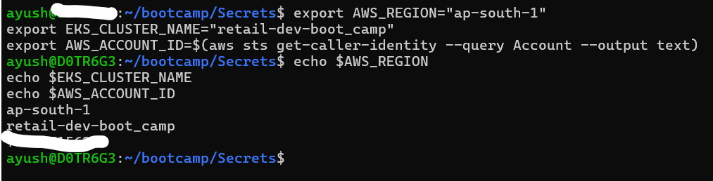


---

###### Create IAM Policy

- This policy grants permission to read one secret — catalog-db-secret — from AWS Secrets Manager.
- We’re scoping access to only one secret (catalog-db-secret*) — least-privilege best practice.
    ```bash
    cat <<EOF > catalog-db-secret-policy.json
    {
    "Version": "2012-10-17",
    "Statement": [
        {
        "Effect": "Allow",
        "Action": [
            "secretsmanager:GetSecretValue",
            "secretsmanager:DescribeSecret"
        ],
        "Resource": "arn:aws:secretsmanager:${AWS_REGION}:${AWS_ACCOUNT_ID}:secret:catalog-db-secret*"
        }
    ]
    }
    EOF

    ```


- Create the policy
    ```bash
    aws iam create-policy \
    --policy-name catalog-db-secret-policy \
    --policy-document file://catalog-db-secret-policy.json
    ```
    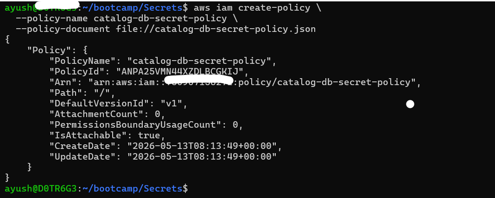


-  Create IAM Role for Pod Identity
    ```bash
    cat <<EOF > trust-policy.json
    {
    "Version": "2012-10-17",
    "Statement": [
        {
        "Effect": "Allow",
        "Principal": {
            "Service": "pods.eks.amazonaws.com"
        },
        "Action": [
            "sts:AssumeRole",
            "sts:TagSession"
        ]
        }
    ]
    }
    EOF

    ```


- Create the IAM role:
    ```bash
    # Create IAM Role
    aws iam create-role \
    --role-name catalog-db-secrets-role \
    --assume-role-policy-document file://trust-policy.json

    
    ```

   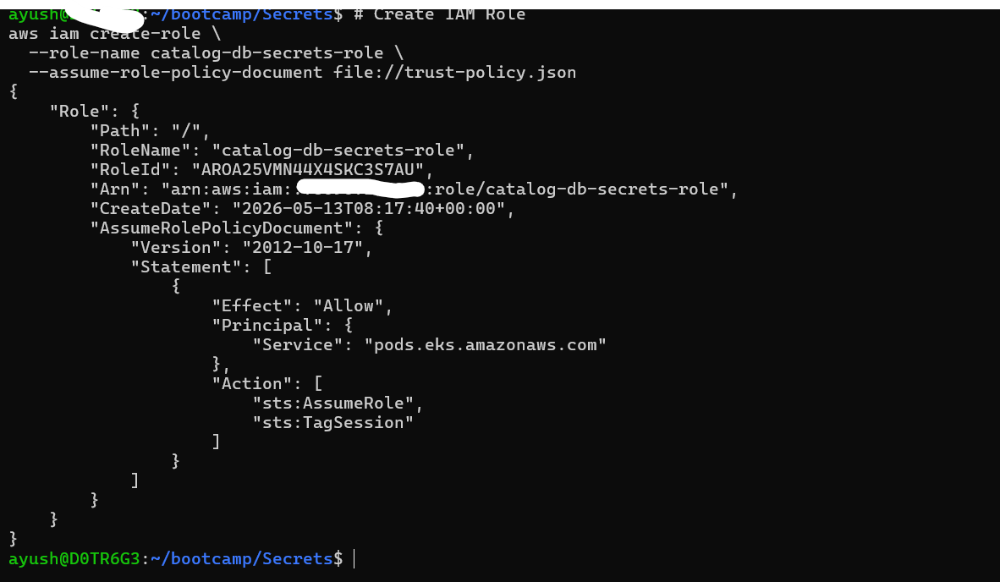 


- Attach the policy to the role:

    ```bash
    # Attach the IAM policy to IAM Role
    aws iam attach-role-policy \
    --role-name catalog-db-secrets-role \
    --policy-arn arn:aws:iam::${AWS_ACCOUNT_ID}:policy/catalog-db-secret-policy


    aws iam list-attached-role-policies --role-name catalog-db-secrets-role

    ```


#### Create Pod Identity Association

```bash
# Verify Amazon EKS Pod Identity Agent Installation
aws eks list-addons --cluster-name ${EKS_CLUSTER_NAME}


# Create Pod Identity Association
aws eks create-pod-identity-association \
  --cluster-name ${EKS_CLUSTER_NAME} \
  --namespace default \
  --service-account catalog-mysql-sa \
  --role-arn arn:aws:iam::${AWS_ACCOUNT_ID}:role/catalog-db-secrets-role


```

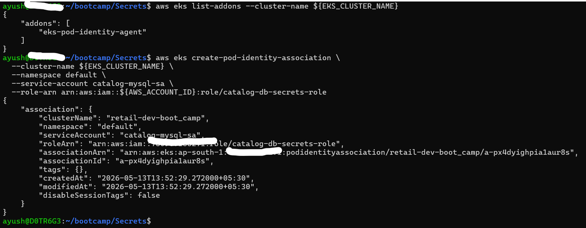


---
## AWS_Secrets_Manager_Catalog_Integration

- Create AWS Secret in Secrets Manager
```bash
# Replace <REGION> with your AWS Region (e.g., us-east-1)
export AWS_REGION="ap-south-1"

# Create Secret 
aws secretsmanager create-secret \
  --name catalog-db-secret-1 \
  --region $AWS_REGION \
  --description "MySQL credentials for Catalog microservice" \
  --secret-string '{
      "MYSQL_USER": "mydbadmin",
      "MYSQL_PASSWORD": "****"
  }'

# List all secrets in your account (filtered by name)
aws secretsmanager list-secrets --region $AWS_REGION --query "SecretList[?contains(Name, 'catalog-db-secret-1')].[Name,ARN]" --output table


# Describe the Secret for Details
aws secretsmanager describe-secret \
  --secret-id catalog-db-secret-1 \
  --region $AWS_REGION

# Retrieve Secret Value (for testing only)
aws secretsmanager get-secret-value \
  --secret-id catalog-db-secret-1 \
  --region $AWS_REGION \
  --query SecretString --output text

```

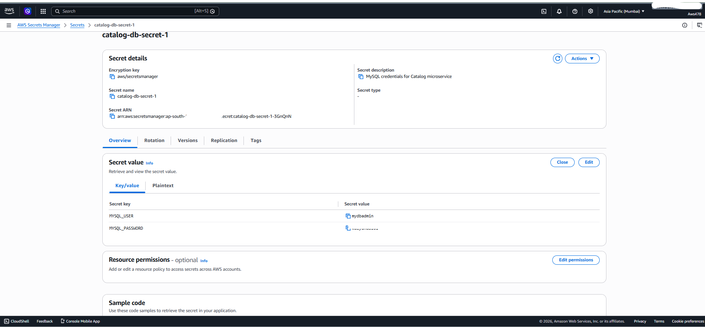


- Create the SecretProviderClass
  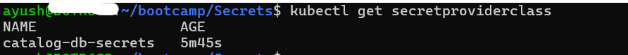
- Create the ServiceAccount and deploy the files
  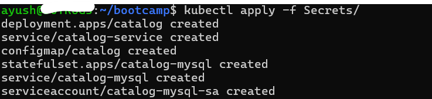

---
- Verify if Secrets mounted in pods or not

```bash
# MySQL Pod
kubectl exec -it <mysql-pod-name> -- ls /mnt/secrets-store
kubectl exec -it <mysql-pod-name> -- cat /mnt/secrets-store/MYSQL_USER
kubectl exec -it <mysql-pod-name> -- cat /mnt/secrets-store/MYSQL_PASSWORD


# Catalog Pod
kubectl exec -it <catalog-pod-name> -- ls /mnt/secrets-store
kubectl exec -it <catalog-pod-name> -- cat /mnt/secrets-store/MYSQL_USER
kubectl exec -it <catalog-pod-name> -- cat /mnt/secrets-store/MYSQL_PASSWORD

```

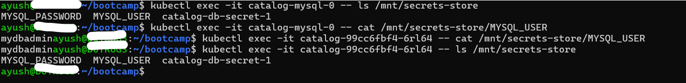
---
- Verify Catalog Microservice Application

```bash
# List Pods
kubectl get pods

# Port-forward
kubectl port-forward svc/catalog-service 7080:8080

# Acess Catalog Endpoints
http://localhost:7080/topology
http://localhost:7080/health
http://localhost:7080/catalog/products
http://localhost:7080/catalog/size
http://localhost:7080/catalog/tags


```

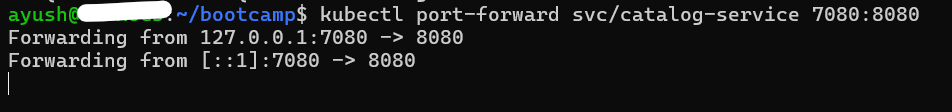
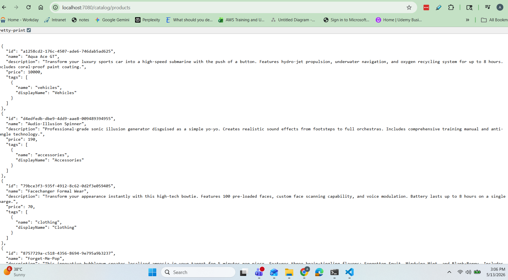


- Connect to MySQL Database and Verify
```bash
# Connect to MySQL Database using MySQL Client Pod
kubectl run mysql-client --rm -it \
  --image=mysql:8.0 \
  --restart=Never \
  -- mysql -h catalog-mysql -u mydbadmin -p


SHOW DATABASES;
USE catalogdb;
SHOW TABLES;
SELECT * FROM products;
SELECT * FROM tags;
SELECT * FROM product_tags;
EXIT;
```

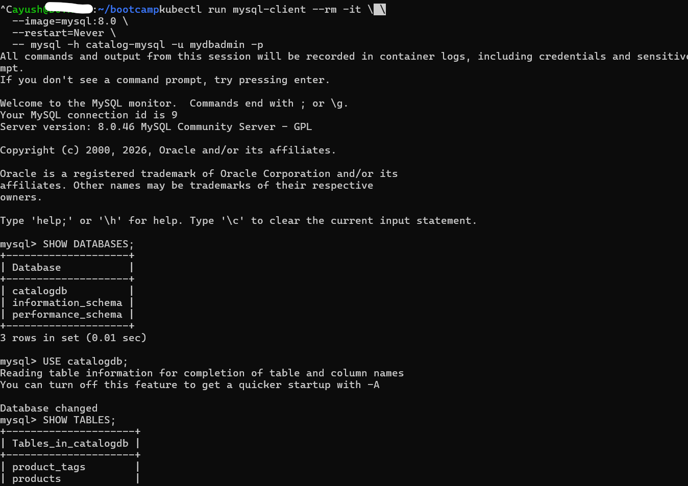
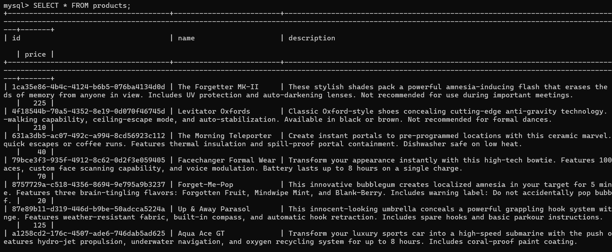