# pv, pvc,  storageclass
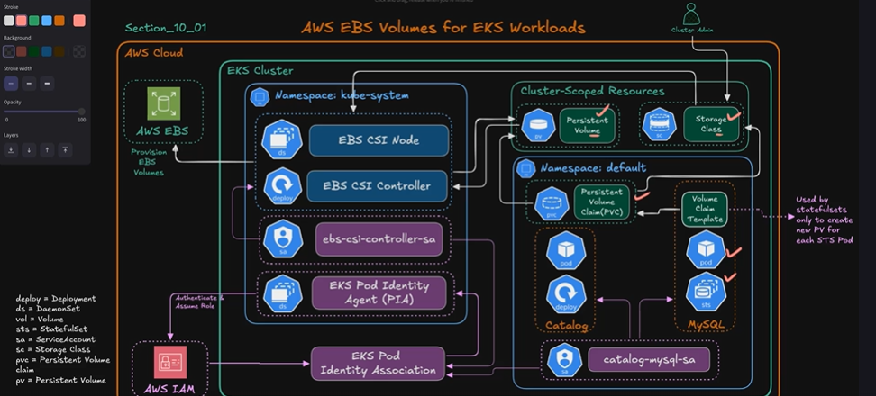
```bash
Container Storage:
┌─────────────────────┐
│      Pod            │
│  ┌───────────────┐  │
│  │  Container A  │  │
│  │  /app/data ✓  │  │ ← only Container A sees this
│  │               │  │
│  └───────────────┘  │
│  ┌───────────────┐  │
│  │  Container B  │  │
│  │  /app/data ✓  │  │ ← DIFFERENT storage!
│  └───────────────┘  │
└─────────────────────┘

Pod Volume (emptyDir):
┌─────────────────────┐
│      Pod            │
│     [volume]        │ ← shared storage
│    /shared/data     │
│       ↙    ↘        │
│  ┌──────┐ ┌──────┐  │
│  │ C-A  │ │ C-B  │  │ ← BOTH see same data 
│  └──────┘ └──────┘  │
└─────────────────────┘
Pod dies → volume gone 

Persistent Volume:
┌─────────────────────┐
│      Pod            │
│  ┌───────────────┐  │
│  │  Container    │  │
│  │  /var/lib/    │  │
│  │  mysql        │  │
│  └───────┬───────┘  │
└──────────┼──────────┘
           │
    ┌──────┴──────┐
    │  EBS Volume │  ← lives outside pod 
    │  10GB       │
    └─────────────┘
Pod dies → EBS stays 
New pod → same EBS 


```
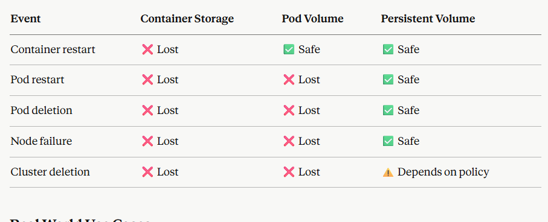


#### Pv (PersistentVolume)
- When running a stateful application, and without persistent storage, data is tied to the lifecycle of the pod or container. If a pod crashes or is terminated, data is lost.

- To prevent this data loss and run a stateful application on Kubernetes, we need to adhere to three simple storage requirements:
   - Storage must not depend on the pod lifecycle.
   - Storage must be available from all pods and nodes in the Kubernetes cluster.
   - Storage must be highly available regardless of crashes or application failures.

- Kubernetes also supports Persistent Volumes. With Persistent Volumes, data is persisted regardless of the lifecycle of the application, container, Pod, Node, or even the cluster itself. Persistent Volumes fulfill the three requirements outlined earlier.

- A Persistent Volume (PV) object represents a storage volume that is used to persist application data. A PV has its own lifecycle, separate from the lifecycle of Kubernetes Pods.

- A PV essentially consists of two different things:
   - A backend technology called a PersistentVolume
  - An access mode, which tells Kubernetes how the volume should be mounted.   

    ```bash
    A PV is an abstract component, and the actual physical storage must come from somewhere. Here are a few examples:

    csi: Container Storage Interface (CSI) → (for example, Amazon EFS, Amazon EBS, Amazon FSx, etc.)
    iscsi: iSCSI (SCSI over IP) storage
    local: Local storage devices mounted on nodes
    nfs: Network File System (NFS) storage

    ```

##### Access mode
- The access mode is set during PV creation and tells Kubernetes how the volume should be mounted. Persistent Volumes support three access modes:

  - ReadWriteOnce: Volume allows read/write by only one node at the same time.
  - ReadOnlyMany: Volume allows read-only mode by many nodes at the same time.
   - ReadWriteMany: Volume allows read/write by multiple nodes at the same time.  
   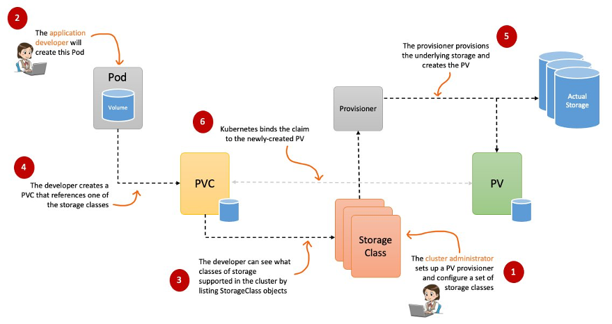  

##### Volume Binding Mode Types

- Immediate (Default):
  - Action: PV is created immediately when a PersistentVolumeClaim (PVC) is created.
  - Use Case: Good for simple storage types (e.g., NFS) that are globally accessible from any node.
  - Risk: Can lead to unschedulable pods if the volume is created in a zone/node that cannot satisfy the pod's later constraints (e.g., node selectors).

- WaitForFirstConsumer (Recommended):
  - Action: Delays volume binding and dynamic provisioning until a pod using the PVC is created.
  - Use Case: Critical for topology-constrained storage (e.g., AWS EBS, GCP PD) to ensure the volume is created in the same zone as the Pod.
  - Benefit: Allows the scheduler to consider all constraints (node selector, anti-affinity, taints) when selecting a node   


#### pvc (Persistent volume claims)   
- A Persistent Volume (PV) represents an actual storage volume. Kubernetes has an additional layer of abstraction necessary for attaching a PV to a Pod: the PersistentVolumeClaim (PVC).

- A PV represents the actual storage volume, and the PVC represents the request for storage that a Pod makes to get the actual storage.

- The separation between PV and PVC relates to the idea that there are two types of people in a Kubernetes environment:

  - Kubernetes administrator: this person is supposed to maintain the cluster, operate it, and add computational resources such as persistent storage.
  - Kubernetes application developer: this person is supposed to develop and deploy the application.
   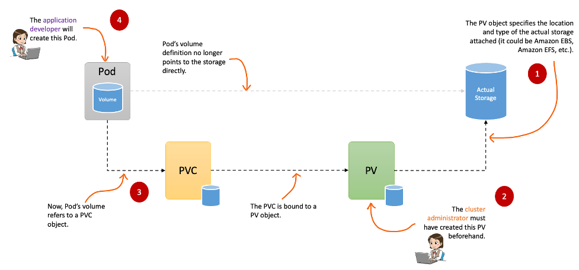


#### Container Storage Interface (CSI) drivers

- The Container Storage Interface (CSI) is an abstraction designed to facilitate using different storage solutions with Kubernetes. Different storage vendors can develop their own drivers that implement the CSI standards, enabling their storage solutions to work with Kubernetes (regardless of the internals of the underlying storage solution). AWS has CSI plugins for Amazon EBS, Amazon EFS , and Amazon FSx for Lustre.


#### Static provisioning

- In what we described in the “Persistent volume claims” section, first the administrator creates one or more PV, and then the application developer creates a PVC. This is called static provisioning. It is static because you have to manually create the PV and the PVC in Kubernetes. At scale this can become more and more difficult to manage, especially if you are managing hundreds of PVs and PVCs.
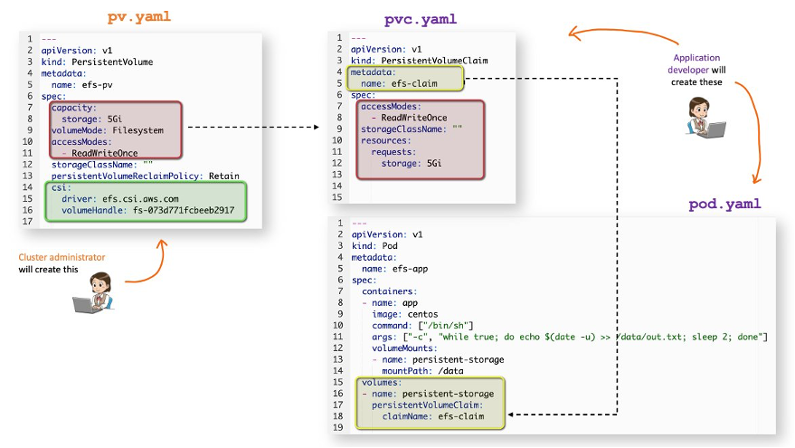

#### Dynamic provisioning
- With dynamic provisioning, you do not have to create a PV object. Instead, it will be automatically created under the hood when you create the PVC. Kubernetes does so using another object called Storage Class.

- A Storage Class is an abstraction that defines a class of backend persistent storage (for example, Amazon EFS file storage, Amazon EBS block storage, etc.) used for container applications.

- A Storage Class essentially contains two things:

  - Name: This is the name, which uniquely identifies the storage class object.
  - Provisioner: This defines the underlying storage technology. For example, provisioner would be efs.csi.aws.com for Amazon EFS or ebs.csi.aws.com for Amazon EBS.
- The Storage Class objects are the reason why Kubernetes is capable of dealing with so many different storage technologies. From a Pod perspective, no matter whether it is an EFS volume, EBS volume, NFS drive, or anything else, the Pod will only see a PVC object. All the underlying logic dealing with the actual storage technology is implemented by the provisioner the Storage Class object uses.
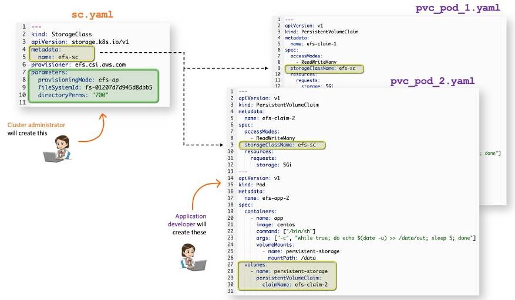


#### Type of reclaim policies

- Kubernetes reclaim policies determine what happens to a PersistentVolume (PV) after its bound PersistentVolumeClaim (PVC) is deleted.
  - Delete (Default): The PV and the underlying storage asset (e.g., AWS EBS, Azure Disk) are automatically deleted when the PVC is deleted.
  - Retain: The PV is not deleted when the PVC is deleted; it remains in a "Released" state, allowing for data recovery.
  - Recycle (Deprecated): A rm -rf /volume-mount-path/* command is executed to clear the volume, making it available for a new PVC.


## Install Amazon EBS CSI Driver

### Export Environment Variables

```bash
export AWS_REGION="ap-south-1"
export EKS_CLUSTER_NAME="retail-dev-boot_camp"
export AWS_ACCOUNT_ID=$(aws sts get-caller-identity --query Account --output text)

# Confirm values
echo $AWS_REGION
echo $EKS_CLUSTER_NAME
echo $AWS_ACCOUNT_ID
```

---

### Create Trust Policy File


```bash
cat <<EOF > ebs-csi-driver-trust-policy.json
{
  "Version": "2012-10-17",
  "Statement": [
    {
      "Effect": "Allow",
      "Principal": {
        "Service": "pods.eks.amazonaws.com"
      },
      "Action": [
        "sts:AssumeRole",
        "sts:TagSession"
      ]
    }
  ]
}
EOF
```

- This trust policy lets **EKS Pods (via Pod Identity Agent)** assume the role.

---

### Create IAM Role and Attach Policy

```bash
# Create IAM Role
aws iam create-role \
  --role-name AmazonEKS_EBS_CSI_DriverRole_${EKS_CLUSTER_NAME} \
  --assume-role-policy-document file://ebs-csi-driver-trust-policy.json

# Attach IAM Policy to IAM Role
aws iam attach-role-policy \
  --role-name AmazonEKS_EBS_CSI_DriverRole_${EKS_CLUSTER_NAME} \
  --policy-arn arn:aws:iam::aws:policy/service-role/AmazonEBSCSIDriverPolicy

# Verify:
aws iam list-attached-role-policies \
  --role-name AmazonEKS_EBS_CSI_DriverRole_${EKS_CLUSTER_NAME}
```
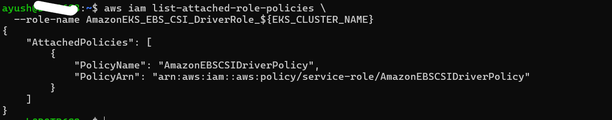
---

### Create Pod Identity Association (required for CLI install)

```bash
# Create EKS Pod Identity Assocication
aws eks create-pod-identity-association \
  --cluster-name ${EKS_CLUSTER_NAME} \
  --namespace kube-system \
  --service-account ebs-csi-controller-sa \
  --role-arn arn:aws:iam::${AWS_ACCOUNT_ID}:role/AmazonEKS_EBS_CSI_DriverRole_${EKS_CLUSTER_NAME}
```

- This binds the IAM role to the `ebs-csi-controller-sa` ServiceAccount
so the EBS CSI Driver can obtain credentials through the Pod Identity Agent.

---

### Install the EBS CSI Driver Add-on

```bash
# List existing EKS add-ons
aws eks list-addons --cluster-name ${EKS_CLUSTER_NAME}

# Install EKS EBS CSI Addon
aws eks create-addon \
  --cluster-name ${EKS_CLUSTER_NAME} \
  --addon-name aws-ebs-csi-driver \
  --service-account-role-arn arn:aws:iam::${AWS_ACCOUNT_ID}:role/AmazonEKS_EBS_CSI_DriverRole_${EKS_CLUSTER_NAME}
```

- This command:
* Installs the Amazon EBS CSI Driver add-on on your EKS cluster.
* Associates it with the IAM Role you created earlier.
* Deploys the following components automatically:
    * **ebs-csi-controller (Deployment)** 
    * **ebs-csi-node (DaemonSet)**

---

### Verify Installation

```bash
# List EKS add-ons (after install)
aws eks list-addons --cluster-name ${EKS_CLUSTER_NAME}
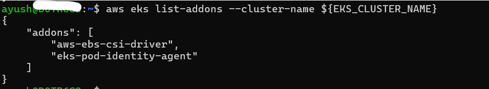

# Describe Addon - Verify Status
aws eks describe-addon \
  --cluster-name ${EKS_CLUSTER_NAME} \
  --addon-name aws-ebs-csi-driver \
  --query "addon.status" --output text
```

```bash
kubectl get pods -n kube-system | grep ebs-csi
kubectl get ds   -n kube-system | grep ebs-csi
kubectl get deploy -n kube-system | grep ebs-csi
```
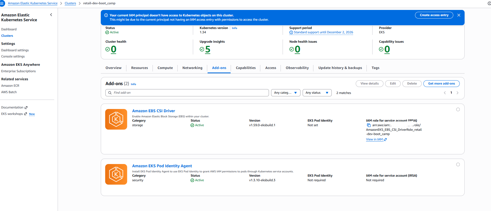
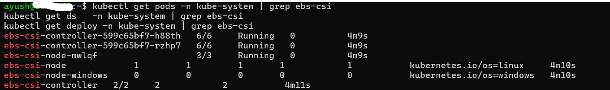


#### Deploy and Verify Resources

- befor deploy we must ensure that PIA is added and secret is there in aws and Kubernetes CSI Driver and AWS Secrets Provider is added on cluster  and role binding don for secret class

```bash
kubectl apply -f secretproviderclass/
kubectl apply -f catalog_k8s_manifests/
kubectl get sc,pvc,pv,pods
```

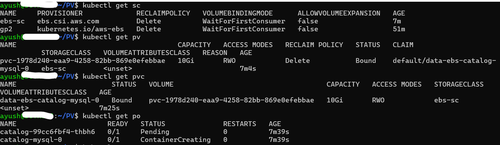

- also we can able to see that ebs is atteched to node
  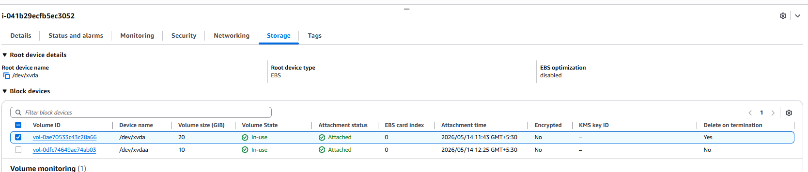
  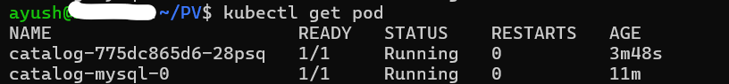


```bash
kubectl port-forward svc/catalog-service 7080:8080

```
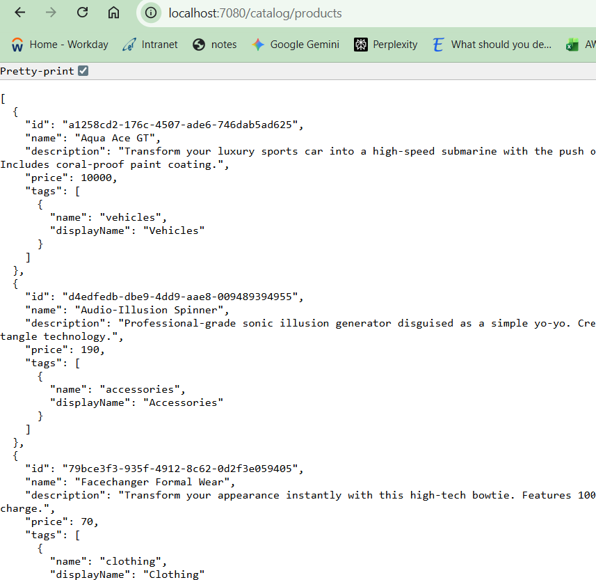


- Verify Database Persistence(deleting my sql pod)


```bash
kubectl run mysql-client --rm -it \
  --image=mysql:8.0 \
  --restart=Never \
  -- mysql -h catalog-mysql -u mydbadmin -p

  # Database Password 
    need to enter

SHOW DATABASES;
USE catalogdb;
SHOW TABLES;
SELECT COUNT(*) FROM products;

```

- created demo table 

```bash
CREATE TABLE IF NOT EXISTS demo_table (
    id INT AUTO_INCREMENT PRIMARY KEY,
    title VARCHAR(100) NOT NULL,
    status VARCHAR(50) DEFAULT 'Active',
    created_at TIMESTAMP DEFAULT CURRENT_TIMESTAMP
);

```
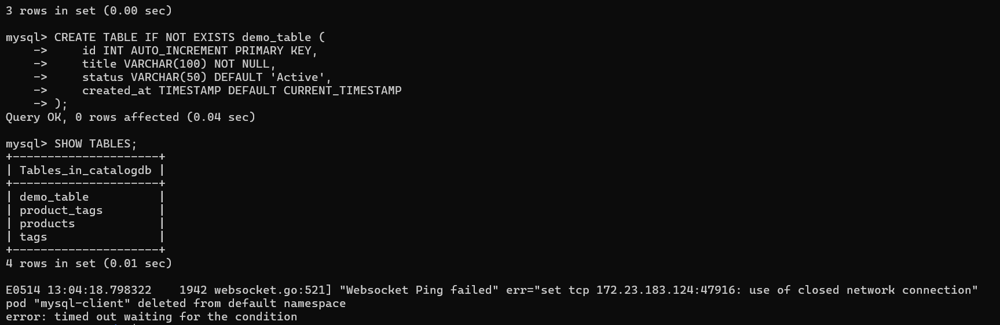


- deleted mysql pod 
  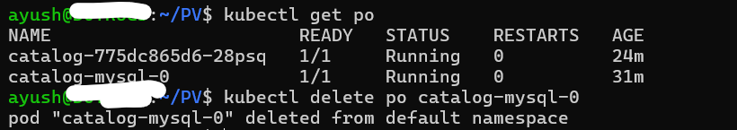


- after deleting pof created new pod  and check older data is still persist
  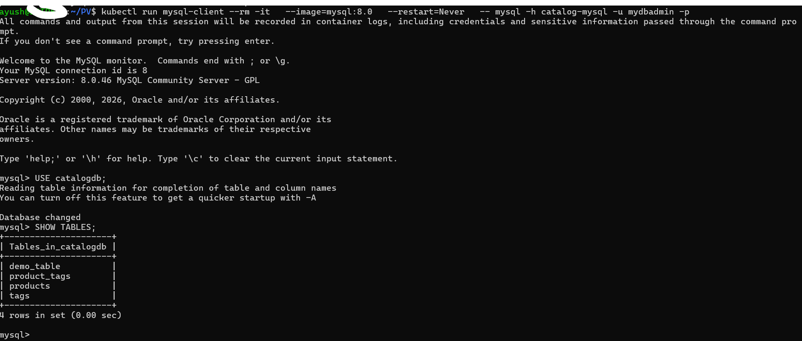


# AWS RDS Database 

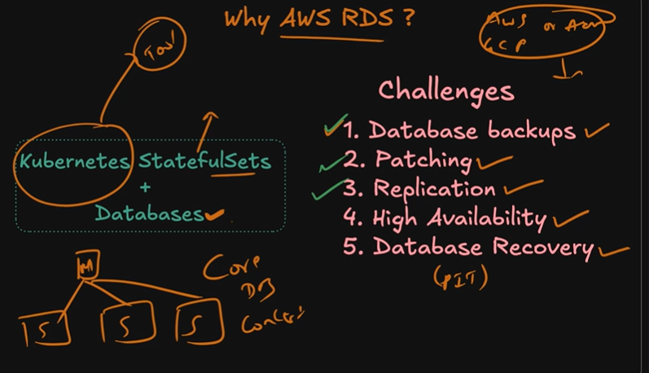

- `ExternalName Service` is used to map a Kubernetes Service name to a DNS name that exists outside of the cluster. Instead of using selectors to route traffic to internal Pods, it acts as an internal alias (a CNAME record) for an external resource.
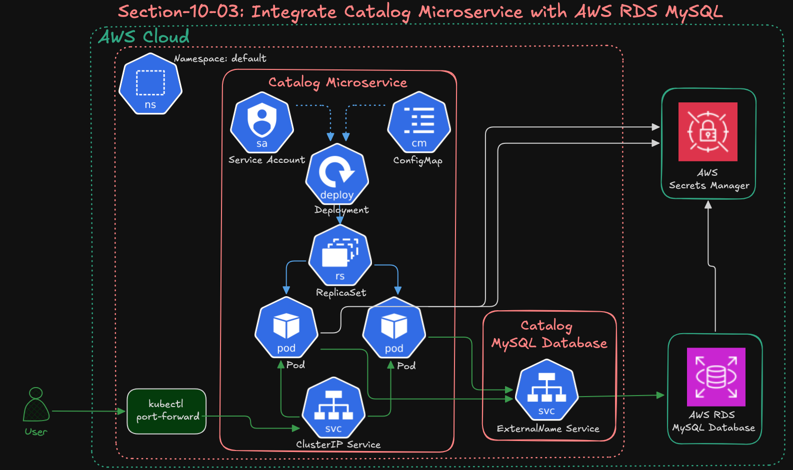

---

### Create Amazon RDS Database

#### Create VPC Security Group (for RDS)
- We need a Security Group that allows the RDS database to accept traffic only from our EKS cluster.

- to get sg id of you cluster
```bash
aws eks describe-cluster \
  --name retail-dev-boot_camp \
  --query "cluster.resourcesVpcConfig.clusterSecurityGroupId" \
  --output text
```

- Create RDS Security Group
* **VPC:** *Select the same VPC as your EKS cluster*
* **Inbound rules (choose one):**
  * **Recommended:**

    * **Type:** MySQL/Aurora (3306)
    * **Protocol:** TCP
    * **Source:** *EKS Cluster Security Group ID*


  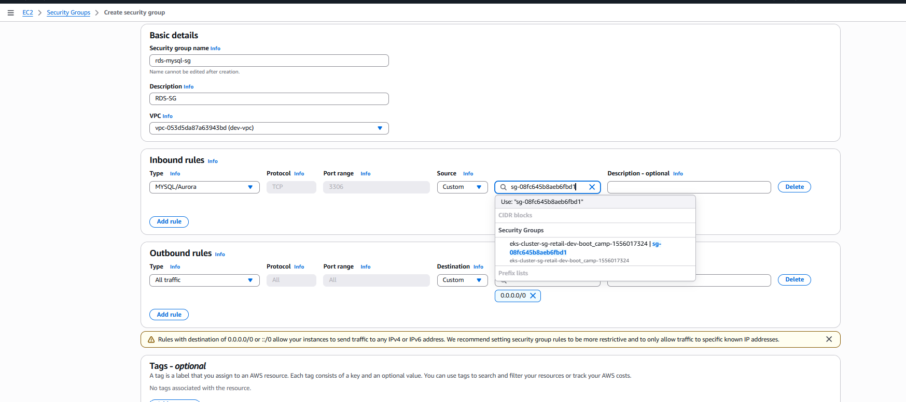  

#### SCreate DB Subnet Group (private subnets)
- **Console:** RDS → Subnet groups → **Create DB subnet group**
- **Name:** `rds-private-subnets`
- **VPC:** *Select the EKS VPC*
- **Subnets:** Add **all private subnets** (at least 2 AZs)
- **Create**

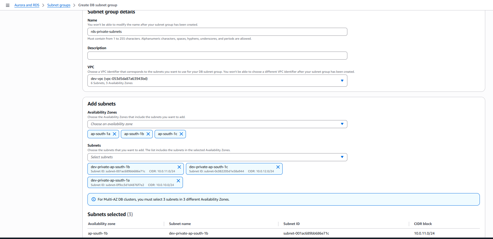
---

#### Create the RDS MySQL Instance
- **Console:** RDS → Databases → **Create database**
- **Method:** Standard create
- **Engine:** **MySQL** (8.0)
- **Templates:** Free tier or Dev/Test
- **DB instance identifier:** `mydb3`
- **Master username:** `mydbadmin`
- **Master password:** `****`
- **Instance class:** `db.t3.micro`
- **Storage:** (default is fine)
- **Connectivity:**
  - **VPC:** *EKS VPC*
  - **DB Subnet group:** `rds-private-subnets`
  - **Public access:** **No**
  - **VPC security group:** **Choose existing** → `rds-mysql-sg`
- (Optional) Disable **Delete protection** for easy cleanup
- **Create database**

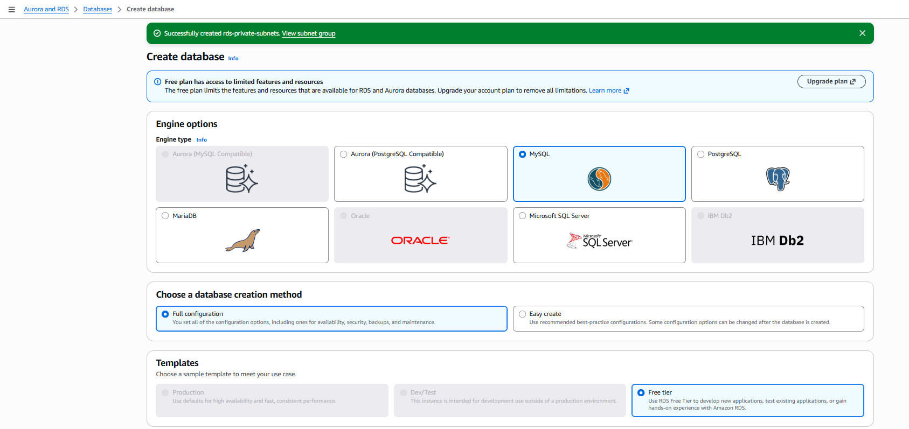
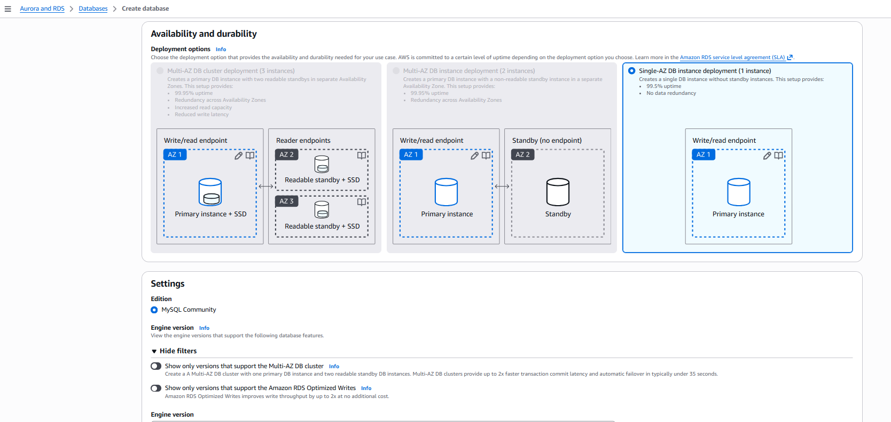
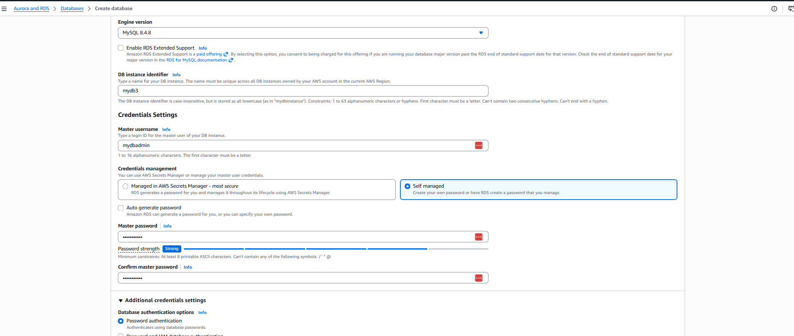
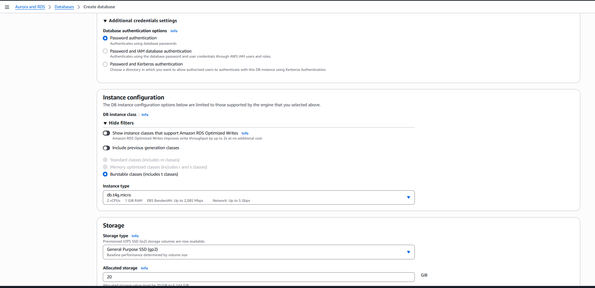
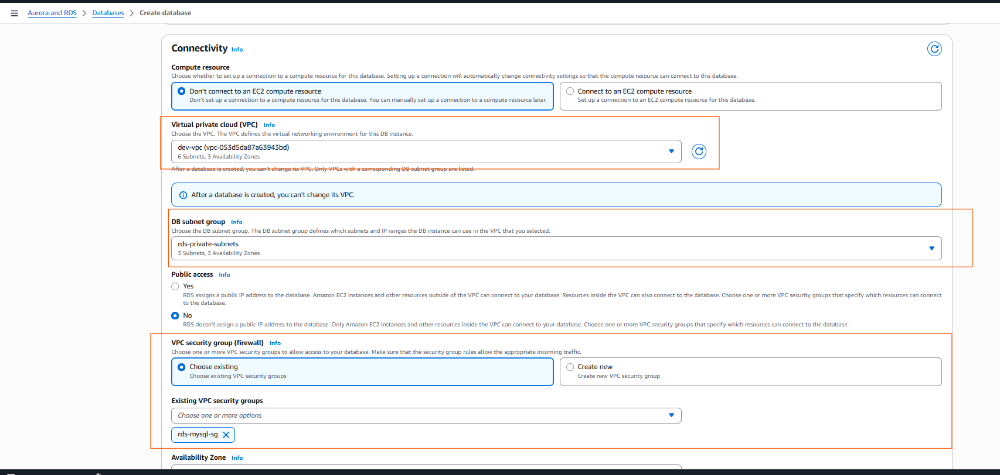
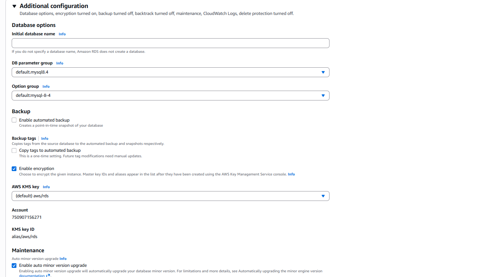
---

### Connect to RDS and Create Database Schema

- Once the database is available, connect to the RDS instance from within your EKS cluster using a temporary MySQL client pod.

```bash
kubectl run mysql-client --rm -it \
  --image=mysql:8.0 \
  --restart=Never \
  -- mysql -h mydb3.*****.ap-south-1.rds.amazonaws.com  -u mydbadmin -p
````

When prompted, enter the password:

```
***
```

Inside the MySQL shell, create the `catalogdb` schema:

```sql
CREATE DATABASE catalogdb;
SHOW DATABASES;
EXIT;
```
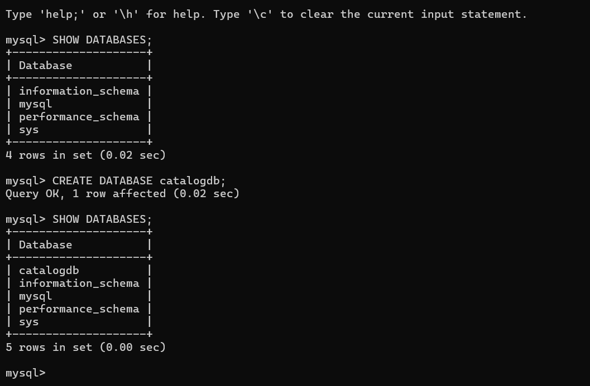

---

### Deploy Resources

Deploy in the following order:

```bash
# Deploy Secret Provider Class
kubectl apply -f 01_secretproviderclass/

# Deploy Catalog Application
kubectl apply -f 02_catalog_k8s_manifests
```

---

### Verify Setup
#### Verify Catalog Application Logs
```bash
# Verify Logs
kubectl logs -f deploy/catalog


```

#### Verify Application

Port-forward and access Catalog service endpoints:

```bash
# kubectl port-forward
kubectl port-forward svc/catalog-service 7080:8080
```

---

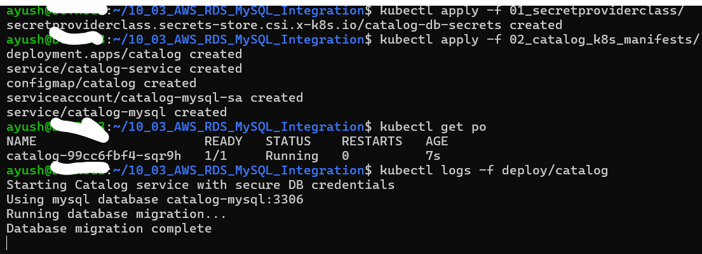
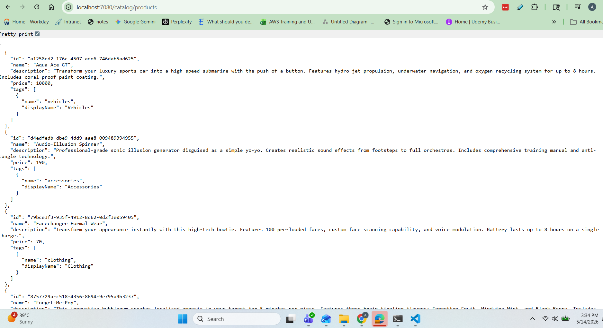


---

#### Verify Database Entries in RDS

Now that the Catalog microservice is running and connected to RDS,  
let’s log in to the RDS database **from within the EKS cluster** to verify data persistence.

---

##### Launch a temporary MySQL client Pod inside EKS

Run the following command:

```bash
kubectl run mysql-client --rm -it \
  --image=mysql:8.0 \
  --restart=Never \
  -- mysql -h mydb3.***.us-east-1.rds.amazonaws.com -u mydbadmin -p
```

- This command starts a **temporary Pod** named `mysql-client` using the official MySQL image.  
- It connects directly to your **RDS endpoint** (`mydb3.****.us-east-1.rds.amazonaws.com`).  
- The flag `-u mydbadmin -p` will **prompt you to enter the database password** (`kalyandb101`).  
- The Pod will be automatically deleted after you exit (`--rm`).

---

#### Step-06-03-02: Run SQL commands inside MySQL shell

Once you enter the password and connect successfully, run:

```sql
USE catalogdb;
SHOW TABLES;
SELECT * FROM products;
EXIT;
```

- This confirms that the **Catalog microservice** is successfully storing and reading data  
from the **Amazon RDS MySQL** database.
---

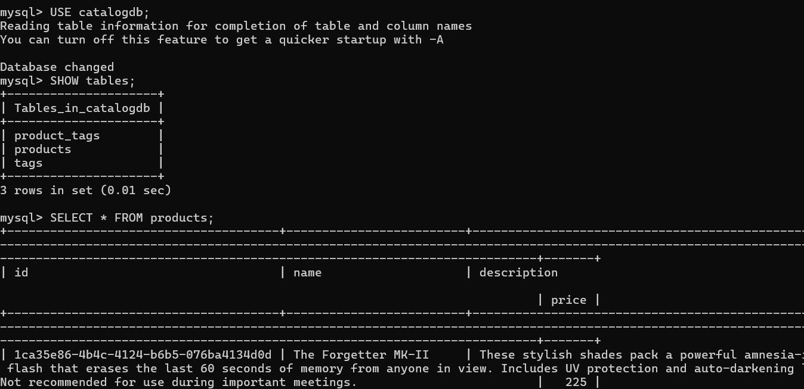